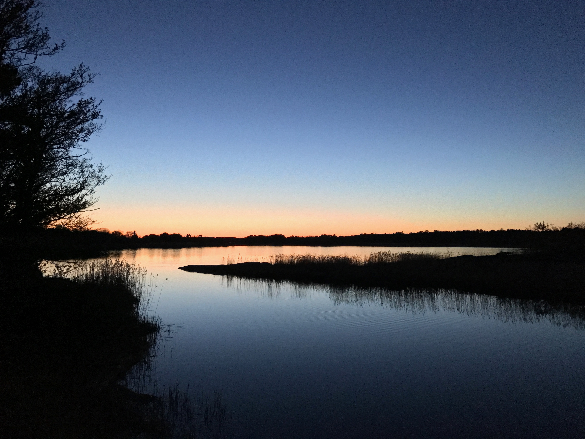

Hey there! I’m Marcus.

I’m an avid hiker, fly fisherman, and all-around outdoor enthusiast.

I’m originally from Finland, although I now live in San Jose, CA with my wife and our Australian Shepherd.

I enjoy spending time outside – especially hiking, biking, and fly fishing. I’m also really into food: both eating it, and cooking it. I like learning new techniques and exploring flavors from around the world.

Nature has been an important part of my life since I was little. I grew up playing in the forest, biking everywhere, and fishing after school with my friends. The sea and especially the Finnish archipelago have a special place in my heart.

<figure>
  
  <figcaption>Midnight twilight in the Finnish archipelago</figcaption>
</figure>

I got my first real experience of hiking in the mountains when I moved to California. The nature was just out of this world. Completely different from what I had seen before. I was hooked. Since then I’ve got really into backpacking and exploring all the breathtaking nature we have in California. I like to hike light and enjoy my time in the wild.

This blog is mainly for me to document my trips and thoughts for later. Hopefully some of the stuff will also inspire you to get out or help you plan your own adventure.

Happy trails!\
Marcus
