I decided to go on a last-minute overnight trip as I was going to be traveling for the next few weekends and wanted to get some trail miles and test gear ahead of the JMT.

As most places in the Sierras are still snowed in, Henry Coe was the logical destination. Less than an hour from the South Bay Area, it's a great place to get out in nature without having to drive too far. I found a loop on [AllTrails](https://www.alltrails.com/explore/trail/us/california/pacheco-falls-loop-via-coyote-creek-hunting-hollow) that was about the length I wanted to do and was in a part of the park I hadn't explored before.

<iframe width="100%" height="500px" src="https://caltopo.com/m/V59T"></iframe>

## Day 1

I arrived at the Hunting Hollow parking lot around 9am on a Friday. There were only four or five other cars on the big lot. I filled in the self-registration and headed off.

The trail starts with a two-mile road walk along Coyote Creek. The sides of the road were full of wildflowers, and the creek was going strong. I only saw two cars on the road walk, so it wasn't bad at all.

At the end of the road, I entered Henry Coe park at the Coyote Creek entrance and continued along a dirt road for another few miles.

<figure>
  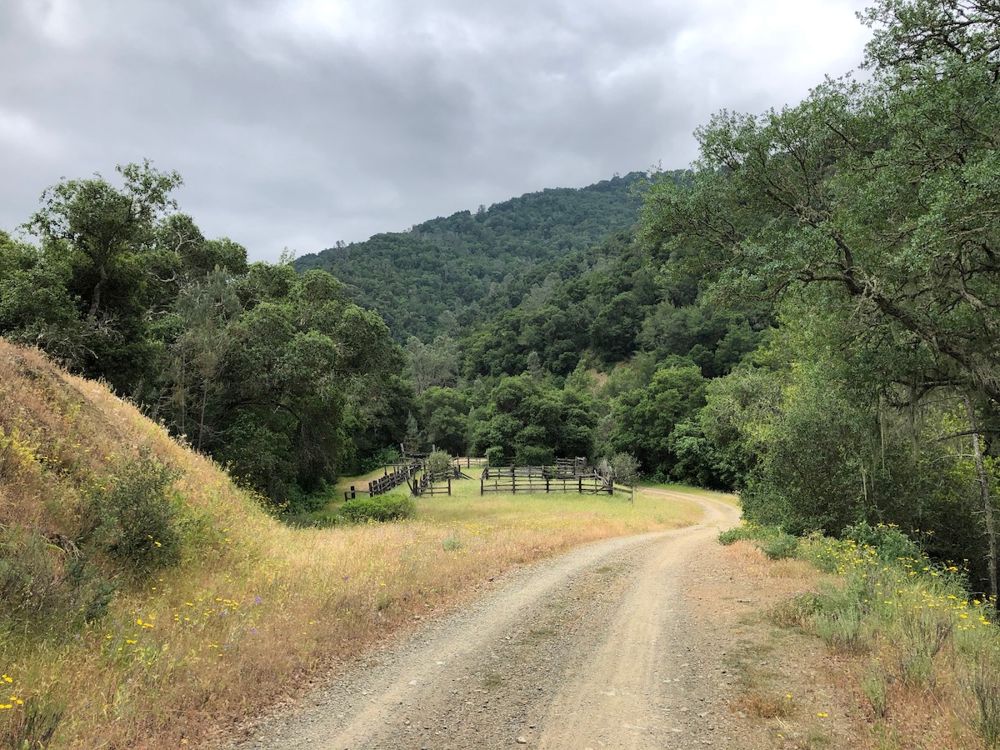
  <figcaption>Coit Road in Henry Coe State Park.</figcaption>
</figure>

I walked a half mile past the junction to Anza Trail as I was too busy checking out the wildflowers. Finally, I noticed that I was way closer to the creek than I should have been and backtracked.

<figure>
  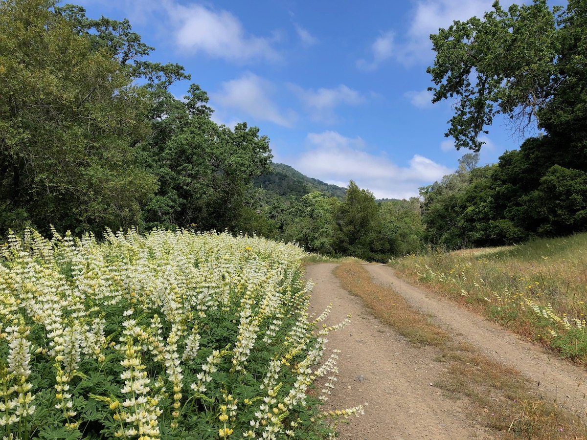
  <figcaption>Wildflowers along Coit Road.</figcaption>
</figure>

Anza trail was a single track trail that went through tall grass. I had to put on my pants on top of my shorts as Henry Coed is notorious for its ticks. I had treated both my pants and shirt with Permethrin the day before to avoid most of them hopefully.

Anza trail is one of the few trails in the park that has switchbacks, so the climb was easy. Soon enough, the views began to open up. The morning mist that made the first part of the hike nice and cool had also burned off, which made for some sweaty hiking in pants and a long sleeve shirt.

But the views were worth it. Coming up to Jackson trail, I could see all the way to Lick Observatory.

<figure class="full-width">
  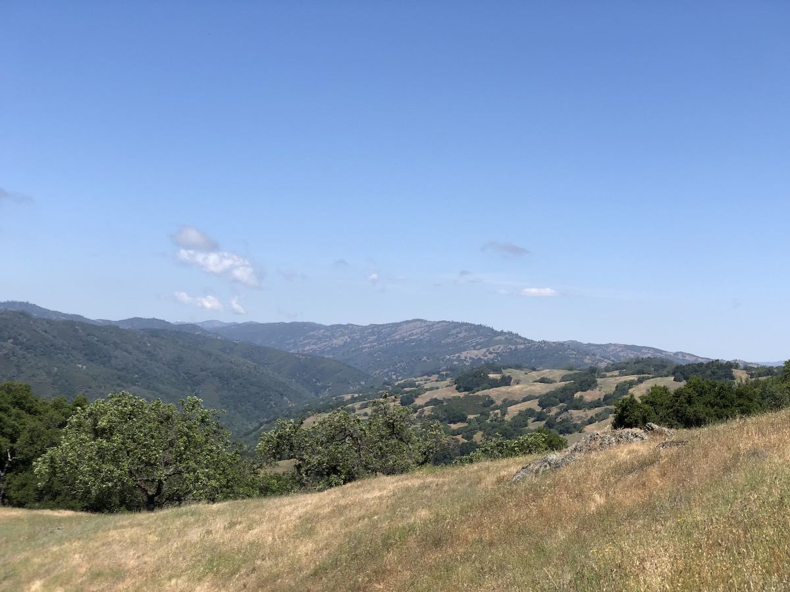
  <figcaption>Lick Observatory in the distance from Jackson Trail.</figcaption>
</figure>

The trail continued through meadows of tall grass and sparse oaks. At one junction, I followed the trail post towards Kelly Lake instead of checking my map. This took me on a smaller trail instead of the road and shortened my day a little.

<figure>
  
  <figcaption>A tree growing out of a rock.</figcaption>
</figure>

It was still early when I got to Kelly Lake, so I decided to take an extended coffee break and observe the ducks and fish doing their thing in the lake. The lake was calm with only an occasional breeze stirring the surface.

<figure>
  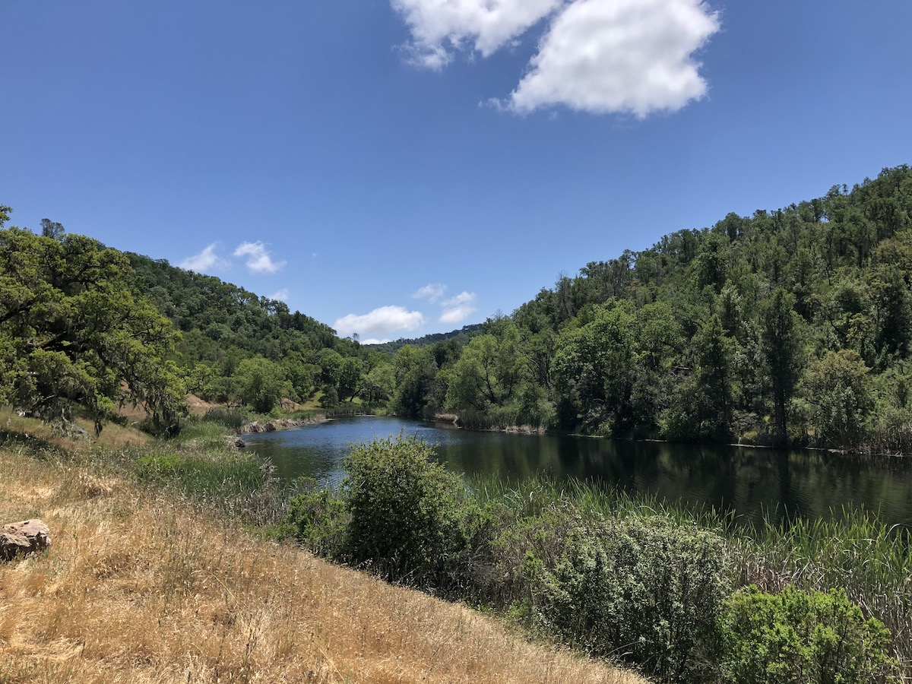
  <figcaption>Kelly Lake.</figcaption>
</figure>

My next destination was Pacheco Falls. I didn't have a plan for where to camp yet. I had checked my map at Kelly lake and marked two potential spots: one near the pond above the falls, and the Pacheco Camp.

As I passed Coit Lake, I saw that pigs had been digging up a lot of the soil around the small streams leading into the lake. Pigs are a big problem in the park as I would notice a bit later. The Rangers had set out traps, hoping to lure them in with a tasty pile of corn.

<figure>
  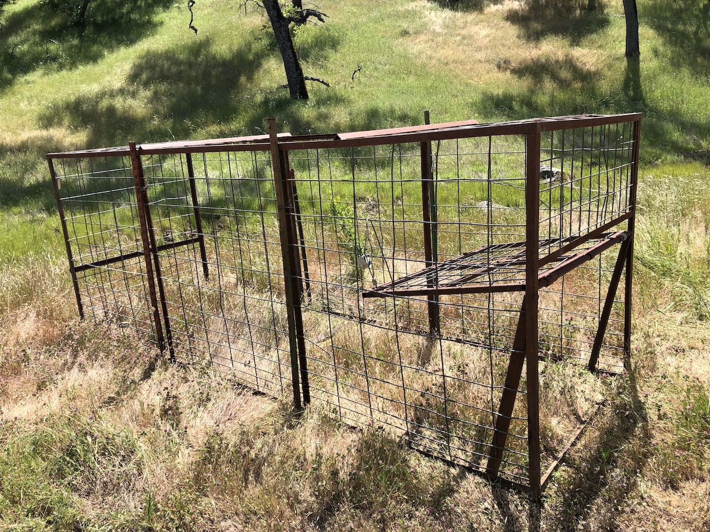
  <figcaption>Pig trap.</figcaption>
</figure>

I saw the first snake of the trip on the road from Coit to Pacheco. I'm no snake expert, but it looked like a baby gopher snake.

<figure class="full-width">
  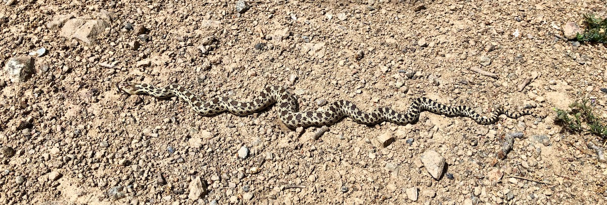
</figure>

The trail down to Pacheco Falls from Live Oaks Spring Road was a pretty steep 1,000ft descent. Walking down, I was fantasizing about taking a dip in the pool under the falls to cool off and wash off the sweat and trail dust I'd collected during the day.

When I finally got down to the falls, I was greeted by a beautiful, turquoise pool surrounded by green trees and bushes. I could see fish casually swimming around in the calm water, cursing myself for not bringing my Tenkara rod.

<figure>
  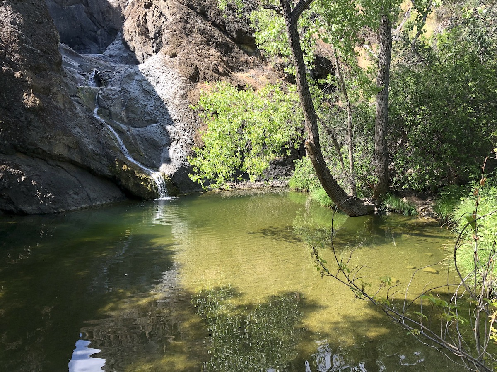
  <figcaption>Pacheco Falls.</figcaption>
</figure>

<iframe width="560" height="315" src="https://www.youtube.com/embed/lIBQz9V93mc?rel=0" frameborder="0" allow="accelerometer; autoplay; encrypted-media; gyroscope; picture-in-picture" allowfullscreen></iframe>

To my big disappointment, it turned out that most of the bushes around the pool were poison oak, and I couldn't find any way to get into the water without getting poison oak all over myself.

Begrudgingly, I started the 1,000-foot climb back up. The camping spot that had looked promising on the map didn't yield any decent places, so I backtracked a mile and then continued to Pacheco Camp.

<figure>
  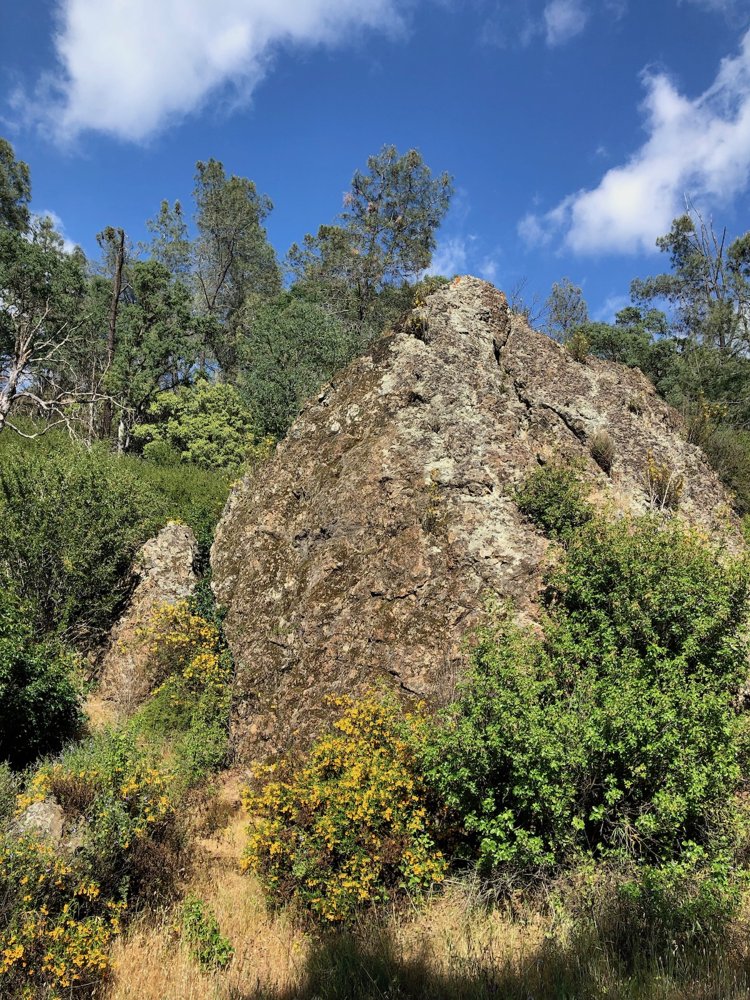
  <figcaption>Big rock near Pacheco Camp.</figcaption>
</figure>

When I got to the camp, I realized that camp didn't mean camping area. It was a dilapidated old hunting camp with a handful of old buildings that looked like they'll fall over any minute.

<figure>
  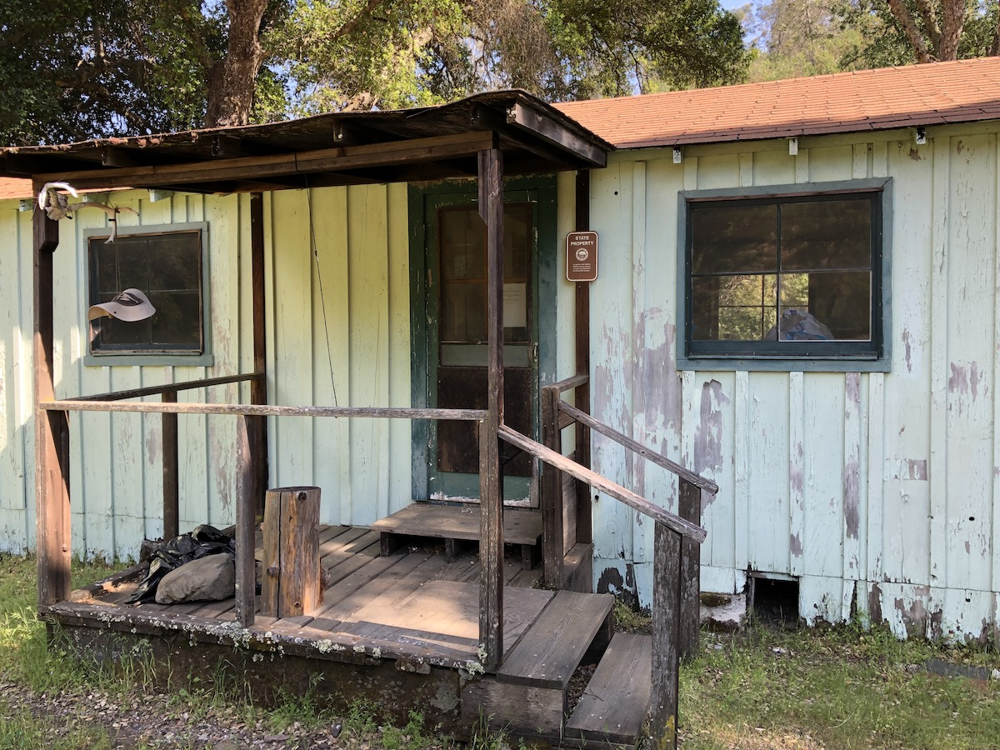
  <figcaption>Pacheco Camp.</figcaption>
</figure>

<figure>
  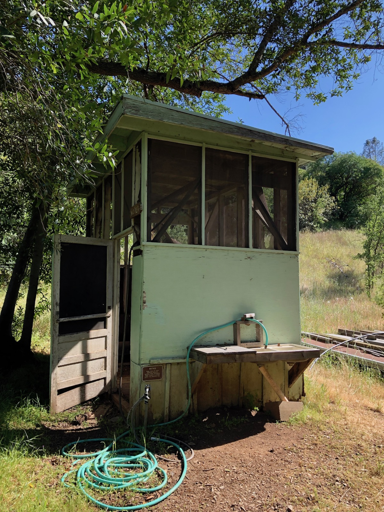
  <figcaption>Shower? Murder hut?</figcaption>
</figure>

I had come out to enjoy nature, and spending the night in the backyard of a creepy old camp wasn't really what I wanted to do. The campsite was also down in a dark valley that would get very damp and buggy once the sun went down.

I still had plenty of daylight, so I had a cup of coffee and made a new plan. I checked my map once again and saw that there were several potential looking campsites along the Wagon Road. I decided to load up on enough water to dry camp and headed out once again.

<figure>
  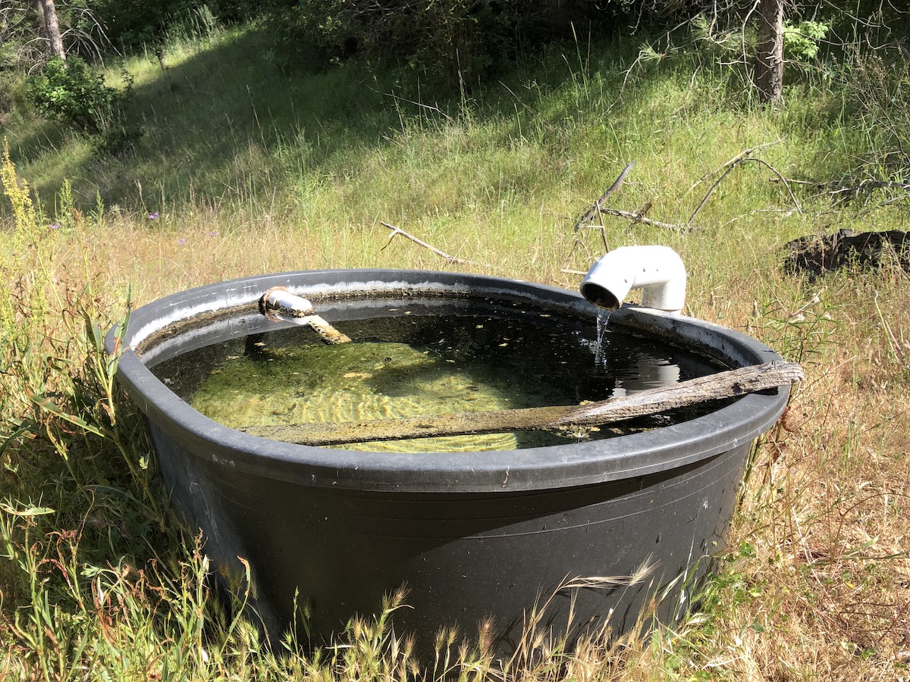
  <figcaption>The spring at Pacheco Camp.</figcaption>
</figure>

Finding a campsite turned out to be more difficult than I had anticipated. I had recently watched Andrew Skurka's video on [finding five-star campsites](https://www.youtube.com/watch?v=RdWdlkBJLJ4) in preparation for my trip in September, and wanted to find something that ticked all the boxes: not near water, under foliage, and on a soft surface.

<figure class="full-width">
  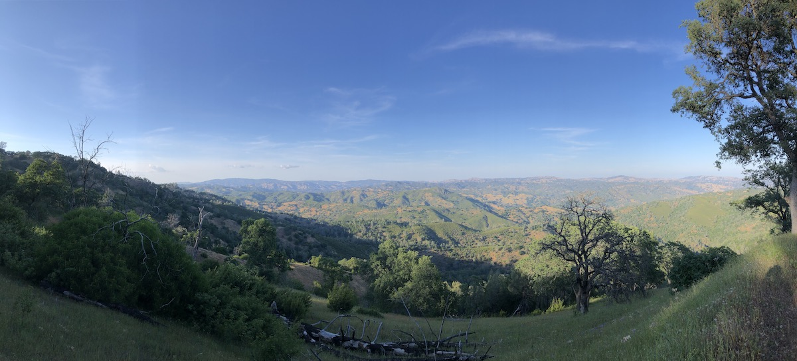
  <figcaption>Views from Live Oak Spring Road.</figcaption>
</figure>

Turns out that the pigs in the park have been busy digging up the ground under pretty much every single oak tree in the park at some point in time. Finally, I found a beautiful place tucked in near a pine for wind protection. It wasn't a full five-star site, but with the views factored in, I'll give it four stars.

<figure>
  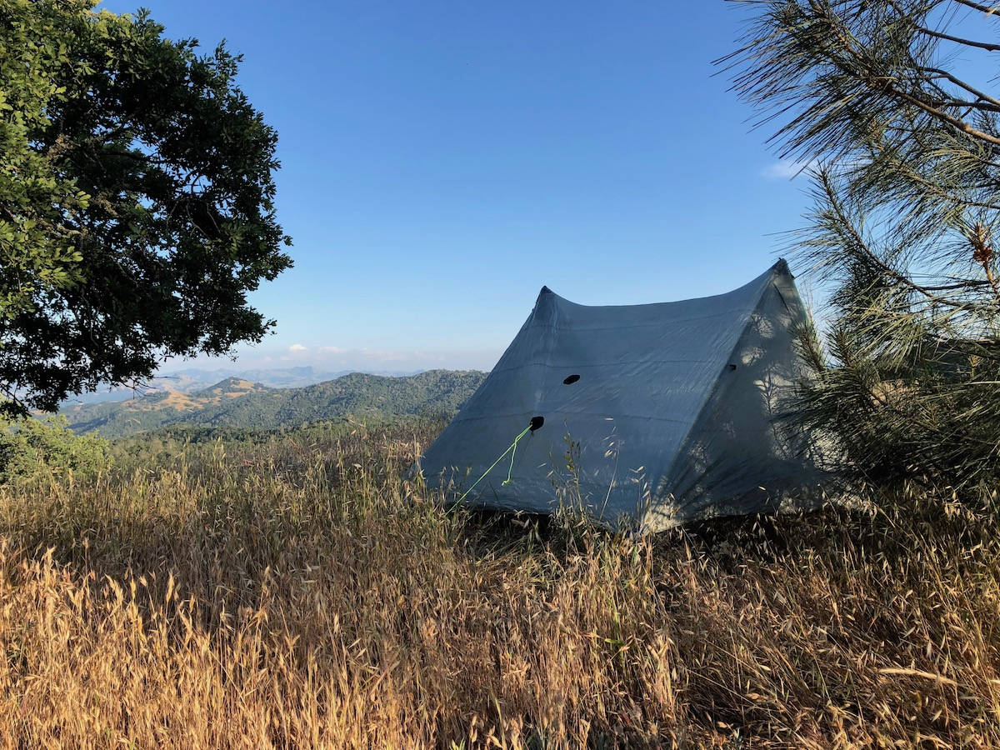
  <figcaption>Tent tucked in by a pine with expansive views.</figcaption>
</figure>

There was a rock outcrop near the campsite where I could sit and cook dinner while I watched the sunset. After dinner, I retreated into my tent and under my quilt to read for a while. I could hear the wind blowing through the pine needles, but my tent was well protected and didn't flap around.

**Day 1 stats: 20 miles, 4,200 ft ascent**

## Day 2

I woke up a bit before six as the sun climbed up over the horizon. My tent is very translucent, which makes for magnificent sunrises.

<figure>
  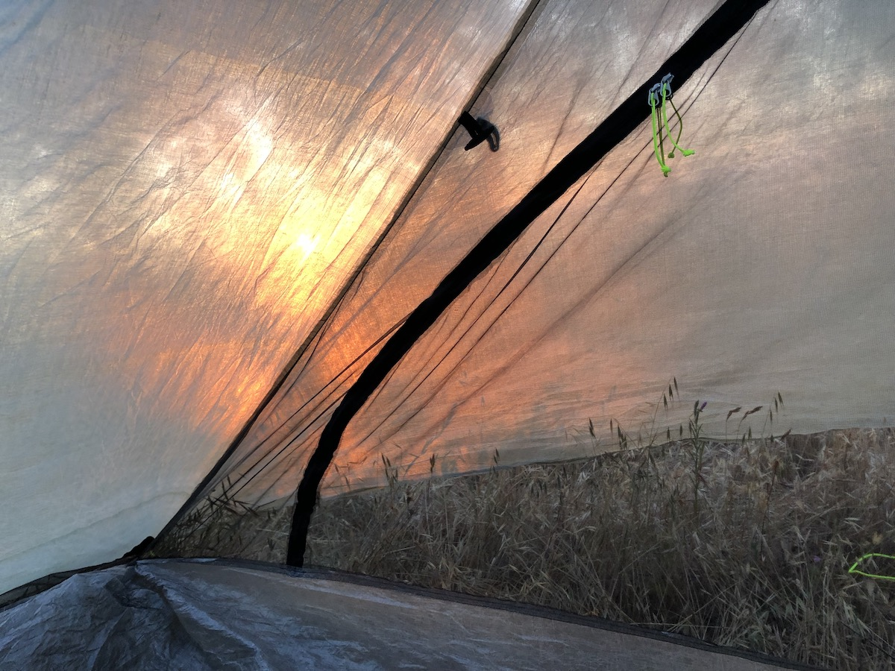
  <figcaption>Sunrise inside the tent.</figcaption>
</figure>

I was greeted by a warm golden glow when I opened the tent door. The tall yellow grass was as if it was on fire. The valleys had collected blankets of mist over the night.

<figure>
  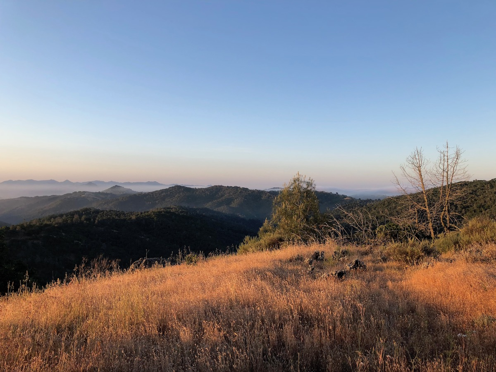
  <figcaption>Sunrise at the campsite overlooking a misty valley.</figcaption>
</figure>

I didn't have enough water to make breakfast at camp, so I planned to quickly pack up and have breakfast at the first water source instead. I ended up walking all the way to Tule Pond before stopping for breakfast because I missed the trail junction to Wasno Pond and wasn't hungry enough to backtrack.

I gathered water at the stream before Tule pond and then continued for a few hundred yards to find a place where I could sit in the morning sun and look at the pond.

I was in no hurry, so I probably spent 45 minutes drinking my morning coffee and looking at turtles swimming around in the pond. Just as I was getting ready to leave I met the first person in over 20h. It's incredible how much solitude you can find so close to a 10 million person metropolitan area.

<figure>
  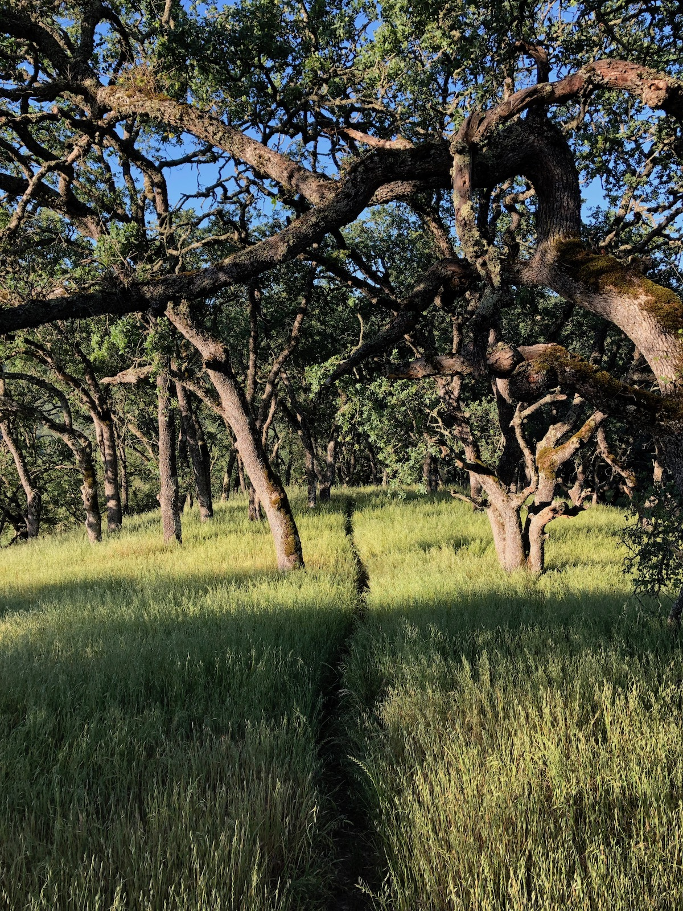
  <figcaption>Tick Alley.</figcaption>
</figure>

After the breakfast, I had one last climb to do before the steep descent back down to Hunting Hollow. Much of the trail went through thigh-high grass. It seems like the Permethrin worked. I only saw two ticks on me on the entire trip.

> Switchbacks are for losers.\
> – Henry Coe trail designer, probably

The standing joke about Henry Coe is that you don't go there to train for the Sierra; you go to the Sierra to prepare for Henry Coe. And indeed, the climbs can be brutal. The trails often follow the path of least effort – for the trail builder that is.

<figure class="full-width">
  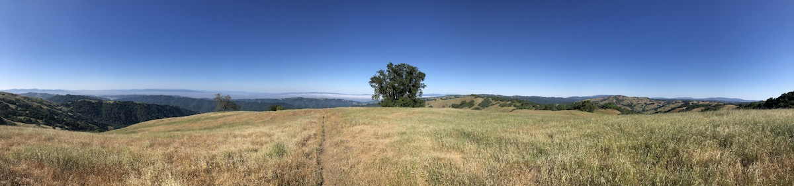
  <figcaption>Views from Middle Steer Ridge Trail.</figcaption>
</figure>

Thankfully, I was going down Middle Steer Ridge Trail. It was a steady steep downhill with some even steeper drops. It would have been a pain without hiking poles to take some load off the knees.

<figure>
  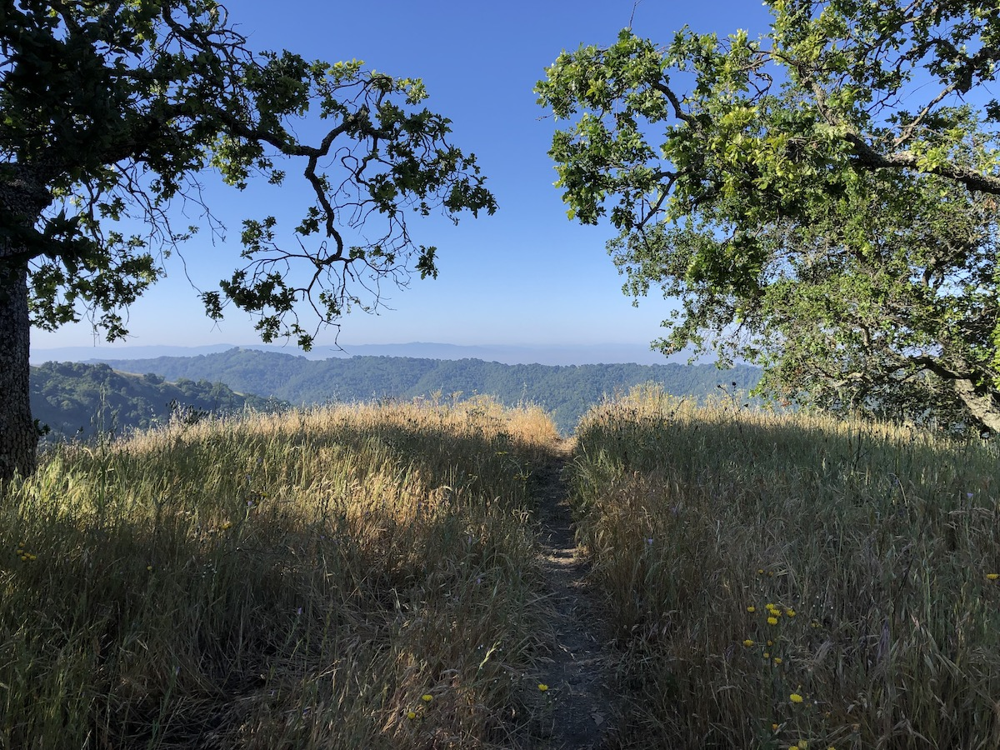
  <figcaption>Where'd the trail go?</figcaption>
</figure>

Once I got down to the bottom, I had less than a mile along a dirt road to get back to my car. The road crossed a creek several times, but the water was low enough already that skipping rocks was easy and I didn't need to get my shoes wet on the home stretch.

It was only 9:30 in the morning when I got back to the car, which left me with a full day for other stuff at home. All in all, this was a good trip.

**Day 2 stats: 6.9 miles, 1,000 ft ascent.**

You can find the (planned) route on [Caltopo](https://caltopo.com/m/V59T).
