## Overview and plan

I'm preparing for my hike of the John Muir Trail in just over a month and wanted to get in a long weekend hike to test out gear, food, and get some more trail miles in before the big adventure.

The snow is still deep on most trails up in the Sierra, so this was an excellent opportunity for me to explore new areas of California. Trinity Alps Wilderness is one area I've wanted to visit for a while. The trail I had scouted out there stayed under 6,000 ft and was mostly free of snow according to reports I found online.

The trail started at Stuart Fork Trailhead and followed the river all the way up to two beautiful alpine lakes. The only issue was that it was pretty short for a 3-day hike: 24 miles, 12 miles each way. So this trip would be more about enjoying nature and practicing skills.

<iframe width="100%" height="500px" src="https://caltopo.com/m/G21A"></iframe>

I wanted to experiment with a few things ahead of my long hike:

**Going stoveless**. Would cold soaked food and cold coffee keep me happy on the trail?

**Understanding the rate of consumption of consumables**. Sunscreen, battery, etc. How much do I need to allocate per day?

**Going TP-less**. The JMT requires you to pack out toilet paper. Would natural materials + washing be a more hygienic option?

**Packing a bear canister**. I need to carry a bear canister for the JMT. I usually don't carry one, so I wanted to make sure I can pack around it efficiently.

**Sleep system**. I'm still not happy with my sleep system. Not getting a good night's sleep. I need to make a decision for the JMT.

## Gear

This was going to be a comparatively short hike, but I wanted to keep the weight in line with what I will be carrying on the JMT. This meant I could bring things like a foldable saw for processing firewood.

You can view the [full gear list here](https://lighterpack.com/r/49l4l3)

## Day 1 - Stuart Fork Trailhead to Morris Meadows

I got to the trailhead at 10:30 AM. The last two miles of the road was a gravel road. It was passable with a regular car, although it was pretty rough at one place and crossed two shallow creeks. I had stopped for breakfast on the drive in so I was ready to hit the trail as soon as I arrived.

The first mile of the trail followed an old dirt road. After that, the trail narrowed and continued in a pine forest. Most of the first day was walking through a forest without grand views. But the forest also offered shade, which was welcome since it was a hot day.

<figure>
  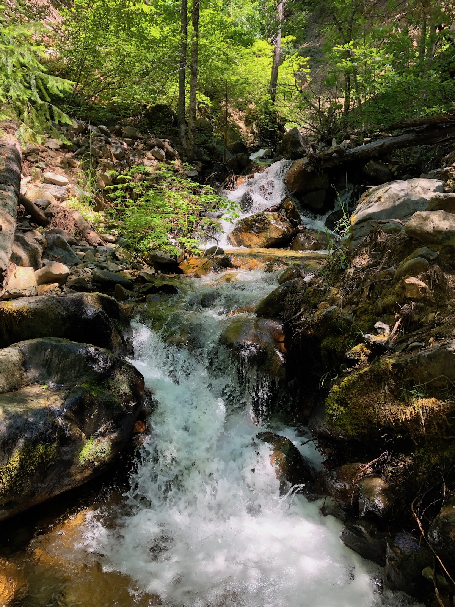
  <figcaption>A small waterfall.</figcaption>
</figure>

The Stuart Fork River was to the left of the trail, sometimes right up to it, and sometimes just barely out of earshot.

Small creeks crossed the trail every few minutes, in the beginning, some with small waterfalls. They were easy to cross on rocks or logs without getting wet.

<figure>
  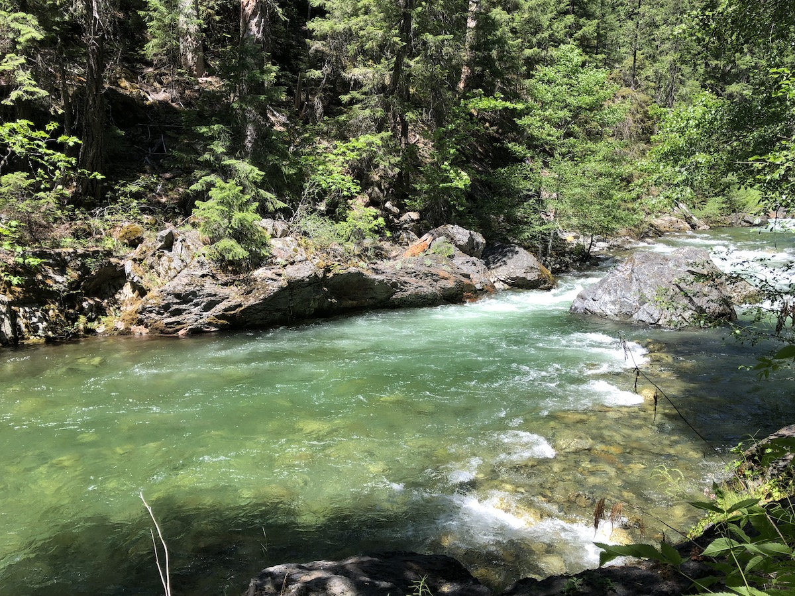
  <figcaption>A blue pool in the rushing river.</figcaption>
</figure>

<figure>
  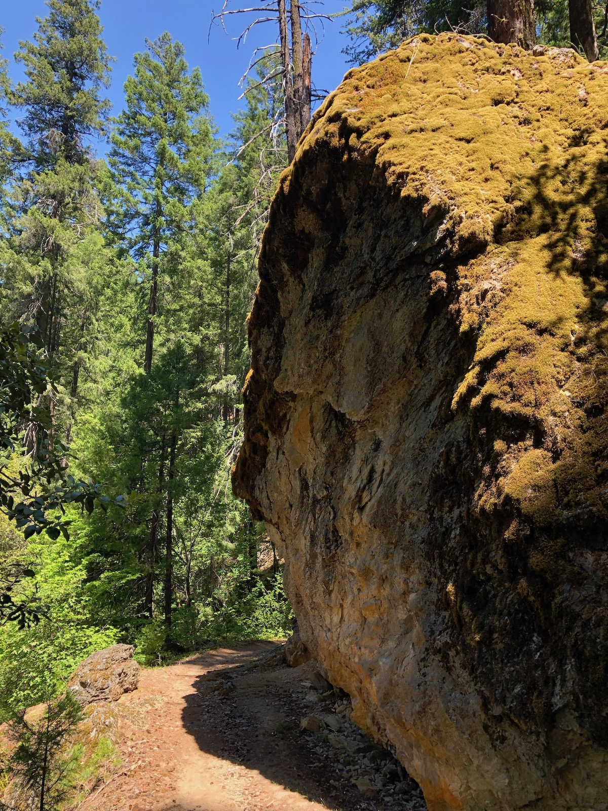
  <figcaption>A big rock along the trail.</figcaption>
</figure>

At times, the trail was close enough to the river that no trees were blocking the view and I could catch glimpses of the snow-capped mountains up ahead.

The trail was a constant, gentle, uphill for the entire first day. I climbed close to 2,000ft, but at times it was easy to forget I was climbing.

<figure>
  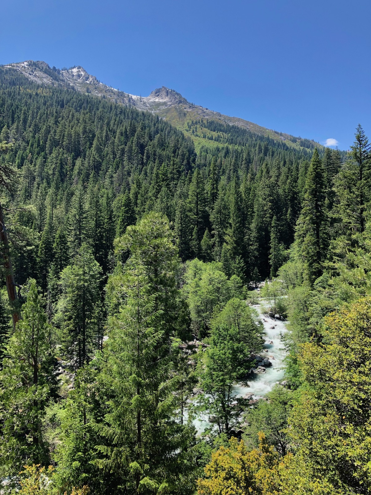
  <figcaption>A view of the moutains. There was still plenty of snow left up there.</figcaption>
</figure>

I got to Morris Meadow around 2PM. It was still early. Since I didn't know the area or where to set up camp, I decided to walk all the way to the North of the meadow first to check out potential campsites.

I eventually backtracked to the South end of the meadow and found a campsite that was a bit secluded from the other groups that were camping there.

<figure class="full-width">
  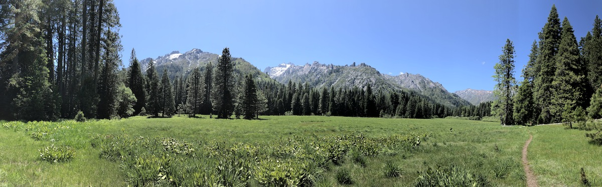
  <figcaption>Panoramic views of Morris Meadow.</figcaption>
</figure>

The river ran right past my campsite. The water was high and fast. But also incredibly beautiful – crystal clear and cobalt blue.

<figure>
  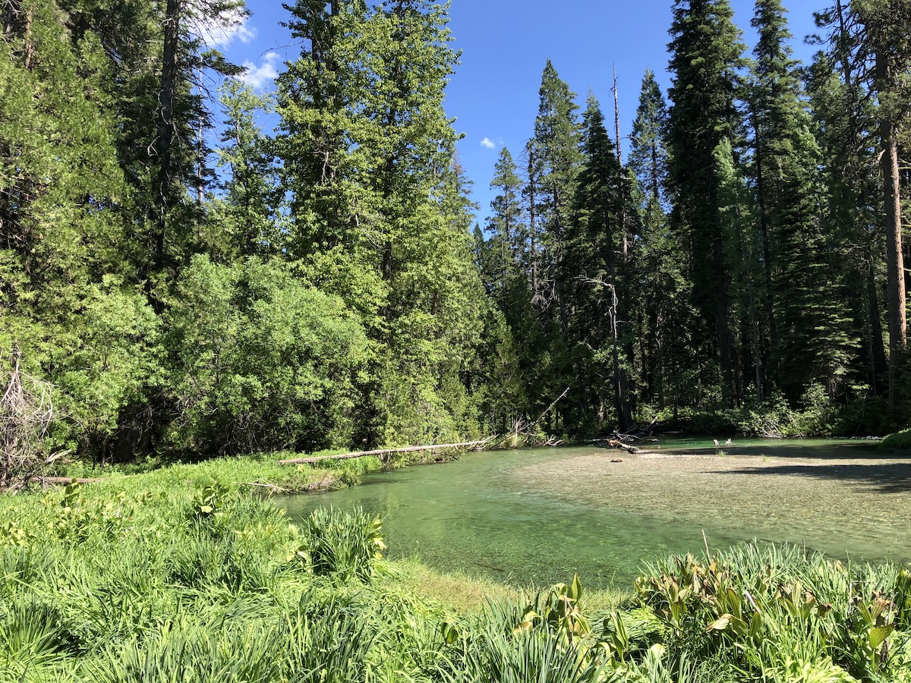
  <figcaption>Stuart Fork running by the campsite.</figcaption>
</figure>

One of the groups camping on the edge of the meadow had brought their goats with them. They were grazing at the edge of the field, making all kinds of goat sounds. Fortunately, I was camped far enough that I couldn't hear them to my camp.

<figure>
  
  <figcaption>Morris Meadow with some goats in the foreground.</figcaption>
</figure>

I fished a while near my camp without success. I then made a small campfire and listened to an audiobook next to it until it got dark and it was time to go to bed.

## Day 2 - Day hike to Emerald and Sapphire Lakes

The plan for my second day was to leave camp set up at Morris Meadow and hike up to the lakes with a light pack. I wanted to explore and do some fly fishing if possible.

The closer I got to Emerald Lake, the more overgrown the trail became. At times it was just forcing myself through thick brush.

<figure>
  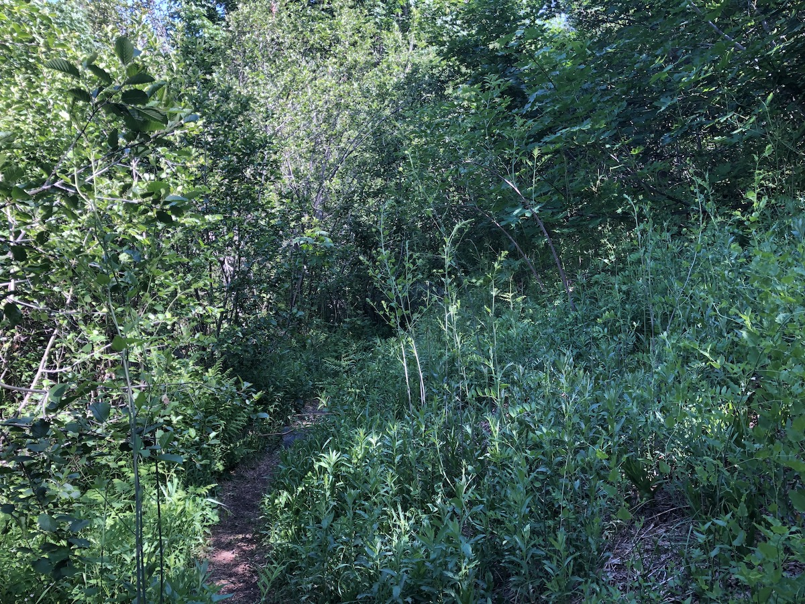
  <figcaption>The trail was very overgrown.</figcaption>
</figure>

The bushwhack was worth the effort. As I climbed higher, I started getting more and more views of the high granite walls on the Western side of the trail.

<figure>
  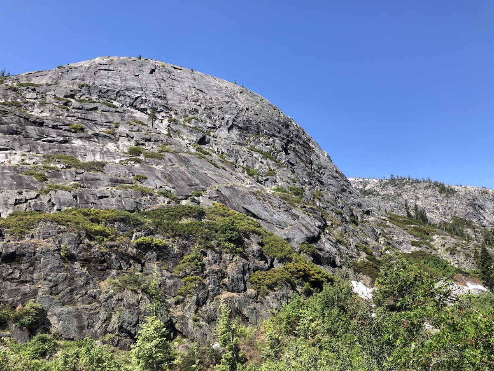
  <figcaption>Granite wall.</figcaption>
</figure>

<figure class="full-width">
  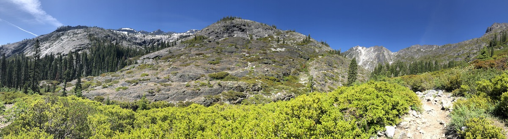
  <figcaption>Above the trees.</figcaption>
</figure>

The views were breathtaking when I finally got up to Emerald Lake. The deep blue lake sits in a bowl, surrounded by mountains on three sides. There were still patches of lingering snow on the Eastern slopes. Meltwater was cascading down the wall on the Western side with a loud roar.

<figure class="full-width">
  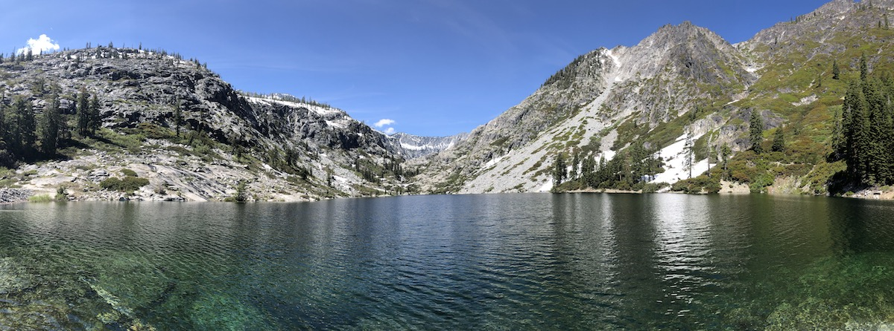
  <figcaption>Emerald Lake.</figcaption>
</figure>

I stopped for a short break at the lakeshore, taking in the views and filling up on water before continuing on to Sapphire Lake.

Sapphire Lake was about 300 feet above Emerald. Getting there required pushing through some even thicker bush, traversing a few snowfields, and finally climbing a rock field up to the lake.

<figure>
  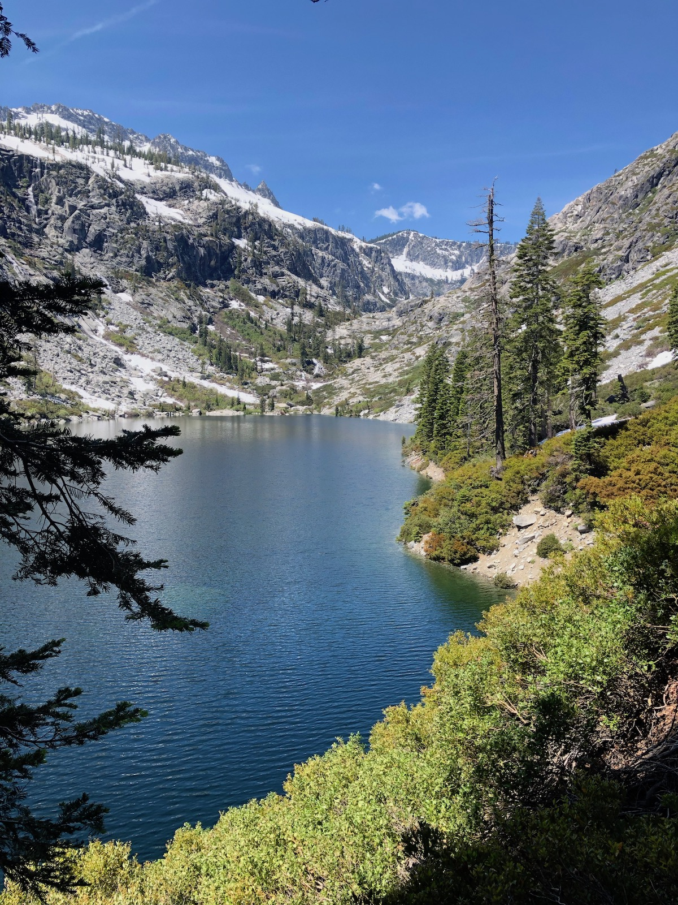
  <figcaption>Above Emerald Lake.</figcaption>
</figure>

<figure>
  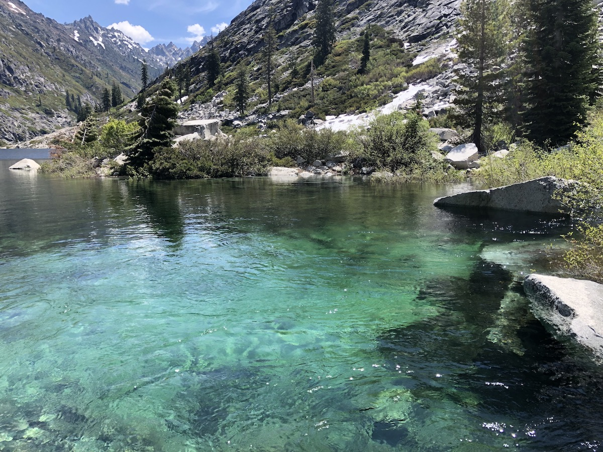
  <figcaption>Emerald Lake inlet.</figcaption>
</figure>

As I started my ascent on the Eastern shore of the lake, I got spectacular views of the lake and down towards the Sawtooth Ridge in the distance.

From above, the water was invitingly blue. The inlet of the lake looked almost unreal as if it were photoshopped.

<figure>
  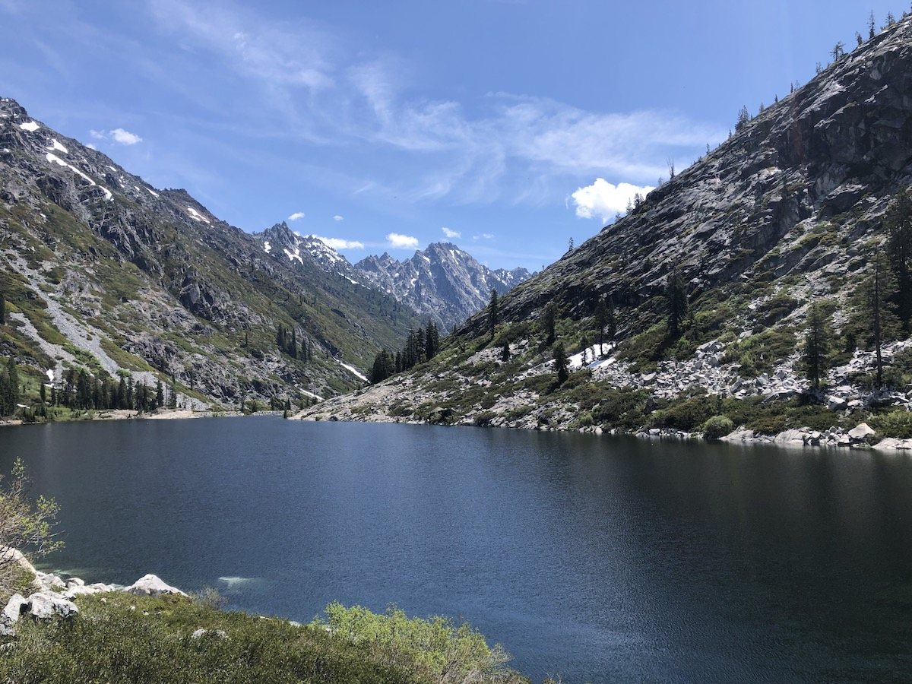
  <figcaption>Sawtooth Ridge behind Emerald Lake.</figcaption>
</figure>

Sapphire Lake was still mostly covered in ice. The shore was blanketed by a dense layer of snow that was soft in the warm sun. I sat by the rocky beach watching small pieces of ice float by. I wanted to wash off but decided I'd rather do it in the unfrozen Emerald Lake on the way down.

After hanging out for a while, I headed back down. I stopped to fly fish at the Emerald Lake inlet for a while but didn't have any luck. I really didn't have any idea if there were fish in the lake, so I didn't spend that much time there.

I rinsed off all my clothes and took a dip in Emerald lake before continuing back down towards my camp.

<figure>
  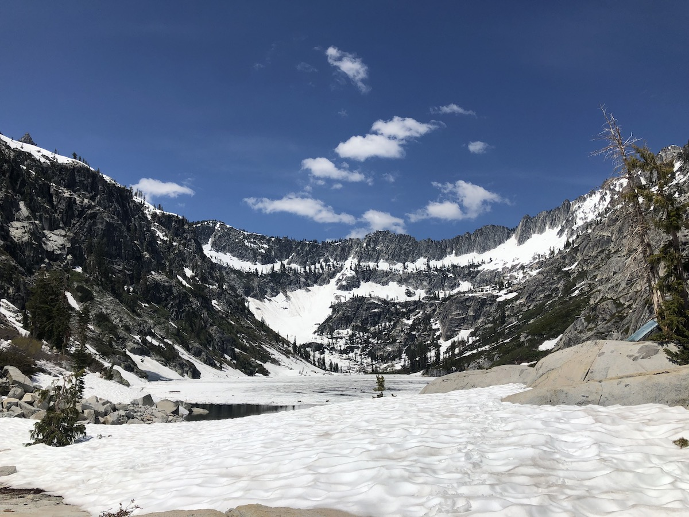
  <figcaption>Sapphire Lake.</figcaption>
</figure>

<figure>
  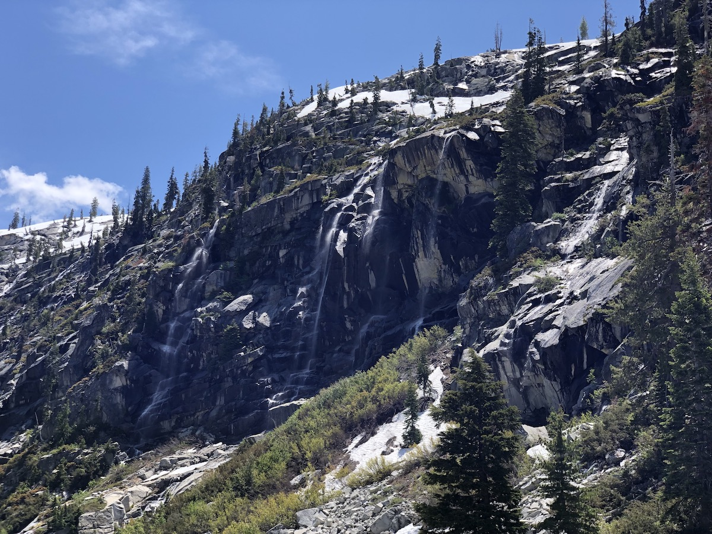
  <figcaption>Waterfalls.</figcaption>
</figure>

On the way down, I could start to see dark clouds forming on both sides of the mountains. When I arrived back at the meadow, I could already hear the thunder beyond the mountains to the West. The rain started shortly after, fortunately just two minutes before I arrived back at my tent.

<figure>
  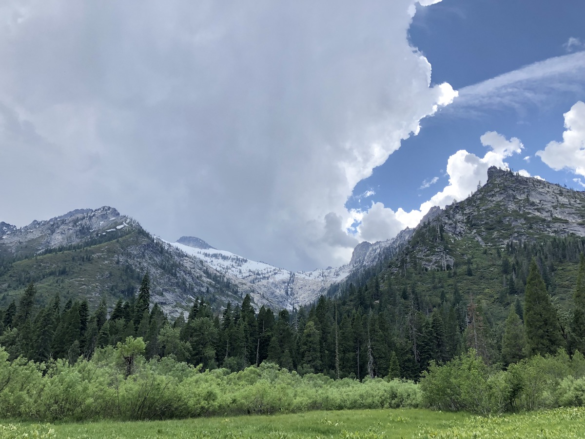
  <figcaption>Afternoon thunderstorm.</figcaption>
</figure>

I laid in my tent, reading and having some snacks while I waited for the thunder to pass. A while later, I noticed something move in the corner of my eye. There were two deers, just 3 meters from my tent. They were not at all afraid of me. In fact, I ended up having to try to shoo them away when I all of a sudden had close to 10 deer hanging out around my tent. They were eating something the previous campers had left behind but were clearly also interested in the salty sweat on my hiking poles.

<figure>
  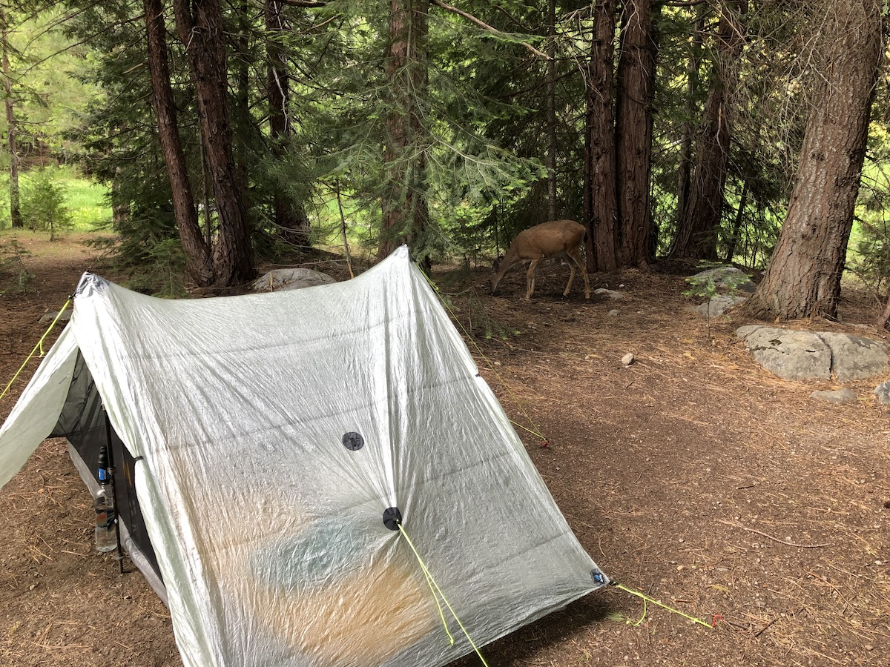
  <figcaption>A deer by my tent.</figcaption>
</figure>

After the thunderstorm passed, I lit a small campfire and sat watching the sunset light up the mountainsides. Although the day hadn't been long, the bushwhacking and fresh air had me ready for bed early.

<figure>
  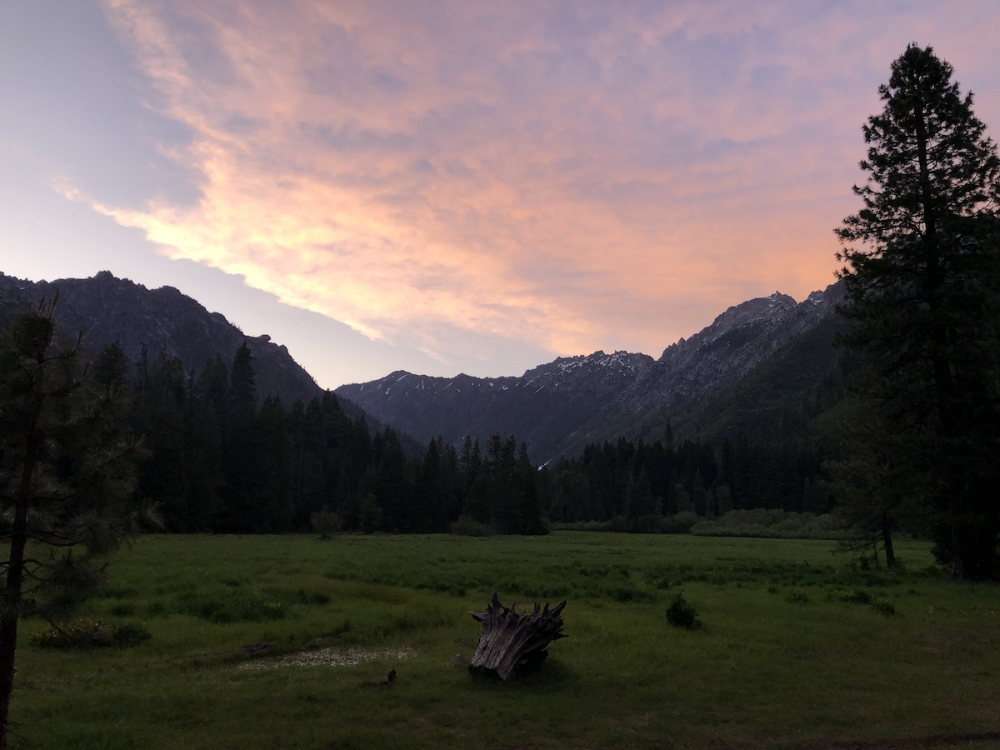
  <figcaption>Sunset at Morris Meadow.</figcaption>
</figure>

## Day 3 - Back home

I slept in again on the second morning. I only had about nine miles back to the car, and they were all downhill.

I had breakfast and broke down camp, before heading down around 9AM. The hike down was nice and cool. Since I had already stopped to take pictures on the way up, it was also fast. I was at my car around noon and headed into Weaverville for a pizza.

<figure>
  
  <figcaption>Views of Trinity Lake on the way home.</figcaption>
</figure>

## Lessons learned

The trip was a success. The nature was incredibly beautiful, and I finally got a chance to explore a new area of Northern California.

How about the experiments?

**Going stoveless**. This worked out better than I had expected. Especially since it was hot outside, I didn't miss warm food at all. Cold soaking was very convenient, and I will most likely hike the JMT without a stove.

**Understanding the rate of consumption of consumables**.

- About 4g sunscreen per application.
- About 2g hand sanitizer per day
- InReach had 50+% battery after the trip

**Going TP-less**. Worked great. Will still bring a few sheets of TP for emergencies, but I fully intend not to be carrying used TP with my food.

**Packing a bear canister**. Worked OK. Weighed a lot and was inconvenient.

**Sleep system**. My inflatable sleeping pad got a leak. I had already not been happy with it from before, so I will try going back to a CCF pad on my next hike to see if that would work better. I like the idea of a CCF pad because it's so simple and bombproof.
