Last weekend I re-hiked a section of the [Tahoe Rim Trail](/trips/tahoe-rim-trail-2018) that I did last year. I described the section in more detail in my [previous posts](/trips/tahoe-rim-trail-2018/kingsbury-south-to-freel-peak/), so I won't go into that much detail about the trail itself here.

I'm preparing to [hike the John Muir Trail](/trips/john-muir-trail-2019) in just two weeks, and this was my last chance to dial in my gear and get some trail miles in. With the big snow year that we've had in 2019, I wanted to pick a section with a bit of snow so I could also verify that my gear worked well in that.

The only significant change to my gear is that I switched from an inflatable NeoAir X-Lite to a Nemo Switchback CCF pad. I couldn't get comfortable on the X-lite because my arms keep falling off the sides. When I got a puncture in it [on my last trip to the Trinity Alps](/blog/2019/06/sapphire-and-emerald-lakes-trinity-alps-video/), I finally decided to go back to a CCF pad.

## Day 1: Van Sickle trailhead to Freel Peak, 14.5 miles

I started driving towards Tahoe at 5AM on Friday to beat the morning traffic. After a breakfast stop, I was in Tahoe a bit after 9. After figuring out parking and slapping on some SPF50, I was on the trail at 10.

<figure>
  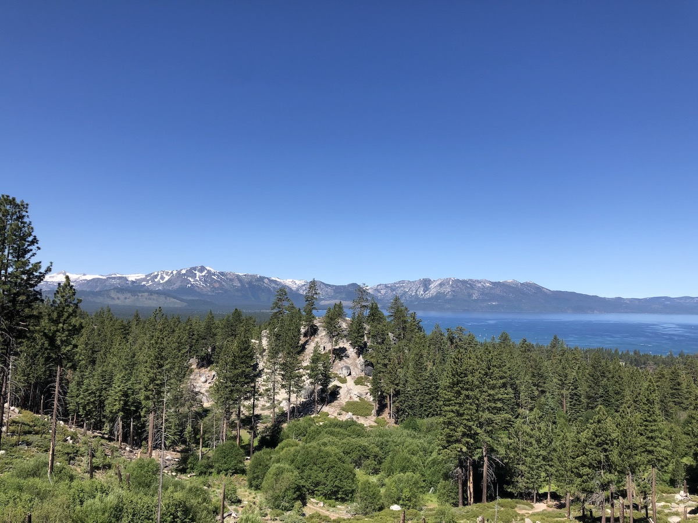
  <figcaption>View of Lake Tahoe from the Van Sickle connector.</figcaption>
</figure>

I hadn't hiked the Van Sickle connector before. It was a beautiful 3-mile hike with expansive views of the lake. As the casinoes disappeared behind me, I joined the TRT and got to enjoy some of my favorite sections of the trail.

<figure>
  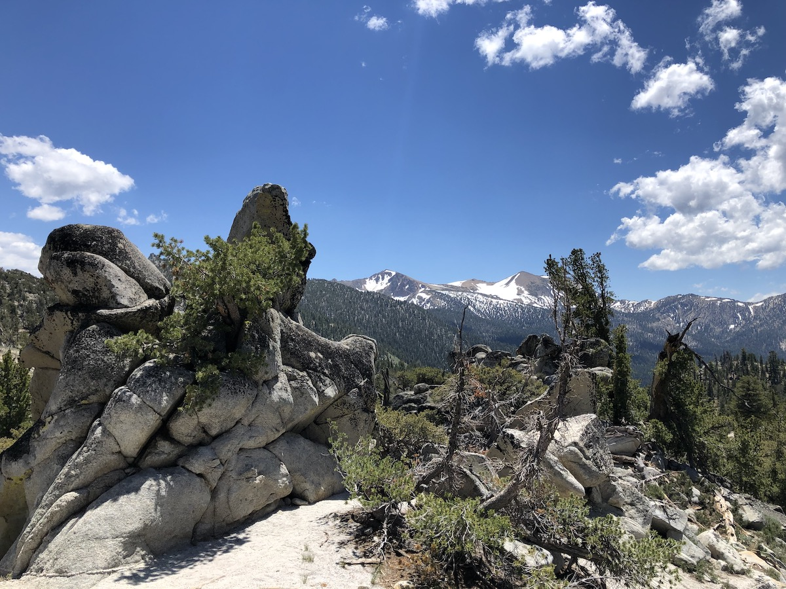
  <figcaption>A rocky cliff with nice views in the background.</figcaption>
</figure>

[On my thru-hike last year](/trips/tahoe-rim-trail-2018/kingsbury-south-to-freel-peak/) I skipped Star Lake as it was getting late and there were a lot of people already camped around it. This time, I was at Star Lake already before 2PM, so I had plenty of time to stop, take a swim, and do some fishing with my Tenkara rod.

The water was crystal clear. I could see the trouts swimming around casually, clearly accustomed to people being around. Sight-fishing was a blast. I tried a few different files. The one that seemed to work best was a black #14 Perdigon nymph with a silver bead. Any time it plopped in the water, the trout just swarmed it.

<figure>
  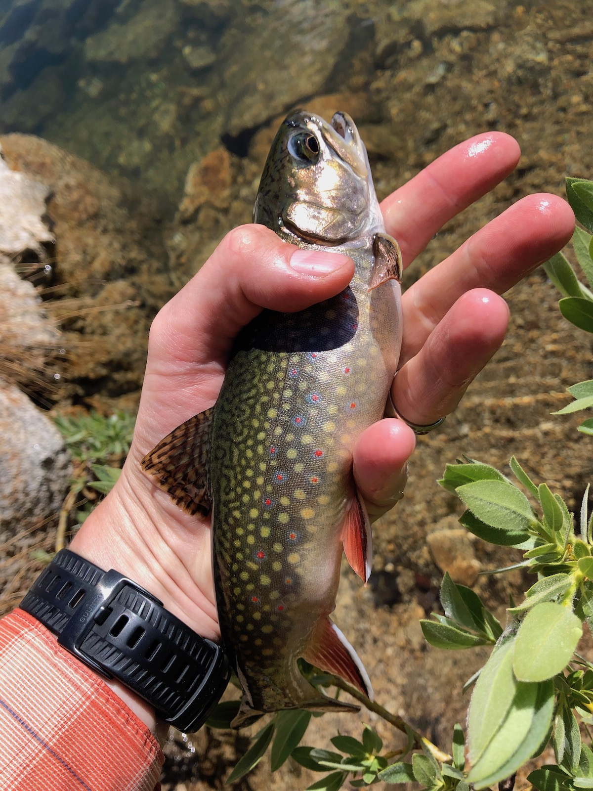
  <figcaption>A beautiful brook trout I caught in Star Lake.</figcaption>
</figure>

<figure>
  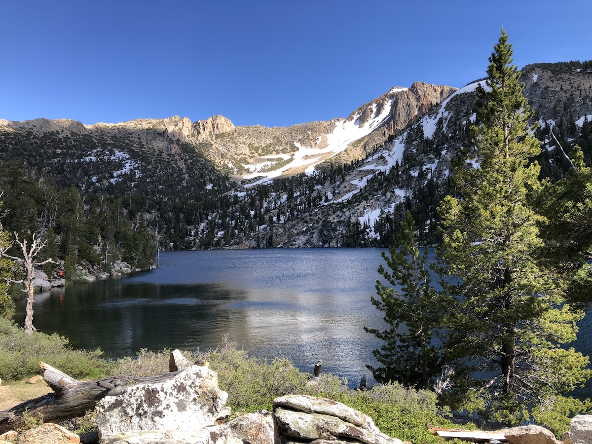
  <figcaption>Star Lake.</figcaption>
</figure>

After spending a few hours at the lake, I continued on to find a campsite. I wanted to get away from the lake to avoid mosquitoes and get a bit of solitude.

<figure>
  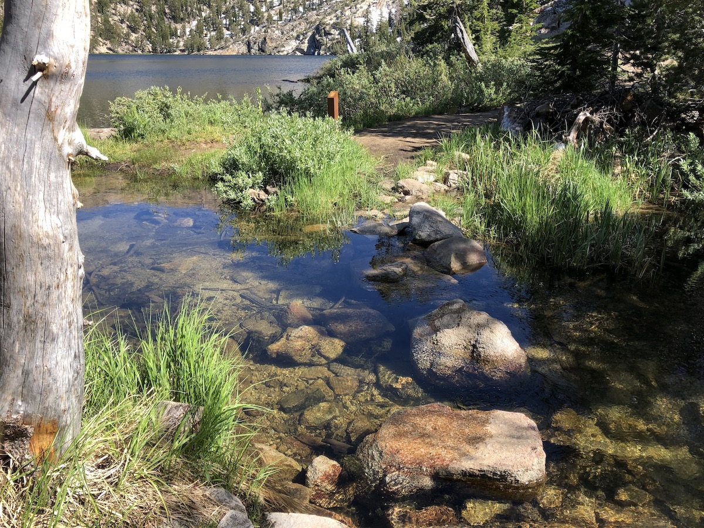
  <figcaption>The Star Lake outlet was easy to get across.</figcaption>
</figure>

The outlet was easy to cross with dry feet on the stepping stones. The trail had been dry and clear of snow up until Star Lake, but immediately after it, I stared encountering lingering snowdrifts. They were small and easy to navigate.

The only snowdrift that was a bit sketchy was a snow bridge over a small stream. I kicked it to check if it held – it promptly collapsed. I then stepped over the collapsed part and continued on.

<figure>
  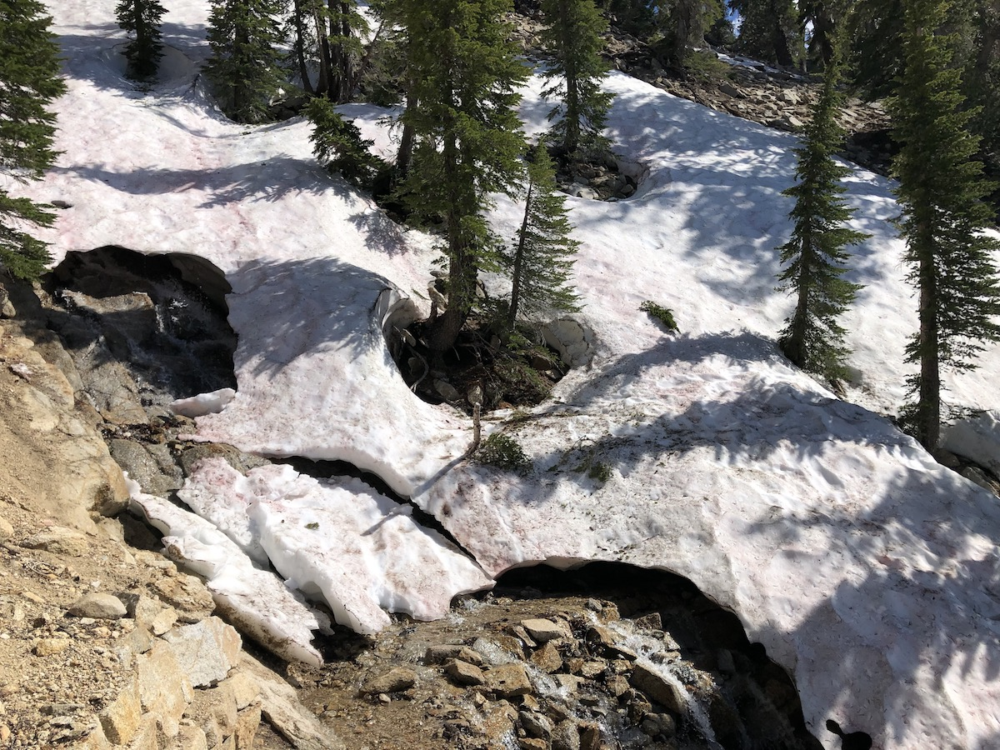
  <figcaption>A collapsed snow bridge a bit after Star Lake.</figcaption>
</figure>

I set up camp just below Freel Peak and enjoyed the exquisite views of the lake as the sun was setting.

<figure>
  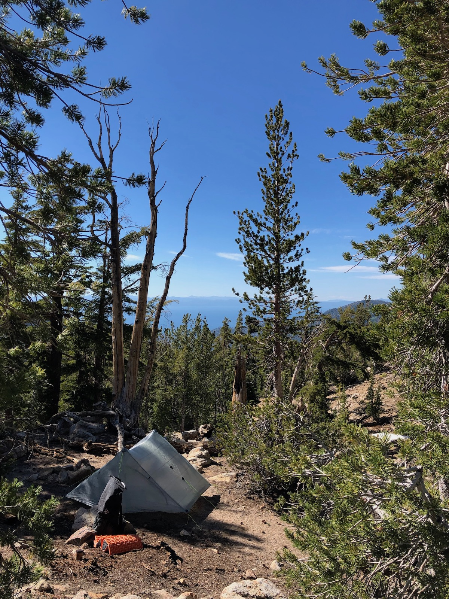
  <figcaption>Tent site for the first night.</figcaption>
</figure>

<figure class="full-width">
  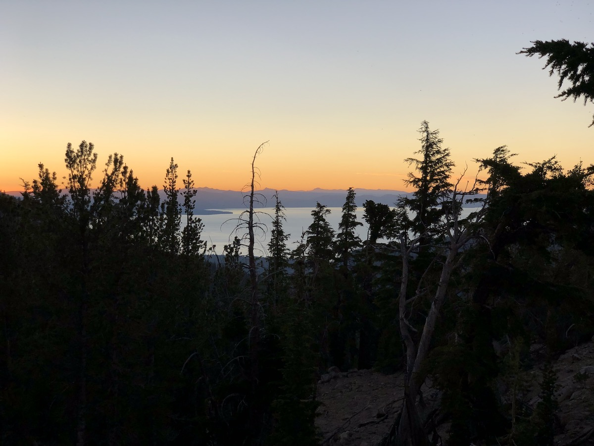
  <figcaption>Sunset over Lake Tahoe.</figcaption>
</figure>

## Day 2: Freel Peak to Showers Lake, 22 miles

I was back on the trail before 7. My campsite didn't have morning sun, so I just packed up quickly and hiked up a half mile for some morning sun with my breakfast.

There were more significant patches of snow as I climbed closer to the peak, some maybe 100 yards or so across. However, they were easy enough to navigate, and the snow was nice and compact.

<figure>
  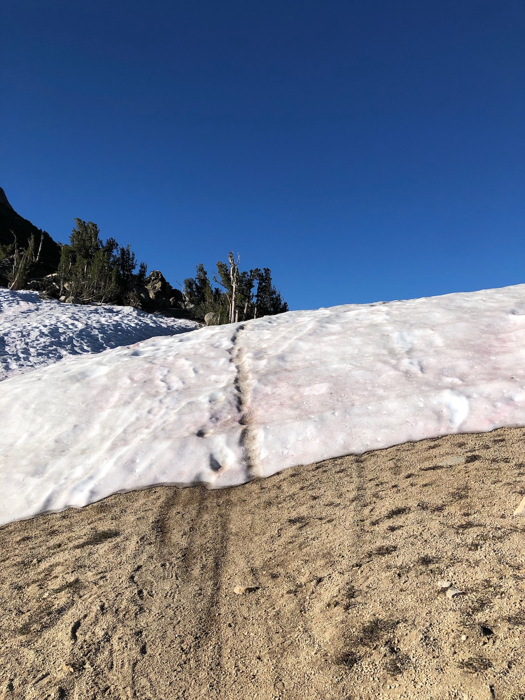
  <figcaption>Snow drifts below Freel Peak.</figcaption>
</figure>

I stopped for breakfast at the top of the climb and had a quick chat with a TRT thru-hiker that came up just as I was heading off.

The snow vanished after Freel Peak, and it was a smooth descent to Armstrong pass. Between Armstrong and Big Meadows, there were a few small patches of snow here and there, never more than a few feet.

I met a hiker just before Freel Meadows who said he had seen two bears on the meadow. Sadly they were gone by the time I got there.

<figure>
  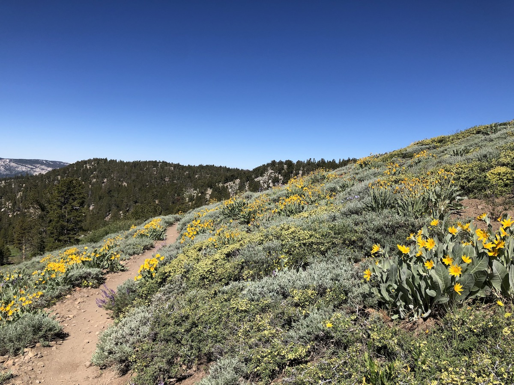
  <figcaption>Wildflowers blooming.</figcaption>
</figure>

I took a quick pit stop at the Big Meadows trailhead and then continued climbing up towards Round Lake. The climb was a lot longer than I remembered. Round Lake was packed with campers, so I didn't spend too much time there. Instead, I continued South toward the PCT junction.

<figure class="full-width">
  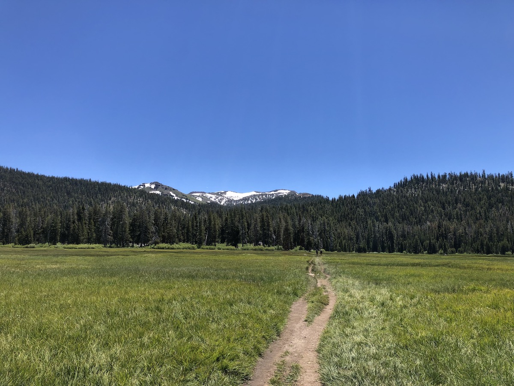
  <figcaption>Big Meadow.</figcaption>
</figure>

After joining the PCT and starting to hike North, I hit the first creek crossing where I couldn't avoid getting my feet wet. I waded through with my trail runners.

From there on, the trail became increasingly wet, muddy, and snow-covered. Since my feet were already wet, it didn't make much difference, I just plowed through.

<figure>
  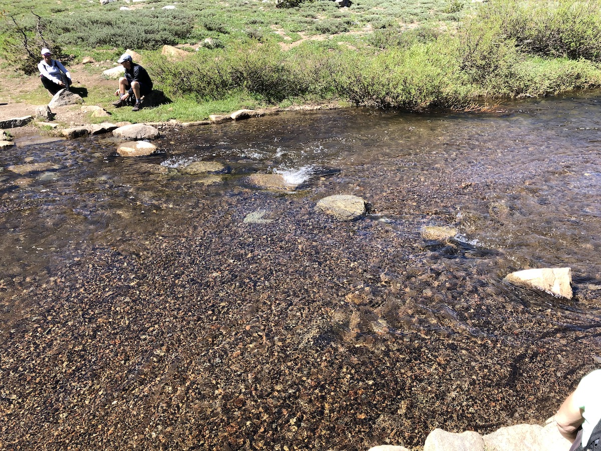
  <figcaption>Upper Truckee was still running high and required fording.</figcaption>
</figure>

Day 2 had been much longer than the first day, so I was happy to lay out my sleeping pad on the rocks overlooking the lake and take a little siesta there before dinner.

## Day 3: Showers Lake to Echo Summit, 8 miles

I woke up to something sniffing around my tent. Groggy, I tried to get the buff I had used to cover my eyes off so I could see what was going on. I yelled HEY, and the intruder backed off with a familiar sound of dog tags. Turns out it was the neighboring tent's dog that was out exploring.

It was 5:30, and I was wide awake. The silver lining was that I got to watch the mountains behind the lake, light up as the sun slowly rose above the trees.

<figure class="full-width">
  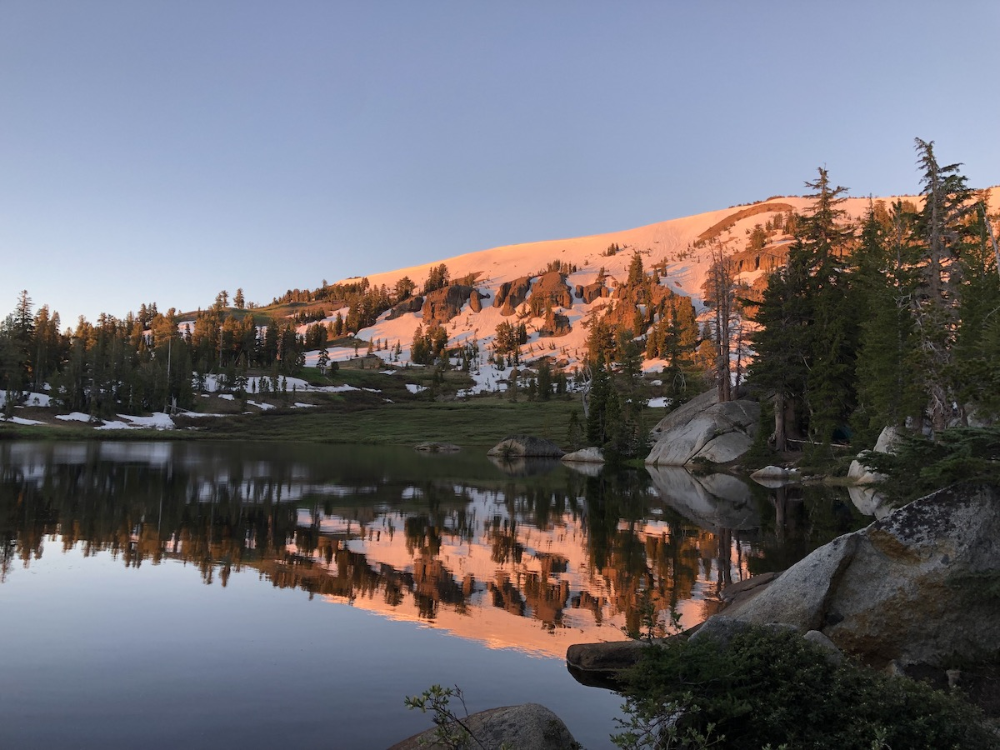
  <figcaption>Showers Lake at sunrise.</figcaption>
</figure>

I only needed to hike 8 miles, and I didn't want to get into town too early, so I took it easy in the morning, heading out of camp around 7.

The amount of snow kept increasing as I climbed out from Showers Lake. There were several hundred-yard snowfields below Little Round Top. They were easy to navigate as there were no trees so I could pretty quickly figure out where the trail was going.

<figure>
  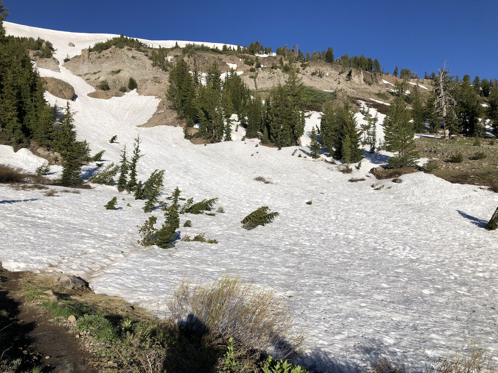
  <figcaption>Snow field under Little Round Top.</figcaption>
</figure>

After the trail entered the forest, around mile 113 (CW), the snow became deeper and the navigation more difficult. For the next 4 miles, the trail was mostly covered in 2-10 feet of snow and dense forest which made pathfinding more difficult.

In most parts, it was easy enough to follow tracks made by PCT hikers, but I did manage to wander off trail a few times. At one point, just as I found the path, I ran into two PCT hikers that had lost the trail as well, and we continued on together for a while.

<figure>
  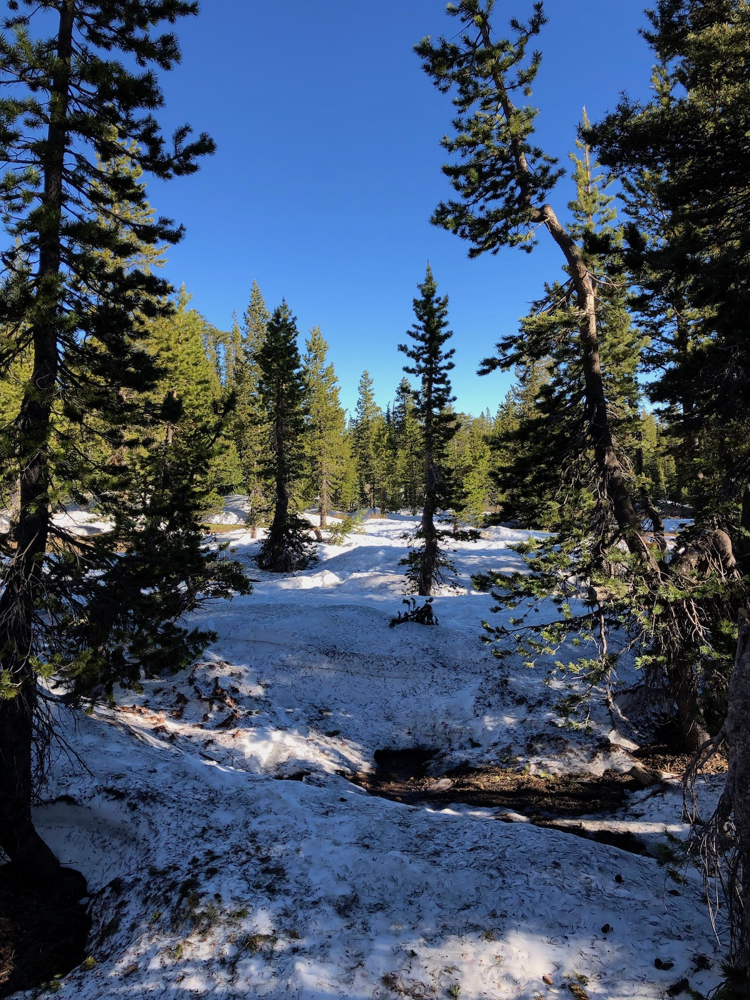
  <figcaption>Snow drifts in the forest.</figcaption>
</figure>

As the trail started descending towards Echo Summit, the snow eased off, and I took a break overlooking the lake. I was really starting to enjoy the CCF pad and the fact that I could use it to lay down anywhere for a break comfortably. I

<figure>
  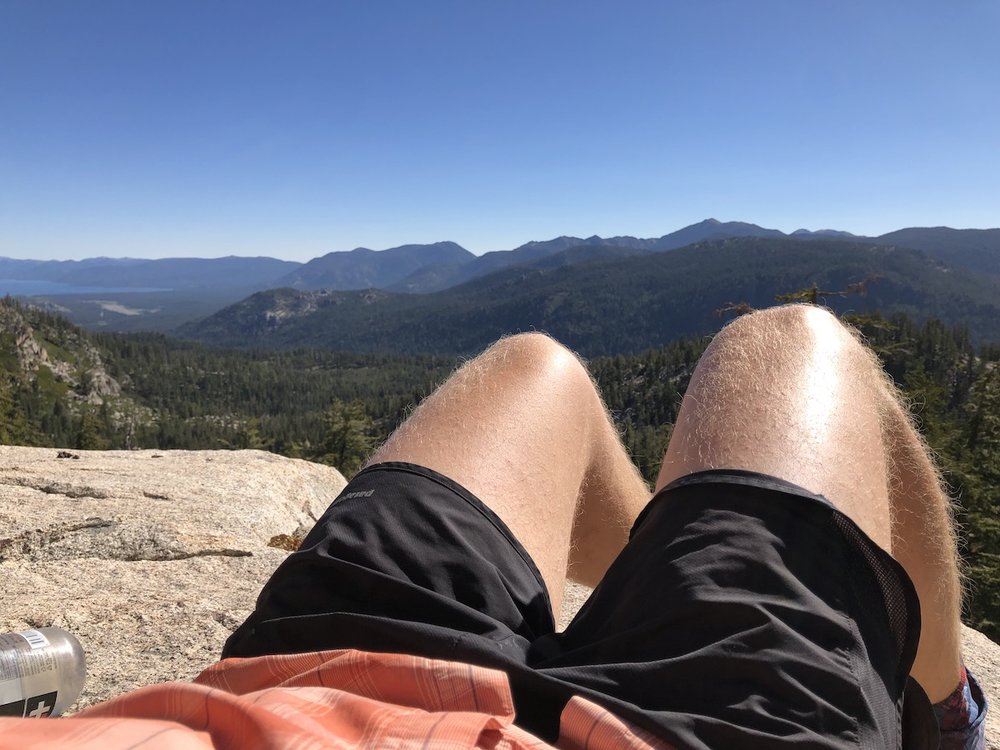
  <figcaption>Enjoying lake views.</figcaption>
</figure>

Just before getting to the trailhead, I met two day-hikers and chatted with them for a while. We met the PCT hikers as well, and the day hikers were kind enough to give the three of us a ride back down to South Lake Tahoe.

## Summary

Overall, this was a great little weekend trip. My gear worked well, and I was happy about the switch to the CCF pad. I slept better on it, and it made breaks luxurious. The only adjustment I will make to my final JMT gear is to bring my stove. I will still cold soak most of my meals, but I want to have the option of cooking fish, enjoying a warm coffee, or using it to make warm water bottles if I get wet and need to warm up.
