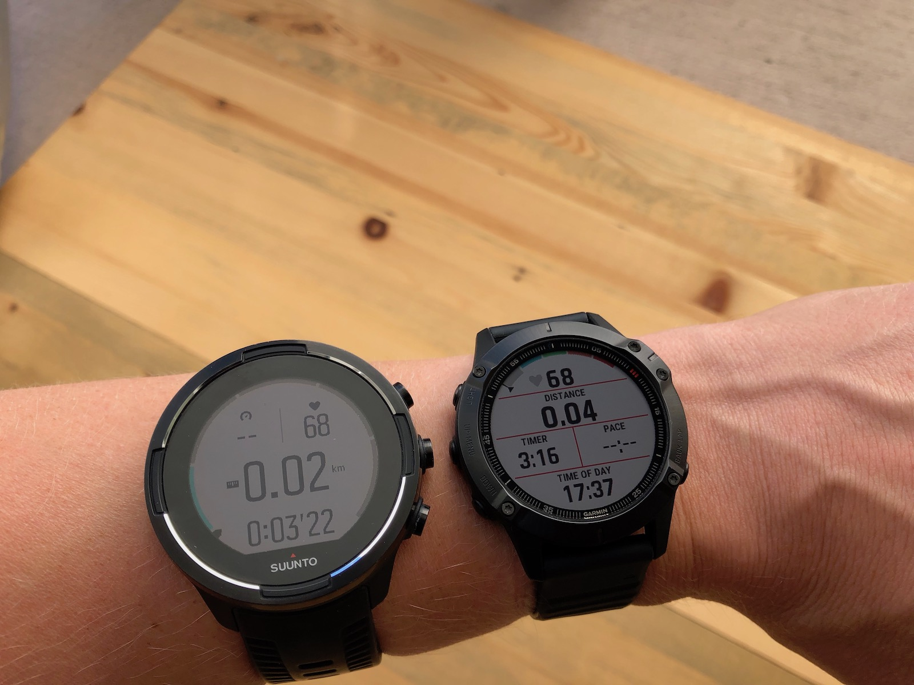
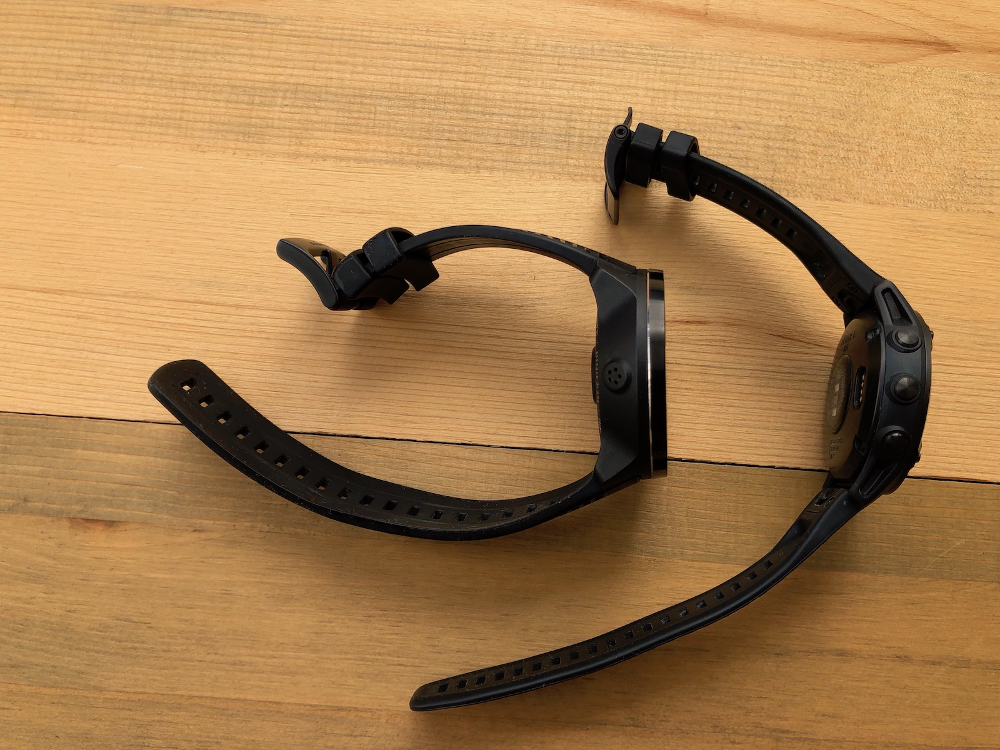
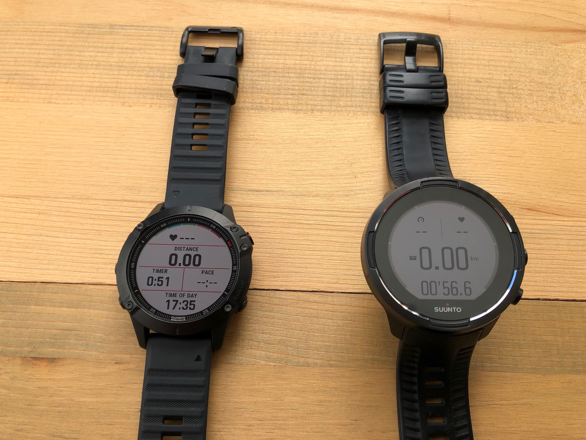
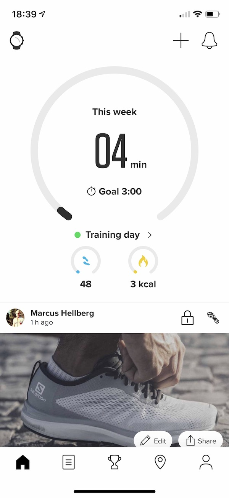

I've been trying to find a good hiking watch for a long time. When [Apple Watch 4](https://amzn.to/34okU2l) came out with its improved sensors, I wanted to see how well it would work as a GPS watch. The watch and software were leaps and bounds ahead of the competition, but it didn't work well for what I needed it. The hiking view offered minimal useful info, not even altitude. The battery only lasted for a few hours of activity, making it less than ideal for long-distance hiking.

As I was giving up on the Apple Watch, Garmin launched a new GPS watch that looked promising: [Garmin Instinct](https://amzn.to/34rkZlK). It looked kind of dorky, like a 80s Casio, but the specs looked really promising. Long battery life, rugged, and tons of customizable data screens. Once I got over the lo-fi display, I really liked the watch. I could have all the data I needed right at my fingertips. But the watch had some issues. First, the GPS and heart rate sensors were not reliable. Second, the "military grade" construction wasn't living up to it's promise – the strap broke after only two months of light use.

Frustrated, I continued looking for a new watch. Essentially, my options were the [Garmin Fenix 5](https://amzn.to/2Q2gSJA) or the [Suunto 9](https://amzn.to/2zZLRey). After my problems with the previous Garmin, I decided to go with the Suunto. At almost 600 dollars, it was significantly more expensive than the Instinct. I hoped it could live up to my expectations.

The build qulity of the Suunto was amazing compared to the Instinct. The software looked beautiful. Although I ended up using the Suunto 9 for over seven months, there were several things that kept me from being completely satisfied with it. So when Garmin launched the [Fenix 6](https://amzn.to/34u2kpp), I decided to give it a try. The specs sounded exactly like what I was looking for.

Is the Fenix 6 better than the Suunto 9? Yes. So. Much. Better. Read my comparison below to see why I think the Fenix 6 blows the Suunto 9 out of the water.

## Is this a product review?

No. There are already several extremely in-depth reviews out there that cover the devices in much more detail than I would ever have patience for.

So, if you're not familiar with the devices from before, head on over to the links below for an overview. Then come back here to see how they compare to each other.

- [Garmin Fenix 6 review](https://www.dcrainmaker.com/2019/08/garmin-fenix6-pro-solar-series-review.html)
- [Suunto 9 review](https://www.outsideonline.com/2373261/long-term-review-suunto-9-baro)

## Compared models

In this post, I'm comparing the Suunto 9 Baro model with the Fenix 6 Pro.

There is a mindboggling array of different Fenix models, so I'll try to point out if some of my comments aren't applicable to a specific model.

I'm not going to spend time discussing the Suunto 9 base model without a barometer, as it's not well suited for hiking.

## Build quality, looks, and first impressions

<figure>
  
  <figcaption>Size comparison of the Fenix 6 and Suunto 9.</figcaption>
</figure>

The Suunto 9 is an impressive watch. It's clearly well constructed out of quality materials. Everything feels solid and rugged. The buttons have a smooth action.

In contrast, the Fenix 6 feels a bit cheap and flimsy. Everything on the watch is functional, but looks have clearly been an afterthought. The buttons stick a bit and have an awkward click when you press them.

**Winner:** Suunto 9

## Comfort and fit

The Suunto 9 is a massive watch, there's no getting around that. It's both wide and tall, which makes it awkward at times. It catches on sleeves and backpack straps. You need to wear it half-way up your arm for the heart rate sensor to get a decent contact with your skin.

The Fenix 6 is more slender. It comes in three sizes: 6S, 6, and 6X, in growing order. The 6X is closest in size to the Suunto 9.

The straps on the Fenix 6 are hinged instead of solid rubber, wich make for a more snug fit around your wrist. This means it's able to get a good heart rate reading while you're wearing your watch like a normal human being.

**Winner:** Fenix 6

<figure>
  
  <figcaption>The Suunto 9 is bulkier than the Fenix 6.</figcaption>
</figure>

## Screen

Both watches come with LCD screens that are optimized for outdoor visibility and low battery consumption. They are nowhere as impressive as something like the Apple Watch, but then again they come with 10+ days of battery life instead of 1 day.

That said, the screen on the Fenix 6 is clearly better than the one on the Suunto 9. Its crisper and more legible without the backlight on. It looks like Garmin took the same high-contrast display they used on the Instinct and improved the resolution of it. The screen on the Suunto 9 is not as easy to read, especially in low light.

Suunto chose to put a touch screen on the Suunto 9, which I think was a bad call. It's slow to respond, and makes the watch difficult to use when wet. Garmin decided wisely to go with a button-only user interface which works reliably in all conditions.

**Winner:** Fenix 6

<figure>
  
  <figcaption>The screen on the Fenix 6 is easier to read in sunlight.</figcaption>
</figure>

## Battery life

The Suunto 9 has an impressive battery life. With the longest tracking interval, it promises up to 120 hours of tracking time. It fills in the blanks between the points by using the compass and barometer, so you end up with surprisingly accurate results.

For most people, the almost 30 hours you get from with the best tracking accuracy is more than enough. It easily lasts two days of all-day thru-hiking.

The Fenix 6 has clearly borrowed the idea of battery mode options from Suunto. It too offers customizable modes that you can change during the activity if needed. You get 30+ hours of tracking with the GPS on best accuracy and heart rate monitoring turned on.

Both watches offer multiple days of heavy use tracking, so in my use they are more or less tied.

**Winner:** Suunto 9

## Sensors and accuracy

The Suunto 9 watch has good GPS and decent altimeter accuracy. But the heart rate sensor is not very good. It works fine while you're not working out, but once you use it for its intended use, things start to go bad. The only activity that worked well for me was running. Other activities, like hiking, cycling or strenght training would give me wildly inaccurate results.

Suunto [recommends](https://www.suunto.com/en-us/Content-pages/what-should-you-know-about-wrist-heart-rate2/) that you wear the watch two finger-widths above your wrist bone for best results. Having the watch that high up on the arm both feels weird, and is impractical as rides down when you start sweating – especially when riding a bike. It means that the Suunto 9 HR monitor is mostly useless while you're working out.

The GPS accuracy on the Fenix 6 has been good based on my initial obsercations. It seems to handle even wooded areas with good accuracy. The altimeter automatically calibrates both based on GPS and the built in topographic maps (on Pro versions) during the activity, which has given me the most accurate altitude readings of any watch I've ever owned.

Equally, the Fenix 6 heart rate monitor has surprised me positively. I can wear the watch as normal, and it works reliably in every activity I've tried.

In addition to heart rate monitoring, the Fenix also measures pulse oxygen saturation. You can either measure manually, or turn on periodic measurements throughout the day for a small battery penalty. Knowing your blood oxygen saturation can be helpful in understanding how well adapted you are to altitude.

**Winner:** Fenix 6.

## Watch software

The interface on the Suunto 9 is very barebones. You have limited options when it comes to configuring data on the watch face or information you want to access in the menu. The menu is clunky and not very intuitive. Navigations, especially using the touch screen, are slow.

The Fenix 6 is almost the complete opposite. You can configure anything and everything on the watch. There are tons of watch face options, ways to configure widgets and data you want to have quick access to. The menus and widgets on the Fenix are much more responsive than on the Suunto, making it more enjoyable to use.

On the Suunto watch, you need to configure activity displays ahead of time on the phone app, whereas the Garmin lets you modify them right on the watch, even during an activity.

The activity screens on the Fenix are more customizable than on the Suunto. You have access to many more sources of data, and you can add as many or few dispays as you want.

The Fenix receives updates automatically to the device and updates itself, whereas the Suunto requires a computer connection.

**Winner:** Fenix 6.

## Phone and computer software

Suunto has two apps for phones, an older Movescount app and a newer Suunto app. The Suunto app has a slick design, but lacks many (most) of the features in the older app. A lot of data are not available on the app. For instance, you get a sleep summary on the watch after each night, but on the phone you can only get information on how long you slept.

<figure class="half-width">
  
  <figcaption>The Suunto app on an iPhone.</figcaption>
</figure>

The connection between the Suunto app and the watch is flaky. You have to open the app to sync any activities, and often the app refuses to connect to the watch. Sometimes, it's enough to force-quit the phone app. Other times, you need to go to the watch an turn airplane mode off and back on for it to start working.

Suunto has 3-4 different web sites that for some reason don't share login details. You need to create several different logins and sometimes it's really not obvious which one you should be logging in with.

<figure class="half-width">
  
  <figcaption>The Garmin Connect app on an iPhone.</figcaption>
</figure>

The Garmin Connect app is clearly an engineer-designed app. It's ugly, but it works and gives you access to more data and insights than you know what to do with. The app syncs activities almost instantaneously and connects to several third-party apps so you can get access to all your relevant fitness data in one place.

Both apps export activities to Strava which is a must-have.

**Winner:** Fenix 6.

## User experience

Although this has mostly to do with software, which I covered above, I wanted to bring up the general user experience of the watch as a separate topic as I think this is where Suunto failed.

If I had to guess, I would say that the one single biggest difference between the two watches is that Garmin has listened to their users and built a watch that fulfills their needs while Suunto has designed a watch they themselves think is good.

A couple trivial, but telling examples:

When you travel, the Fenix updates its time and location info immediately when you get a cell signal and the app figures out where you are.

In contrast, with the Suunto watch, you have to first scroll through settings menus to find the right time zone, and then spend 5 minutes outside to get a GPS signal if you want to get location-specific data like sunrise and sunset times.

Speaking of sunsets: the Suunto has a watch face where you can see the sunset time. The problem is that once the sun goes down, it tells you when it will set tomorrow. If I'm sitting in a dark tent in the wilderness, I'm more interested in knowing when the sun goes up, than when it will set again tomorrow. Garmin has clearly listened to their users, as their watch face switches between sunrise and sunset times depending on which one is up next.

Another quite mind-boggling omission on the Suunto is that there's no way of turning off the watch except to wait for the battery to run out. On the Fenix, it's available as a menu option. This means that if you want to take off the Suunto, and don't want your house to turn into an EDM club from the heart rate monitor's green LEDs, you need to figure out how to turn off the 24/7 HR tracking instead.

**Winner:** Fenix 6.

## Conclusion: which one is better?

|                             | Fenix 6 | Suunto 9 |
| --------------------------- | ------- | -------- |
| Build quality               |         | ✔️       |
| Comfort and fit             | ✔️      |          |
| Screen                      | ✔️      |          |
| Battery life                |         | ✔️       |
| Sensor accuracy             | ✔️      |          |
| Watch software              | ✔️      |          |
| Phone and computer software | ✔️      |          |
| User experience             | ✔️      |          |

The [Fenix 6](https://amzn.to/34u2kpp) is the clear winner for me. It has accurate sensors, a crisp screen, and is highly customizable. It comes with a reliable companion app on the phone.

The [Suunto 9](https://amzn.to/2zZLRey) is good-looking and well-constructed, but it's let down by it's poor software. Both the watch software and the phone app are very barebones and lack seemingly obvious features. Suunto could narrow this race significantly by improving their software.

<small>**Note:** I have purchased both watches myself and have not been paid to promote either. This post contains Amazon affiliate links to the products mentioned. Purchases made through them will help support this site at no cost to you.</small>
