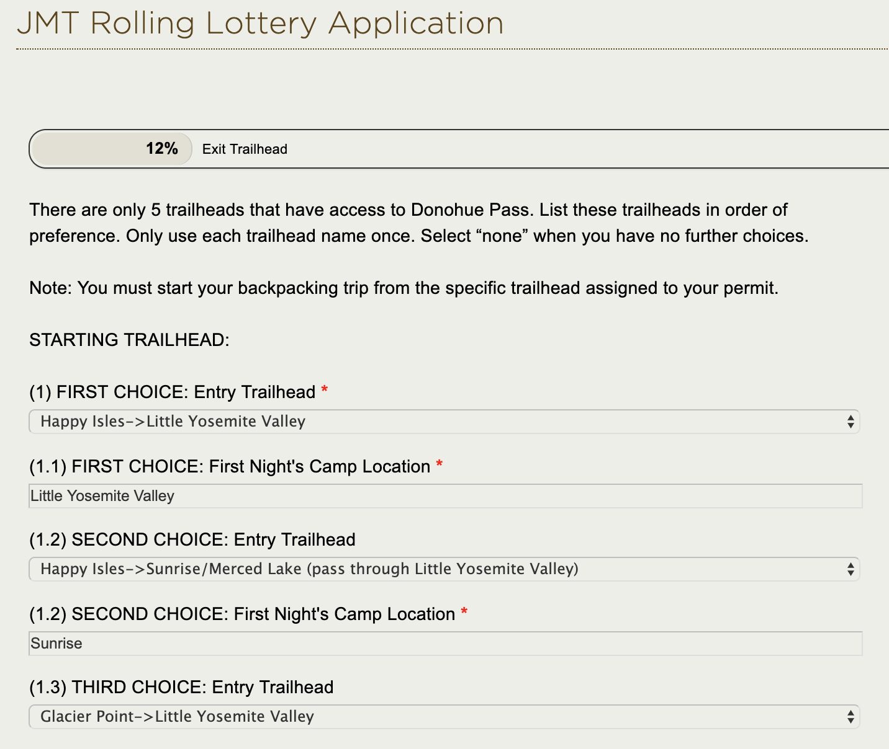
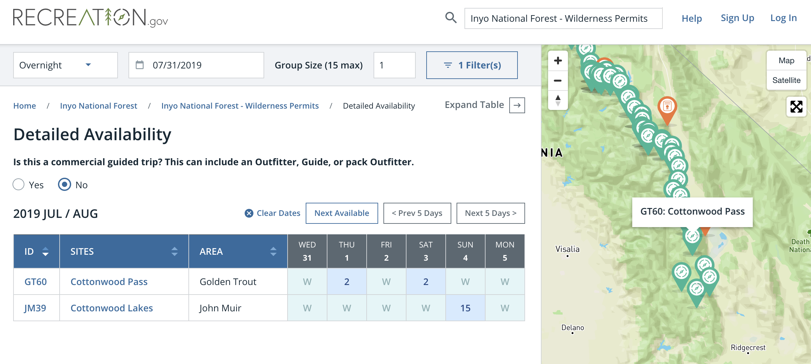

I've wanted to hike the John Muir Trail for years. Ever since I first saw a documentary about a group of friends hiking the trail, I knew I wanted to experience it myself one day. After completing the [Tahoe Rim Trail](/trips/tahoe-rim-trail-2018), I decided I wanted to attempt the JMT as my next big trip.

Turns out that one of the biggest challenges of hiking the JMT comes months before the actual hike: getting permits to hike the trail.

## NOBO or SOBO?

Most people prefer to hike the JMT South-bound (SOBO). This allows you to start at the lowest elevation and acclimatize both your lungs and legs as you tackle increasingly higher passes until you finally top Mt. Whitney. Because most hikers are trying to get a permit out of Yosemite, this is the most challenging permit to obtain.

Going North-bound (NOBO) is more manageable from a permitting standpoint. It requires you to start at a trailhead South of Mt. Whitney, most often Cottonwood Pass, which adds approximately 20 miles to the hike. In addition to the extra miles, going NOBO requires you to go from zero to Mt. Whitney in 2 days, all while carrying the heaviest resupply of the trip.

## JMT permit strategy

After researching my options, I decided on a 3-step strategy to maximize my chances of getting to experience the trail in 2019:

1. [Apply for the SOBO permit lottery out of Yosemite](https://www.yosemiteconservancy.org/jmt-rolling-lottery-application)
2. [Get a NOBO permit from the Cottonwood Pass Trailhead](https://www.recreation.gov/) as a backup
3. Obsessively check the [Yosemite Trailhead Report](https://www.nps.gov/yose/planyourvisit/fulltrailheads.htm#donohue) for cancellations.

## 1. Yosemite JMT permit lottery

The permit lottery process for the JMT allows you to enter the drawing for up to 21 days at a time. You will get an email every day letting you know if you got a permit or not. This process is purely based on luck. Most people will NOT get a permit this way, at least not on the first try. But you never know, it's always worth a shot.

To enter, head over to [the Yosemite Conservancy JMT Rolling Lottery Application](https://www.yosemiteconservancy.org/jmt-rolling-lottery-application) and fill in:

1. Your start trailheads in order of preference
2. Your exit trailhead
3. The earliest and latest dates that work for you (21 days max)
4. Trip length
5. Group size: ideal and minimum acceptable
6. Do you want a Half Dome permit?
7. Your personal info

## 2. NOBO permit through recreation.gov

As mentioned, it's much easier to get a NOBO permit. Once I had my lottery application in, I headed to [recreation.org](https://www.recreation.gov/) for a NOBO permit.

If you don't mind the challenge of a NOBO journey, this is the way to go. If you are at all flexible with your dates, you are almost guaranteed to get a permit this way.

On the site, search for "Inyo National Forest - Wilderness Permits," then select your start date and that you are not planning a commercial trip.

Use the filter function to search for "Cottonwood," and you should see something like this:

Both trailheads are roughly 20 miles from Crabtree, so either one is fine.

The only slight hassle of getting an Inyo wilderness permit is that you need to supply an itinerary. So spend a bit of time figuring out roughly where you'll be camping before starting the process. As far as I know, they use this info to check that you have a rough idea of what you're doing, and you will not be bound to follow the itinerary.

With my NOBO permit secured, it was time to enter the third and final phase: checking the Yosemite Trailhead Report for cancellations.

## 3. Find cancellations on the Yosemite Trailhead Report page

Because it's so hard to get SOBO permits, many people enter the lottery just in case and then realize they can't make it. Others fail to recognize that you have two weeks to pay for your permit after winning the lottery to confirm your permit.

In either case, there are always cancellations that pop up on the [Yosemite Trailhead Report](https://www.nps.gov/yose/planyourvisit/fulltrailheads.htm#donohue) page.

Make this page your browser start page or set a reminder to check it a couple of times a day. Once you see there's an opening for a date you're interested in, call the Yosemite Permit office at 209-372-0740 and hope you're the first one to call. You will have the option to pick up a Half Dome permit if the trailhead allows for it.

## Success!

After just over a week I found a cancellation for a SOBO permit and managed to get it. This meant I could cancel the backup NOBO permit and start planning my trip for real!
