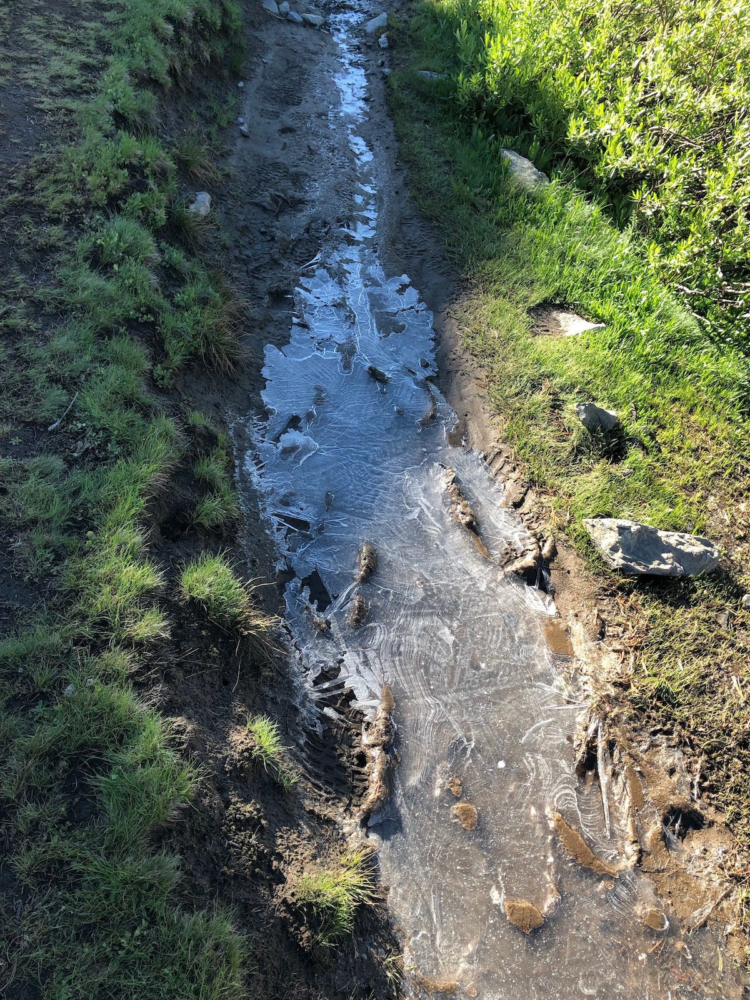
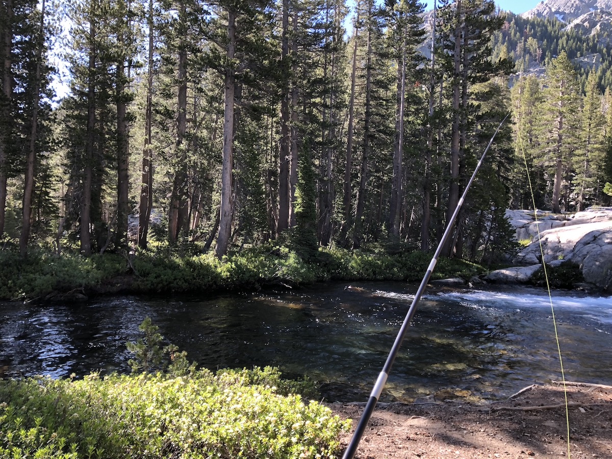
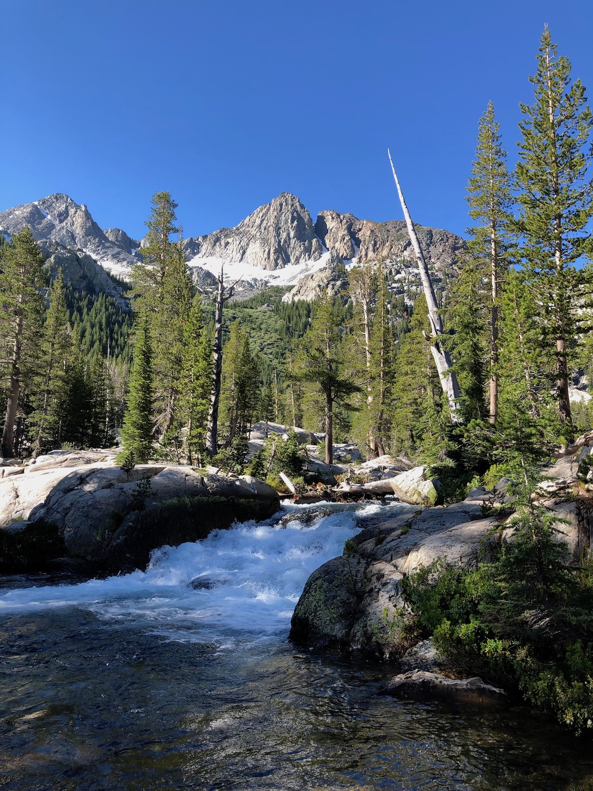
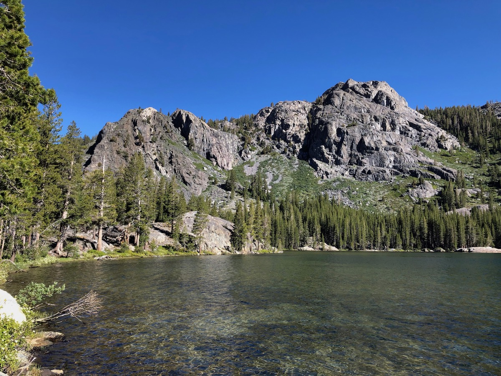
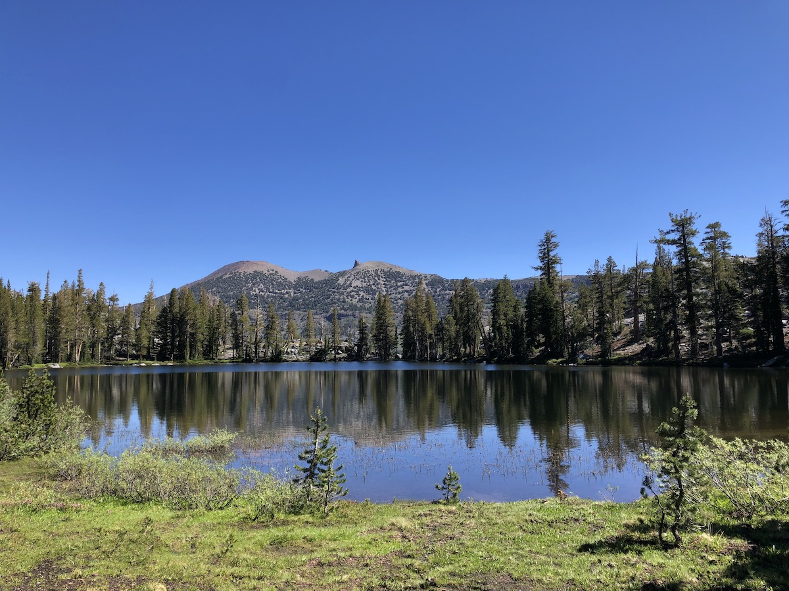
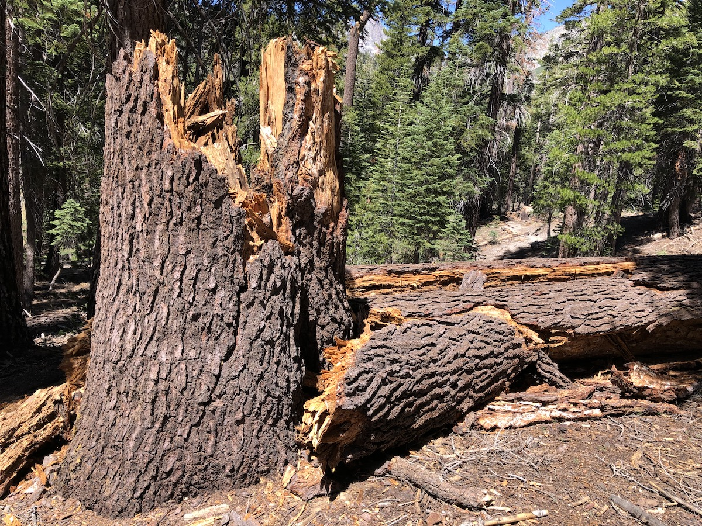
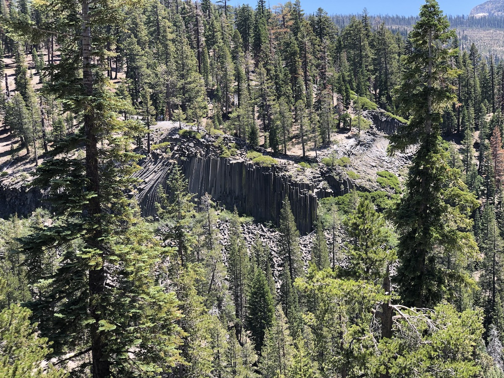
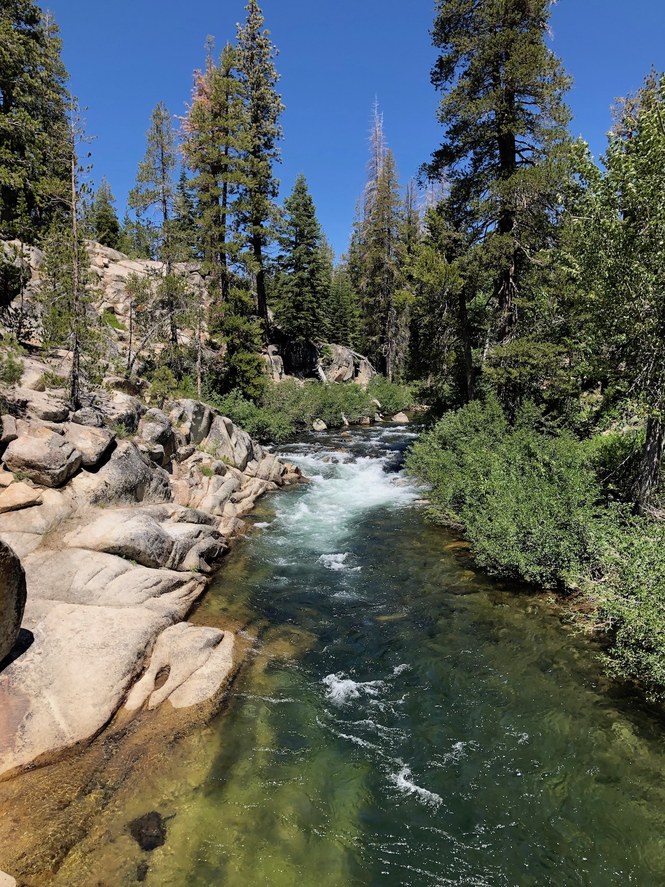
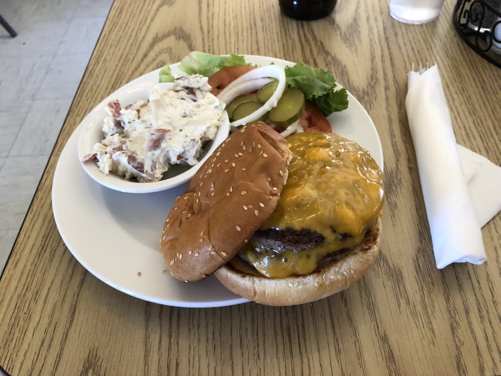

**Day 5 – 15 miles, 1830 ft ascent.**

It was much warmer than the night before, but I still slept cold. I could feel the cold radiate through my sleeping pad. I think that the shady place I camped at must have held snow until very recently and that the ground was still cold.

I climbed quietly through the campsite right outside the camping restriction zone as I got on my way. The camp had grown from four tents to more than ten over the night.

The morning was wind still, and the sun was already hitting the trail when I started climbing up from the lake. The path was still frozen in some places after the cold night. There were a couple of small stretches of snow, but the snow was still firm and easy to traverse.

<figure>
 
 <figcaption>A frosty trail after a cold night.</figcaption>
</figure>

I stopped to fish a promising looking pool in Shadow Creek. I caught a small brookie before I realized that it was wedged in between two waterfalls, so it was unlikely that it would hold a lot of fish.

<figure>
 
 <figcaption>Fishing a promising looking hole.</figcaption>
</figure>

<figure>
 
 <figcaption>A waterfall.</figcaption>
</figure>

Shadow Lake had a dam on its Eastern side, and there was no camping allowed around the lake. The trail climbed several hundred feet right after the lake. Fortunately, the trail was in the shade for the entire climb, which made it easy.

<figure class="full-width">
 
 <figcaption>Shadow Lake.</figcaption>
</figure>

Shortly after getting to the top of the climb, I arrived at another, smaller lake. The trail crossed its outlet and rose another couple hundred feet before starting a long and dry descent towards Devil's Postpile and Red's.

<figure>
 
 <figcaption>Gladys Lake.</figcaption>
</figure>

On the way down, there were tons and tons of fallen trees. I would later find out that the widespread damage had been caused by a freak windstorm ten years earlier. Usually, the winds in the Sierra are from the West, and the trees have grown their roots to withstand them. In this storm, the 150+ mph winds were from the East and knocked over thousands of trees.

<figure>
 
 <figcaption>There were lots of fallen trees on the descent to Red's.</figcaption>
</figure>

Before arriving at Devil's Postpile, the trail crossed Minaret Creek, the first wet crossing of the JMT for me. I walked straight through with my trail runners on, as I always do. This amused the hikers that were taking off their shoes for the crossing. They said I would get blisters from walking with wet feet (I didn't get a single blister on the entire trail).

I opted to stay on the actual JMT trail even though it didn't go all the way up to Devil's Postpile. I have visited it up close before, and I wanted to avoid the tourist crowds.

<figure class="full-width">
 
 <figcaption>Devil's postpile in the distance.</figcaption>
</figure>

As I neared Red's, I crossed the San Joaquin River on a bridge and joined a drove of day hikers heading up to the store at Red's.

<figure>
 
 <figcaption>The San Joaquin River before Red's.</figcaption>
</figure>

Once I got to Red's, the first order of business was to get food. I ordered a cheeseburger and a strawberry milkshake. The restaurant didn't serve beer, but they said it was okay to go and buy a beer at the store and drink it at the restaurant. The food was delicious. And the portion was generous, to say the least. I could barely breathe by the time I was done.

<figure>
 
 <figcaption>A well-deserved double cheeseburger at Red's.</figcaption>
</figure>

I went to check out the backpacker's campground where I had planned to stay the night. It was really far from the store and restaurant. It was only 3 pm, so I changed my plan. Instead of staying the night at Red's, I would take the shuttle into Mammoth and spend the night there. I needed to get a belt for my pants and some more fishing gear anyway.

The shuttle cost \$8 for a round-trip and departed from right outside the restaurant. It took me to the Mammoth ski area where I needed to change to another shuttle to get into town. Within Mammoth, there were free shuttles that could take you anywhere within the city.

Once I got a cell signal, I booked myself a decent hotel. I went to the hotel to drop off my stuff and take a shower. I also needed to wash off the worst of the sweat before heading into town.

After taking a shower, I headed into town with my still wet clothes. I went to the local mountaineering store to get a belt. The only belts they had were too wide and expensive. Fortunately, the employee was super helpful and made me a belt out of some nylon webbing and buckles – for a total cost of \$4!

I also hit up a fly fishing store to get some more tippet and flies. I also got good advice on the types of flies that work in different rivers and lakes around the area.

I was still full from my cheeseburger, so I decided just to grab some snacks from the grocery store and go to my hotel room. I fell asleep before 9.
