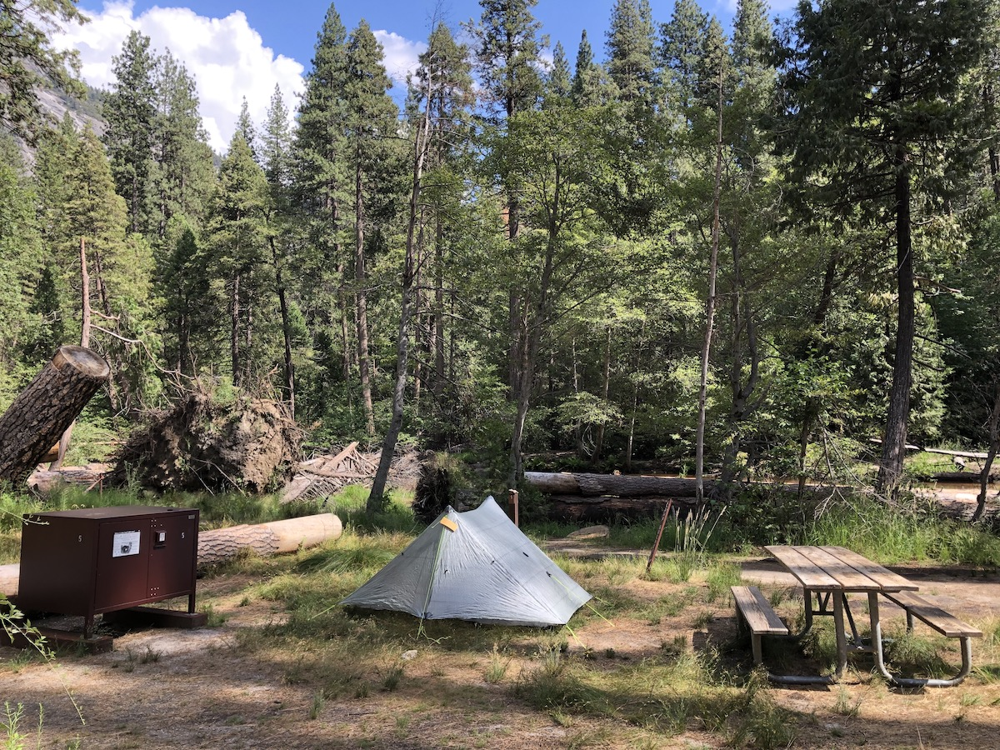
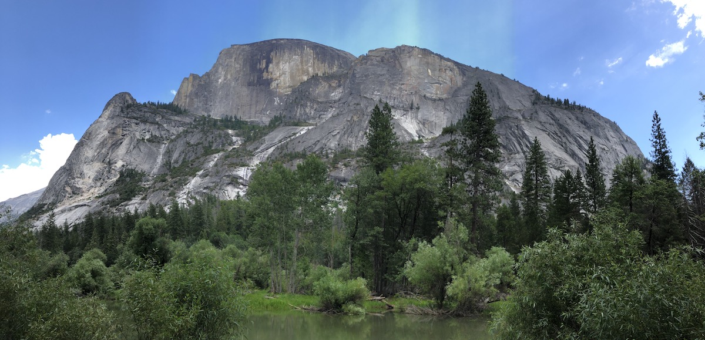
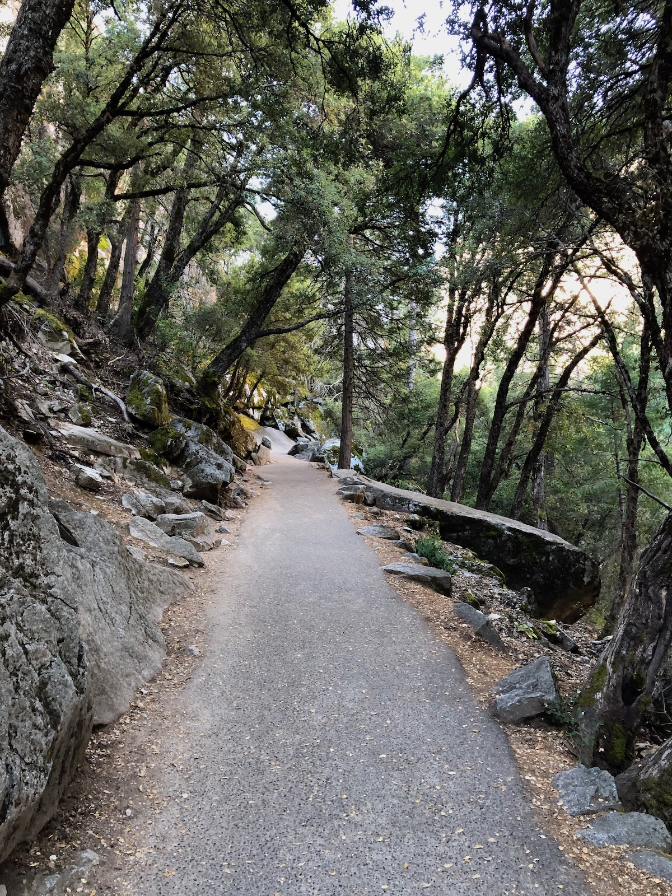
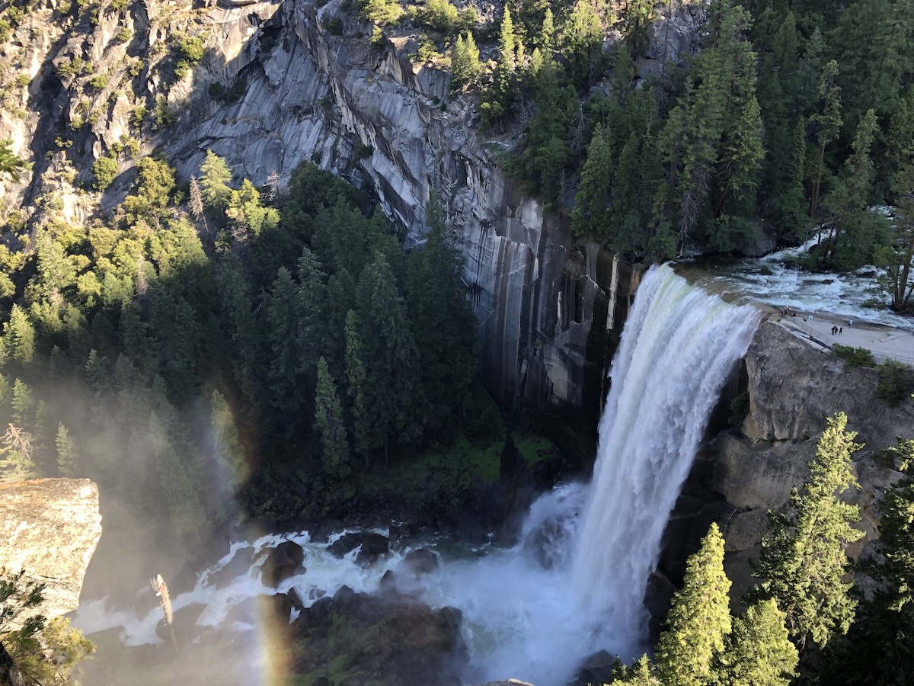
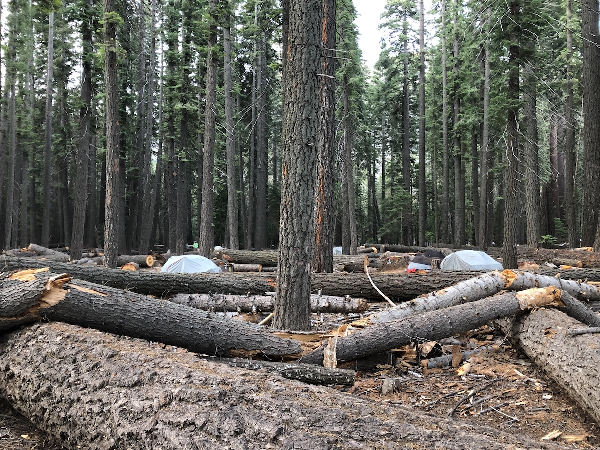
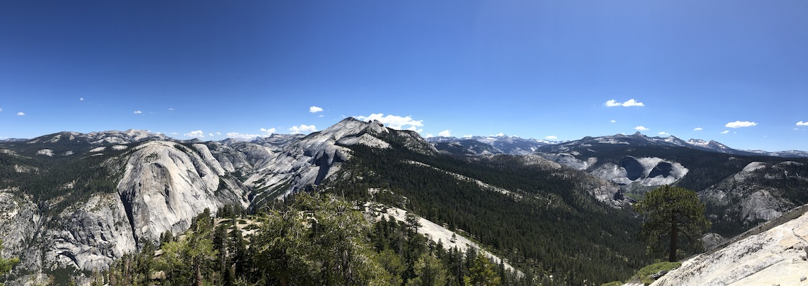
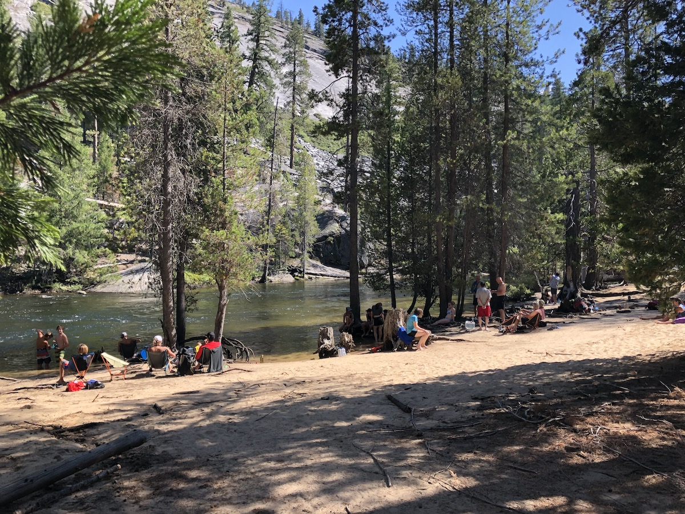

## Getting to the trailhead in Yosemite Valley

I took a train to Merced and then the YARTS bus up to Yosemite Valley. I was happy I wasn't driving, as traffic in the valley was crazy.

<figure>
 
 <figcaption>Yosemite Valley.</figcaption>
</figure>

Once I arrived, I went to pick up my permit and got some lunch. I then went to set up my tent in the backpacker's campground before exploring the valley. The campground was quite big, but only had a few tents when I arrived.

<figure>
 
 <figcaption>Backpackers' Campground.</figcaption>
</figure>

I hiked a short hike up to Mirror Lake. It sprinkled a little, but not enough to deter any of the people swimming in the river.

<figure class="full-width">
 
 <figcaption>Views at Mirror Lake.</figcaption>
</figure>

After checking out Mirror Lake, I headed back into Yosemite Village to get some dinner. I then retreated to the campground. There were now tens of tents set up all over the campsite. I spent some time talking to other hikers before going to bed – excited to get up early the next morning.

## Day 1 – 13 miles, 5280 ft ascent

I woke up with the sun before 6 AM. Most hikers at the Backpackers' Campground were already packing their stuff.

The Happy Isles trailhead was a 15-minute walk from the campground, through drive-in campgrounds.

As I was walking towards the trailhead, I noticed that I hadn't downloaded the topo layer in my Guthooks app. The Google street map was very unhelpful for navigating. I tried downloading it on the little bit of LTE service I had but wasn't able to. Fortunately, I had a paper map and offline topo maps on Gaia, so it wasn't a big deal.

<figure>
 
 <figcaption>The trail heading out from Happy Isles.</figcaption>
</figure>

The trail leading out from Yosemite Valley was paved and somewhat steep. There were lots of people already out hiking although it was only a little after 7 in the morning.

After a mile, the JMT split off from the more popular Mist Trail that went down to Vernal Fall. Once I was on the JMT, I only saw a few other hikers.

After I got to the top of the falls, I decided I wanted to go and check them out closer, so I went down to the river and the overlook above the falls. I then continued on the alternate trail past Nevada Falls before re-joining the JMT.

<figure>
 
 <figcaption>Vernal Fall seen from above.</figcaption>
</figure>

I got to the backpackers' campground in Little Yosemite Valley before 10. My permit required me to stay the night there, so I set up my tent and left most of my stuff in it before continuing to Half Dome.

<figure>
 
 <figcaption>Little Yosemite Campground.</figcaption>
</figure>

<figure>
 
 <figcaption>Outhouse at Little Yosemite Valley campground.</figcaption>
</figure>

It was about 3.5 miles from the campground to the top of Half Dome – all uphill. As I climbed, the views just got more incredible.

<figure class="full-width">
 
 <figcaption>Views toward Clouds Rest.</figcaption>
</figure>

Once I got to the base of Half Dome, a ranger checked my permit, and I started climbing up a series of steep steps built into the side of the Sub Dome. After the steps ended, there was a short section of somewhat steep rock to climb before it evened out.

<figure>
 
 <figcaption>Sub Dome steps.</figcaption>
</figure>

Then it was time for the infamous cables up to the top. I'm pretty OK with heights, but the cables still looked very steep and made me somewhat uncomfortable. But I could see people of all ages and abilities, ranging from 10-year-olds to people with knee braces doing it, so I put on my gloves and got going.

I had hit the peak of the rush hour. Getting up the cables ended up taking more than an hour of mostly standing still while others were taking breaks above.

<figure>
 
 <figcaption>Half Dome cables.</figcaption>
</figure>

When I finally made it to the top, I had incredible 360-degree views of the Yosemite Valley and the entire park. I stayed on top for a half hour or so, taking in the sights and eating snacks.

<figure class="full-width">
 
 <figcaption>View of Yosemite Valley from the top of Half Dome.</figcaption>
</figure>

Going down the cables was much less scary than I had thought and the hike back down to the campground was easy enough as it was all downhill. Once I got to the campsite, I left my pack in my tent and headed down to the river to rinse off the sweat and dust.

<figure>
 
 <figcaption>People swimming in Merced River.</figcaption>
</figure>

After swimming, I had some dinner and talked to hikers in neighboring tents. One of my neighbors was planning to make a 45-day solo trip from Yosemite Valley to Mt. Whitney and back on unmaintained trails and off-trail. It sure made my walk along a well-beaten path look simple.

As the sun started setting, I went down to the river again to try my luck at fishing. The river was still running high because of heavy rains the day before, and I wasn't having any luck. But I did see a snake that had caught a nice looking brook trout.

<figure>
 
 <figcaption>A snake had better luck fishing than I did.</figcaption>
</figure>

I gave up with fishing and instead went back to my tent and listened to a podcast before turning in for the night.

<figure>
 
 <figcaption>Sunset at Little Yosemite Valley campground.</figcaption>
</figure>
