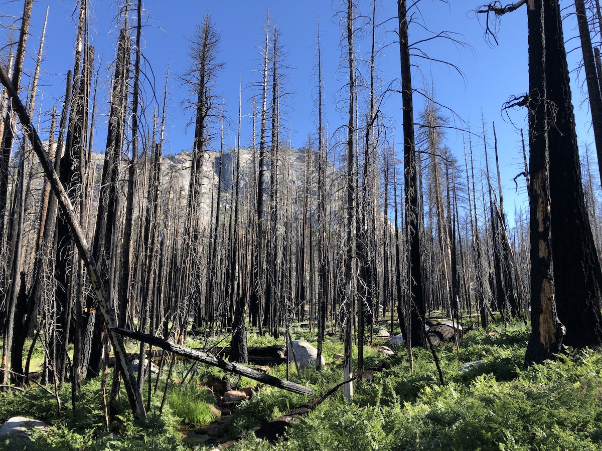
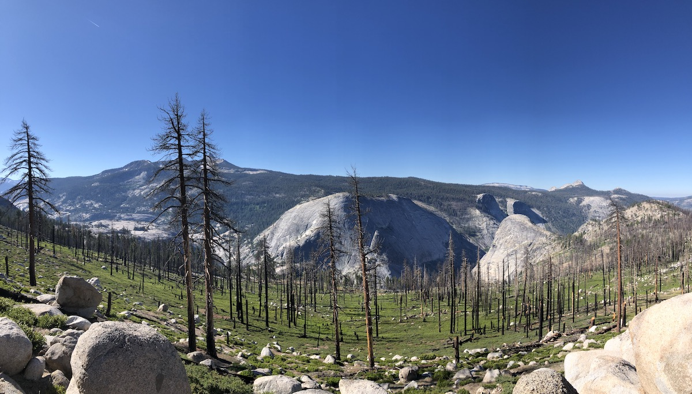
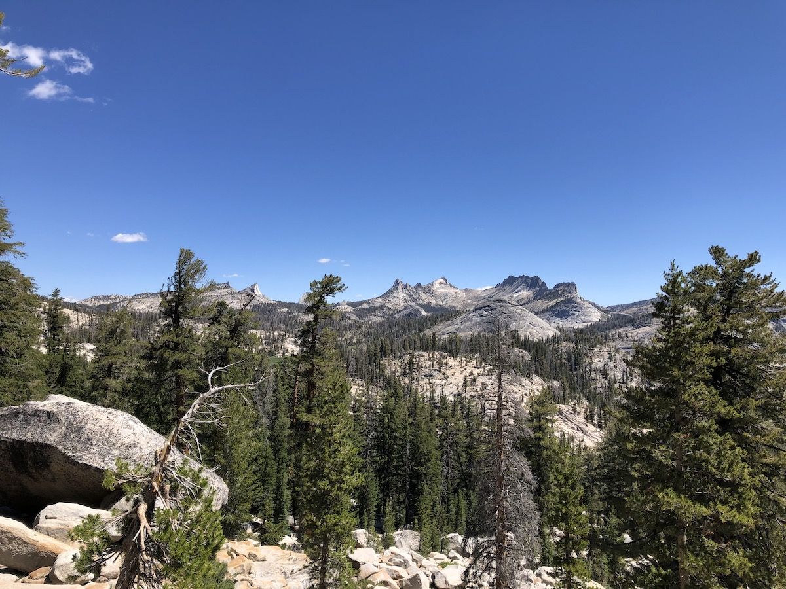
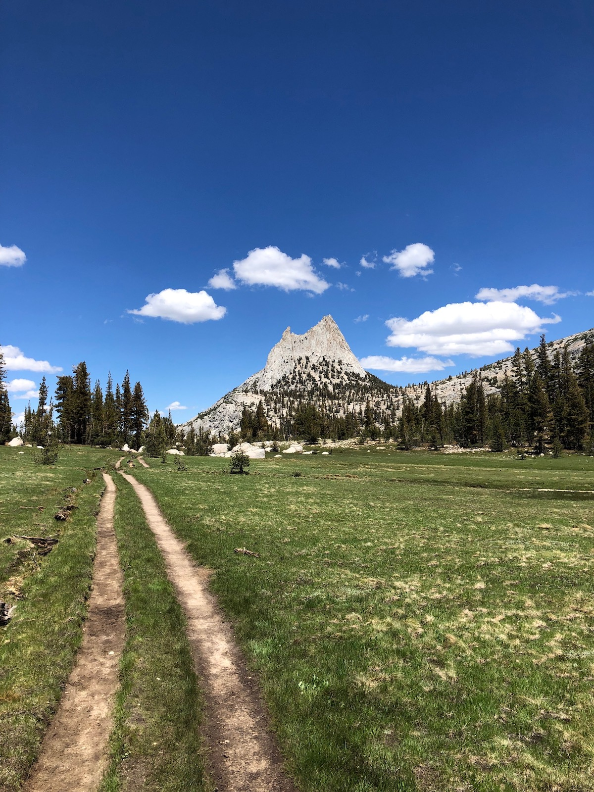
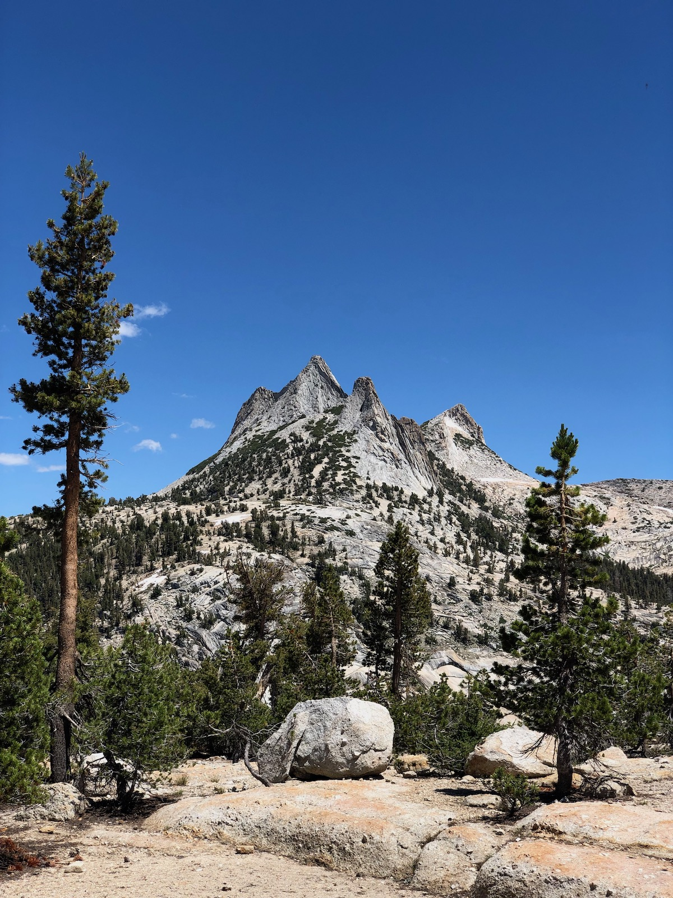
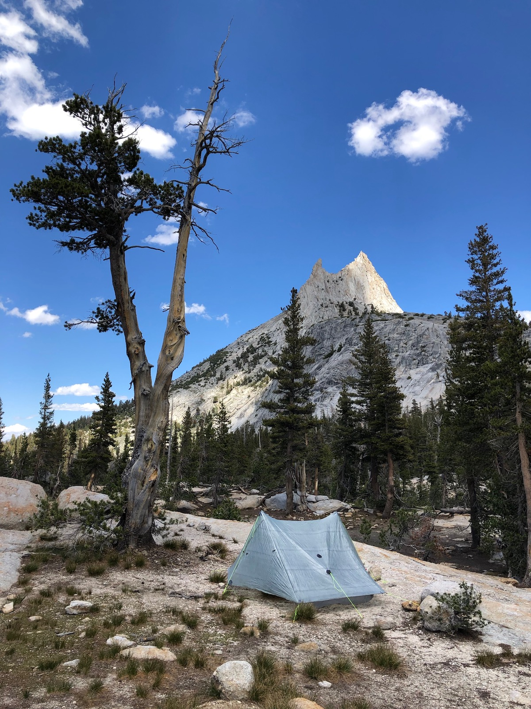
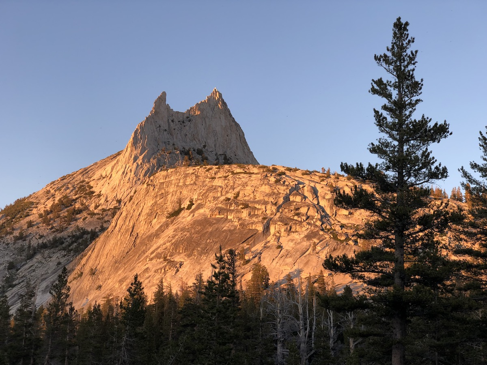

**Day 2 – 13.4 miles, 4270 ft ascent.**
The first night was warm, and I woke up as the sun was rising. I had a short day ahead of me, so I was in no hurry. I ate breakfast and packed up camp, and was on the trail after 7.

I started up the same trail as I had when I went up to Half Dome the day before but then turned East where the Half Dome trail split off.

I walked through an old burn area. The tree trunks were blackened from the flames, but the forest floor was carpeted by bright-green plants. The trail was overgrown at places with prickly bushes.

<figure>
 
 <figcaption>Old burn area.</figcaption>
</figure>

As I emerged from the burn, I continued on the Sunrise Trail North. The trail followed a ridge with magnificent views to the East.

<figure class="full-width">
 
 <figcaption>Sunrise trail.</figcaption>
</figure>

After passing through a denser section of forest, the trail started climbing sharply. Once I got to the top, I took advantage of my CCF pad and had a short break laying down on it and listening to music.

<figure>
 
 <figcaption>Views of the mountains.</figcaption>
</figure>

As the trail descended, it crossed beautiful meadows with wide-open views of the surrounding peaks. Unfortunately, I wasn't the only one enjoying the views. The mosquitoes were out in force. I spoke with a hiker going the other way, and he suggested I'd skip Cathedral Lakes because of the mosquitoes. Instead, I should camp at the meadow before the lakes.

<figure>
 
 <figcaption>Trail through meadow.</figcaption>
</figure>

<figure>
 
 <figcaption>Echo Peaks.</figcaption>
</figure>

I arrived at Upper Cathedral Lake at 2 pm. There was only one other tent set up when I got there, so I could choose my tent site freely. I wanted a spot with a slight breeze away from the lake, hoping to avoid the mosquitoes. They weren't too bad as I was setting up.

<figure>
 
 <figcaption>The DoubleTree at Upper Cathedral Lake.</figcaption>
</figure>

After setting up the tent, I took a swim and explored around the lake. It was remarkable how similar the plants and nature was to the Finnish archipelago. I did feel like I had too much time at camp and I started to run out of things to do. I had initially planned to do my hike with a friend, but he got injured before the hike. Hiking solo, I decided that it would be more fun to do longer days on the trail and have less time at camp.

I watched the sunset at the lake but retreated to my tent as the mosquitoes came out when the wind died down. I stayed up until it got dark so I could look at the night sky. Seeing the Milky Way with my bare eyes is one of my favorite things to do when up in the Sierra.

<figure class="full-width">
 
 <figcaption>Cathedral Peak illuminated by the sunset.</figcaption>
</figure>
