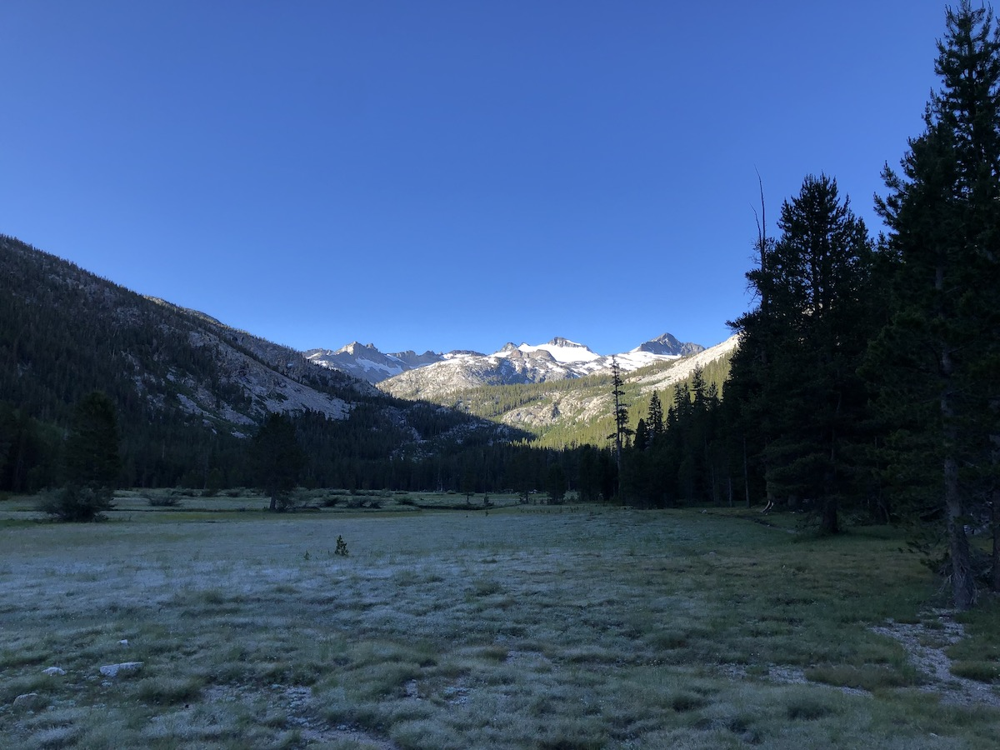
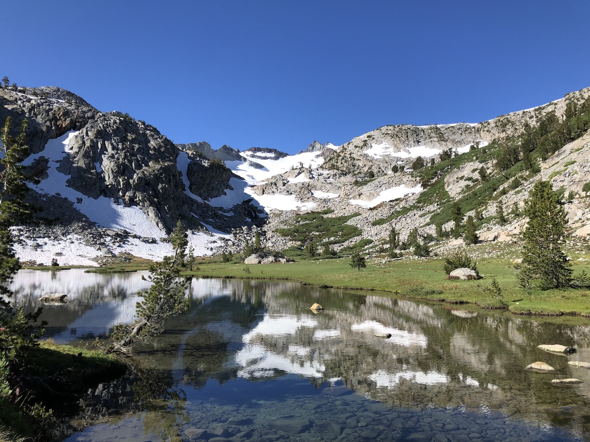
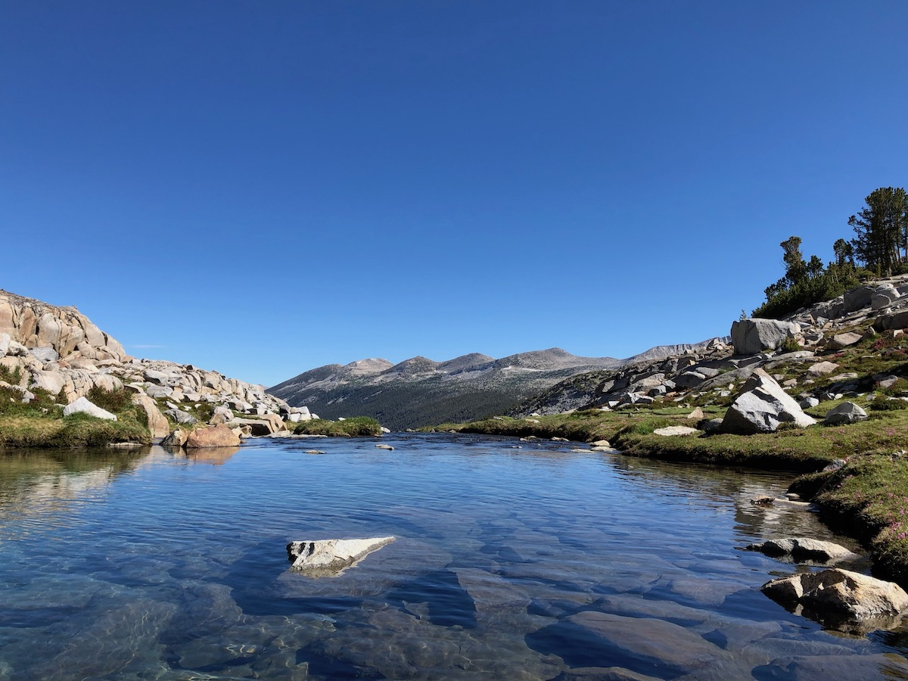
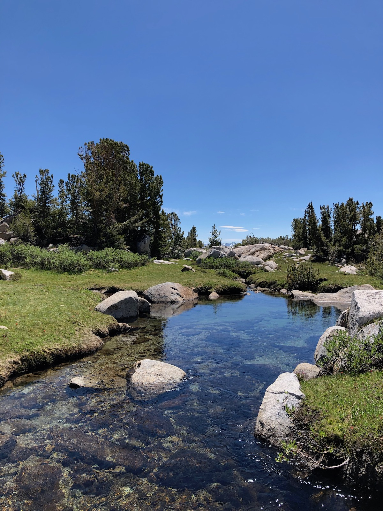
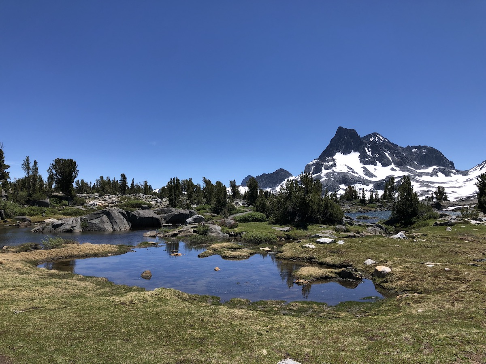
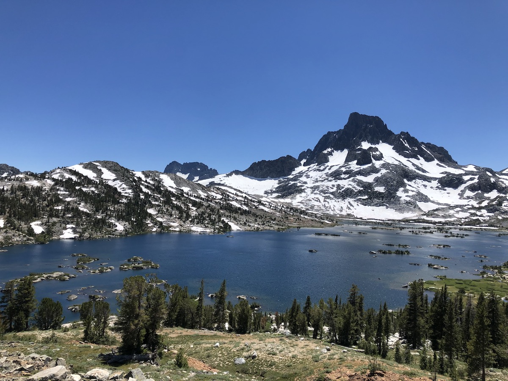
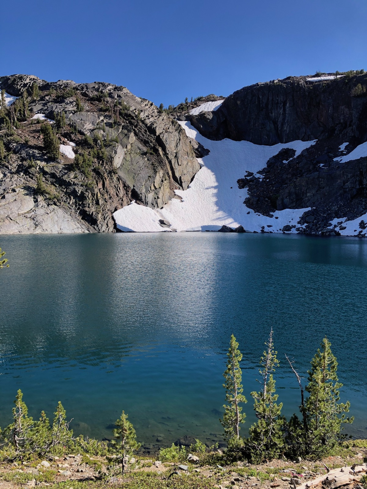
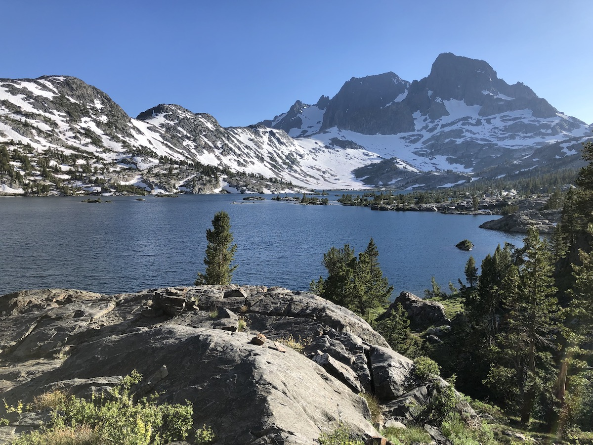
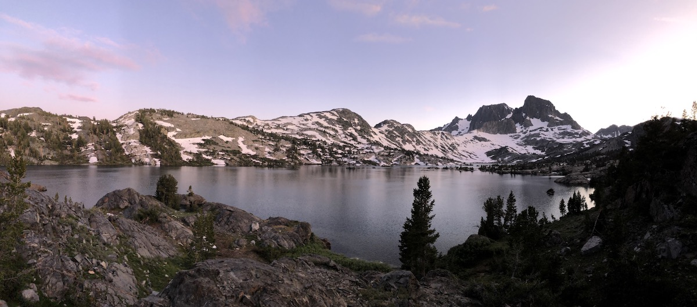

**Day 4 – 10.8 miles, 1120 ft ascent.**

The night was cold. My watch showed 37F when I woke up. But on the upside, my tent and gear were dry, so a significant improvement over the previous night.

I had breakfast and started walking South towards Dohonohue Pass. The meadow was covered in frost after the cold night, making the blue water of Lyell Fork stand out even more as the morning sun hit it.

<figure>
 
 <figcaption>Lyell Fork in the morning.</figcaption>
</figure>

<figure>
 
 <figcaption>The meadow was covered in frost after a cold night.</figcaption>
</figure>

I met the hiker couple from the previous day at a bridge crossing the river. They had stayed a bit further down the canyon but had started hiking before me. Their plan was for hiking the JMT in about 10 more days than me, so again we concluded that we probably wouldn't see each other again, and I continued on.

A little later, I came to a small lake where the trail crossed the outlet. I saw trout in the water and decided to take a short fishing break. The pool just above the trail crossing was reasonably deep and produced a good number of small brook trout. As I was fishing, I waved to the couple as they passed by on their way to the pass.

<figure class="full-width">
 
 <figcaption>I stopped to fish at a lake below Donohue Pass.</figcaption>
</figure>

After crossing the lake outlet, the trail climbed to a smaller lake before getting to the pass. Again, I met the couple, and they said that they had come up with a trail name for me: 3F – Finnish Fishing Friend. I thought it was perfect. The name evolved into triple-F over the trip but stuck with me until the end of the hike.

<figure>
 
 <figcaption>Looking back at Lyell Canyon over a lake.</figcaption>
</figure>

A northbound hiker gave me a tip that I could get around the snowfield on the Northside of the pass by going on the right side of it. The advice turned out to be good, and I got to the top of the pass without walking on snow.

At the top, I took off my shoes and socks to dry them out. There was cell phone signal, so I was finally able to download the topo maps for Guthook and reactivate my Spotify podcast episodes which had expired for some reason the night before.

<figure class="full-width">
 
 <figcaption>The views from Donohue Pass were spectacular.</figcaption>
</figure>

The Southside of Donohue pass was spectacular. The barren rocky landscape of the pass gave way for rugged alpine meadows with meandering, crystal-clear brooks, and small pine trees. The contrast with the bright blue sky made the views feel almost unreal. The mosquitoes were there to remind me it was real.

<figure>
 
 <figcaption>Beautiful alpine meadows on the South side of Donohue.</figcaption>
</figure>

Shortly after Donohue, the trail started climbing to the second pass of the day: Island Pass. This time, the climb was barely noticeable, and it was difficult to tell when I was actually at the top of the pass. But the pretty meadows continued, so I didn't care.

<figure>
 
 <figcaption>Island Pass.</figcaption>
</figure>

After descending from Island pass, I could start seeing glimpses of Thousand Island Lake. I had heard of the lake from many PCT and JMT hikers as one of the most beautiful lakes on the trail.

The lake is dotted with small rocky islands and surrounded by brushy vegetation and pines. Again, the resemblance to the Finnish outer archipelago was astounding as long as I disregarded the mountains.

<figure class="full-width">
 
 <figcaption>Thousand Island Lake.</figcaption>
</figure>

<figure>
 
 <figcaption>Rocky islands in Thousand Island Lake.</figcaption>
</figure>

I stopped for an hour or so at Thousand Island Lake, taking a swim and then laying in the sun to dry off. The water was still frigid (the lake was still frozen just a couple of weeks earlier), and the wind was not helping. But laying on the warm granite shielded from the wind made for an enjoyable afternoon nap.

<figure>
 
 <figcaption>A decent sized rainbow trout from the outlet of Thousand Island Lake.</figcaption>
</figure>

I stopped to fish at the outlet as I was heading out from Thousand Island Lake. The outlet made an S-curve just before the bridge, and there was a deep pool where I could see fish rising to feed on insects. I caught a few very decent size rainbows, considering the high alpine location. It was still early for dinner, so I didn't keep any of them. Instead, I continued on towards Garnet lake.

There were a few snow patches on the small climb up from the lake, and I had to check my map to make sure I was on the right track before going too far. On the way to Garnet Lake, there was a smaller lake, Ruby Lake, that was surrounded by sheer cliffs on the other side. The water was exceptionally blue in the afternoon light, accented by the lingering snow on the opposite shore. There were a few beautiful campsites near the lake, but I wanted to continue on to Garnet.

<figure>
 
 <figcaption>Ruby Lake.</figcaption>
</figure>

When I got to Garnet Lake, a few groups were setting up camp just outside the camping restriction zone, close to the trail. I wanted to find a nicer camp spot, but the shore was very steep and rocky. After 15 minutes of searching, I managed to find a decent campsite high over the lake with a nearby cliff where I could watch the sunset and eat dinner.

<figure>
 
 <figcaption>Garnet Lake.</figcaption>
</figure>

I got into camp much later this day, so I only had time to eat some dinner and sit for a while before it got dark. But I didn't mind. I was well tired out from hiking and sunshine and fell asleep quickly.

<figure class="full-width">
 
 <figcaption>Garnet Lake Sunset.</figcaption>
</figure>
