**Day 6 – 16.4 miles, 3800 ft ascent.**

I didn't sleep as well as I thought I would in a real bed. The AC and fridge were making a lot of noise. Especially to someone that's gotten used to the quiet of the forest.

I checked out of the hotel and went to a nearby breakfast restaurant for a proper pre-hike meal. The food was excellent, and there was lots of it.

<figure>
 
 <figcaption>A big breakfast to get the day started.</figcaption>
</figure>

With a full stomach, I went outside to wait for the trolley to take me to the area from where the shuttle to Red's Meadow leaves. I barely had to wait for either of them and I was at Red's a little after 9. I spent a few minutes chatting with hikers I had met the day before and to put on some sunscreen before heading out.

<figure class="full-width">
 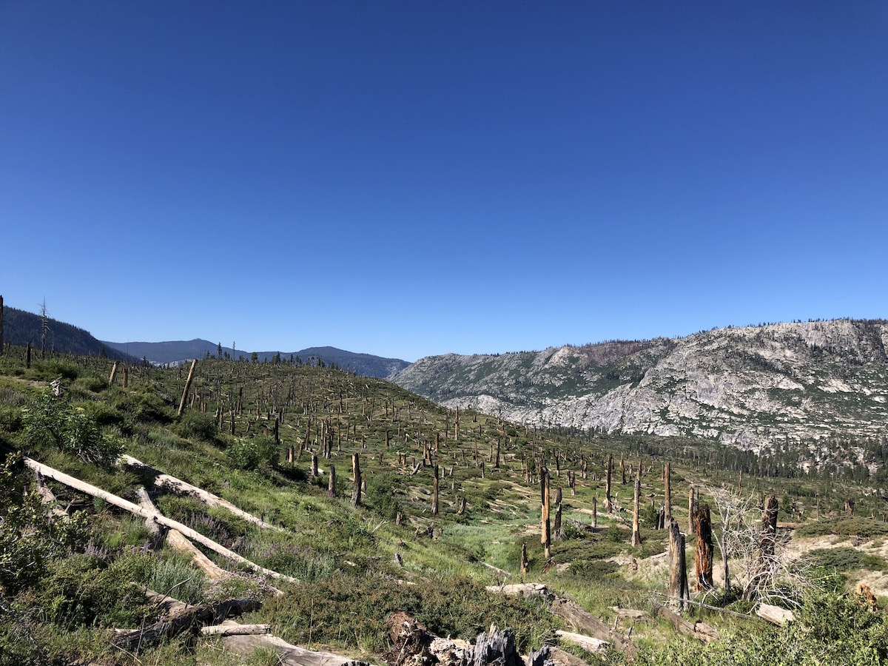
 <figcaption>Right after Red's Meadow, the trail crossed an old burn area with expansive views.</figcaption>
</figure>

The first few miles outside Red's Meadow were an old burn area. The lack of trees meant that there were expansive views of the surrounding mountains. The ground was bright green and covered in all kinds of berry bushes. A certified bear buffet. My suspicions were validated when a North-bound hiker I met said she saw a black bear just a minute ago. Sadly, it was already gone by the time I got there.

<figure>
 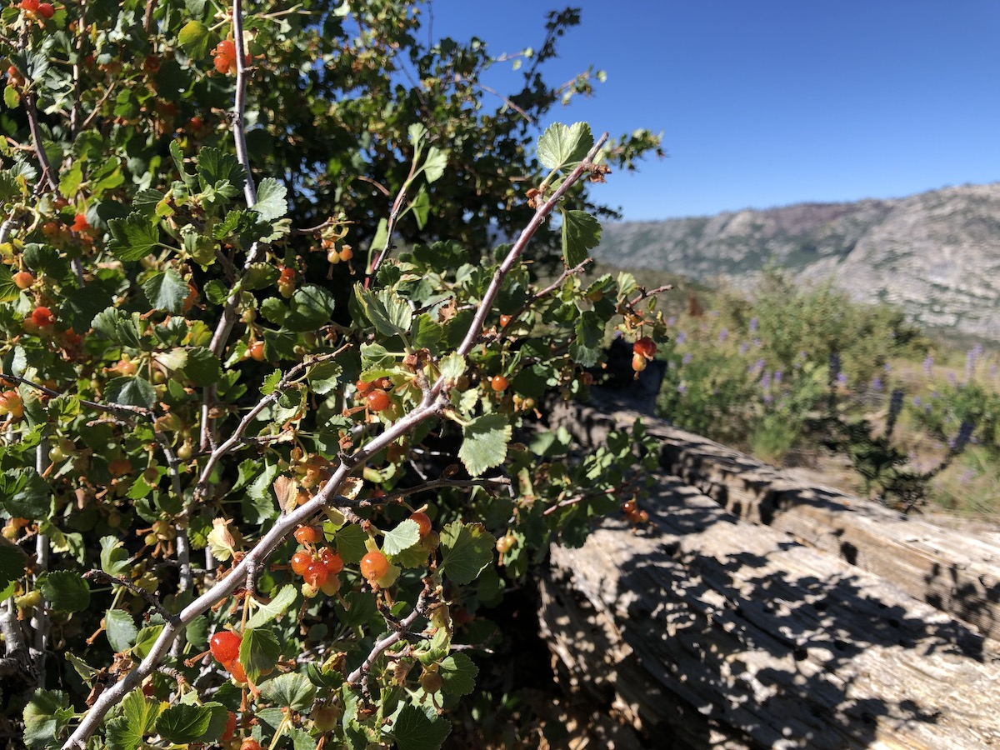
 <figcaption>The burn area was full of berry bushes.</figcaption>
</figure>

The climb out from Red's Meadow must have been the most comfortable ascent of the entire JMT. The grade was very mild, the trail was firm sand, and was shaded by trees. It was like getting 2,000 ft of ascent for free.

<figure>
 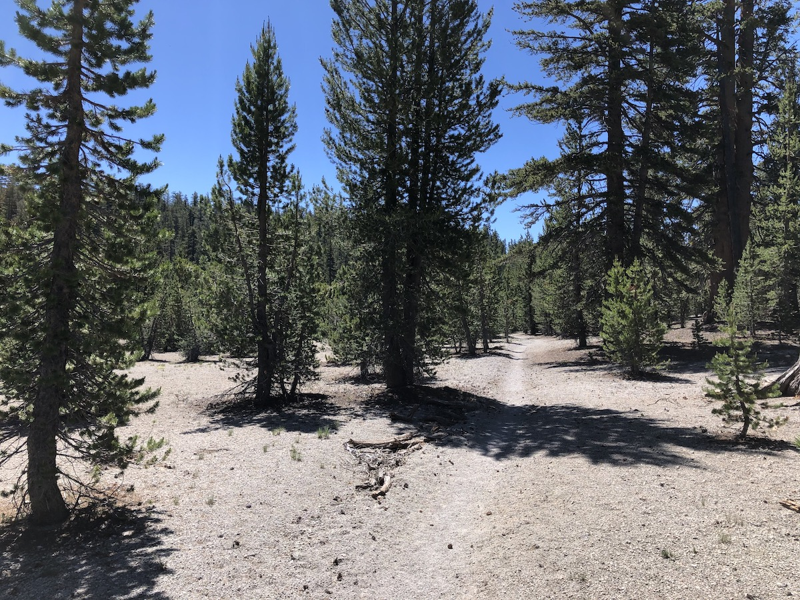
 <figcaption>The climb out of Red's was one of the easiest of the entire JMT.</figcaption>
</figure>
<figure>
 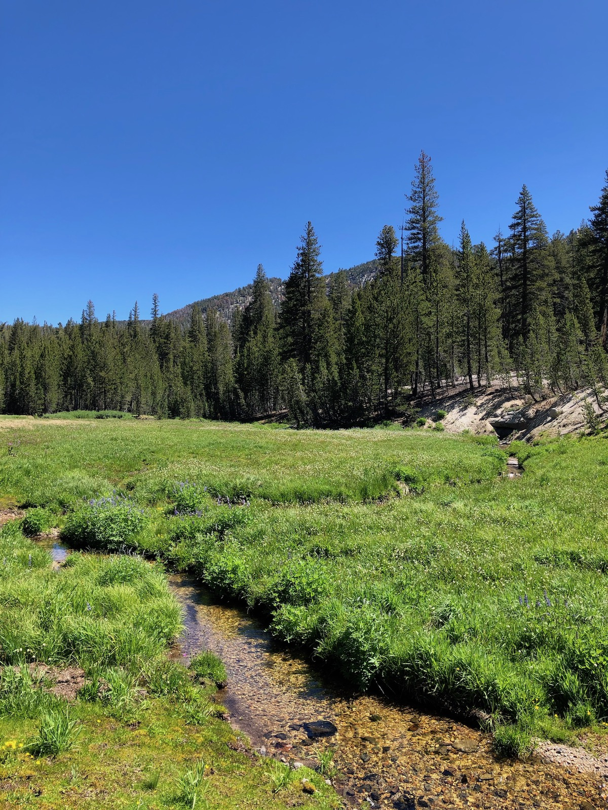
 <figcaption>After a long dry stretch, the trail came to a meadow with a stream.</figcaption>
</figure>

After several miles, the dry trail gave way to a meadow and a few streams. Once I got up to around 10,000 feet, the views really opened up. The trail followed the edge of a valley with amazing views for miles.

<figure class="full-width">
 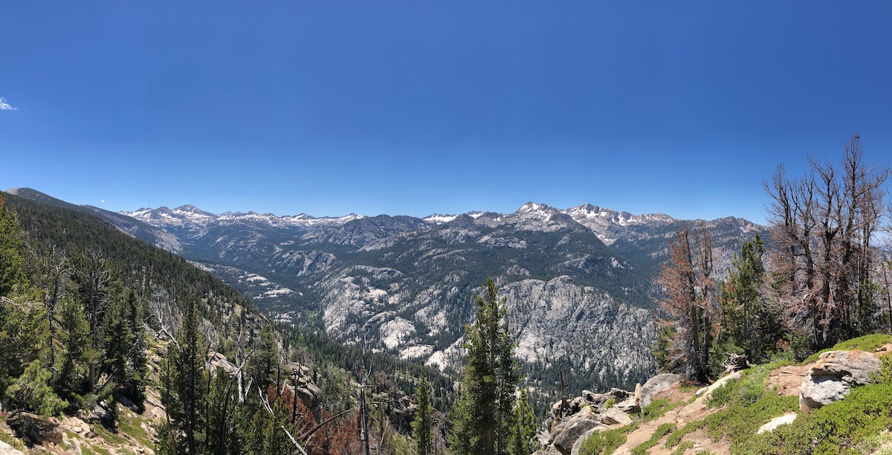
 <figcaption>The views finally opened after a long climb.</figcaption>
</figure>

<figure class="full-width">
 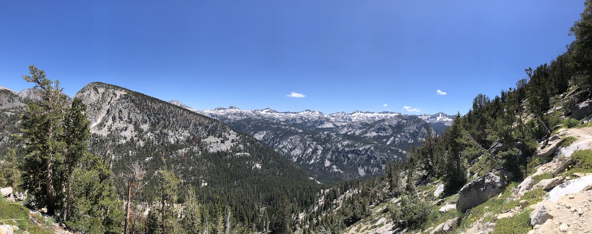
 <figcaption>Open views of snow-capped mountains.</figcaption>
</figure>

After the junction to Duck Pass, there was a short but steep climb before Purple lake. I stopped at Purple lake for a snack. As I was getting my meal, I noticed trout swimming in the water and decided that I'd instead try my luck at catching a trout for lunch. I didn't have to fish long before I caught a perfect-sized trout that I cleaned and cooked up. It was so good.

<figure>
 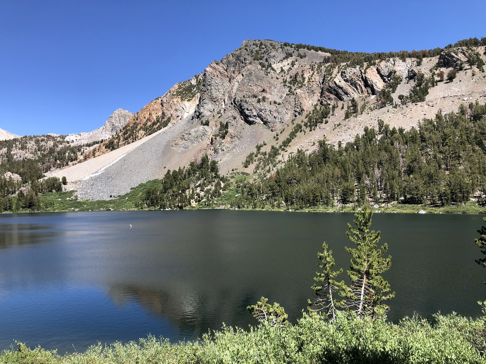
 <figcaption>Purple Lake.</figcaption>
</figure>

From Purple Lake, it was a short hike to my final destination of the day: Lake Virginia. It was one of the most beautiful lakes so far on the trail, and I was excited to spend some time there.

I noticed that getting across the outlet of Lake Virginia required getting wet, so I opted to cross in the evening so I wouldn't have to start off the day with wet feet.

<figure class="full-width">
 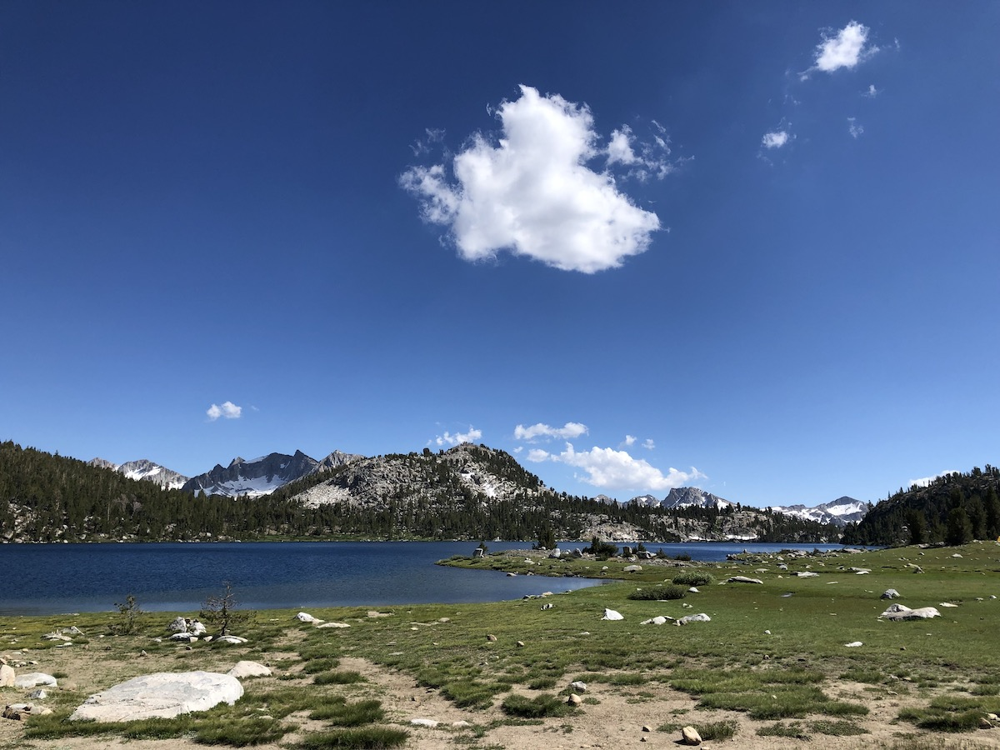
 <figcaption>Lake Virginia.</figcaption>
</figure>

I found a campsite above the South shore of the lake. The location and views were great, but the previous campers were clearly not believers of Leave No Trace. There was a firepit even though fires were not allowed at that elevation. I also filled half of my trash bag with assorted wrappers and other small trash left behind.

The wind was still blowing strong, so I decided to wait with the fishing until later. Instead, I went down to the lake and enjoyed the views and wildflowers.

<figure>
 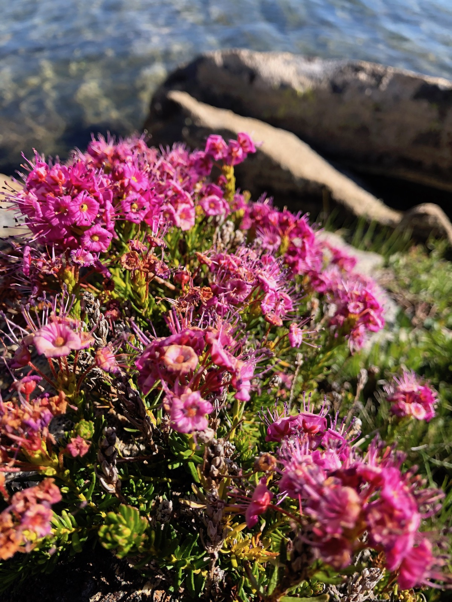
 <figcaption>Purple Wildflowers.</figcaption>
</figure>

<figure>
 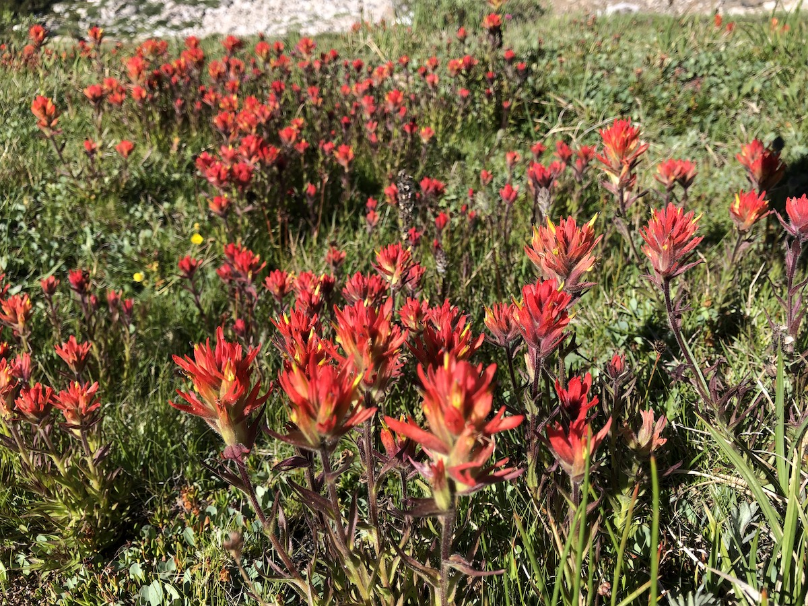
 <figcaption>Red Wildflowers.</figcaption>
</figure>

After dinner, the wind started dying down as the sun was setting. I could see fish starting to feed at the surface, so I set up my rod and went down to fish. After trying a couple of flies, I got a nice rainbow trout on a dry fly.

<figure>
 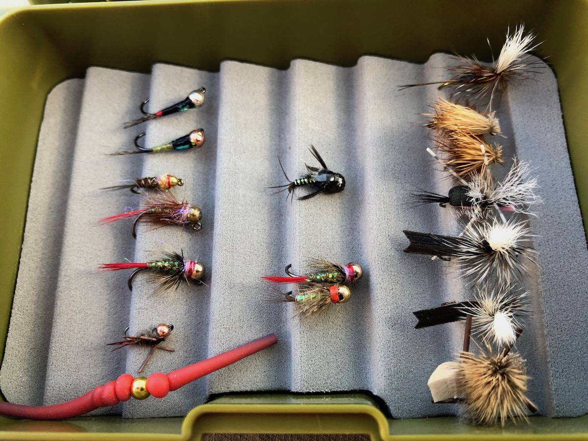
 <figcaption>My assortment of flies had grown after the stop in Mammoth.</figcaption>
</figure>

<figure>
 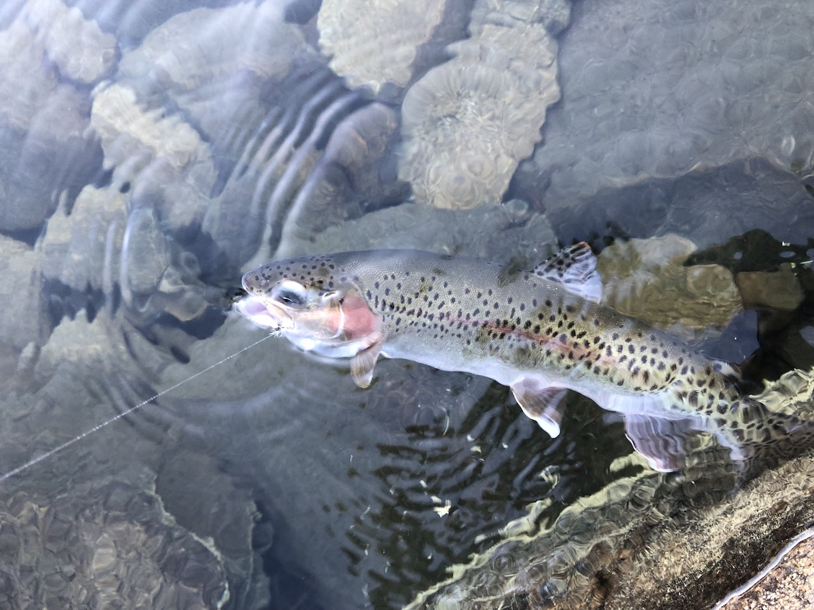
 <figcaption>A rainbow trout on a dry fly in Virginia Lake.</figcaption>
</figure>

Although the fishing got good when the wind died down, it also meant that the mosquitoes came out in full force. After catching the rainbow, I decided to call it a day and go hang out in my tent to avoid the mosquitoes. I could still enjoy the views from the open doors.
