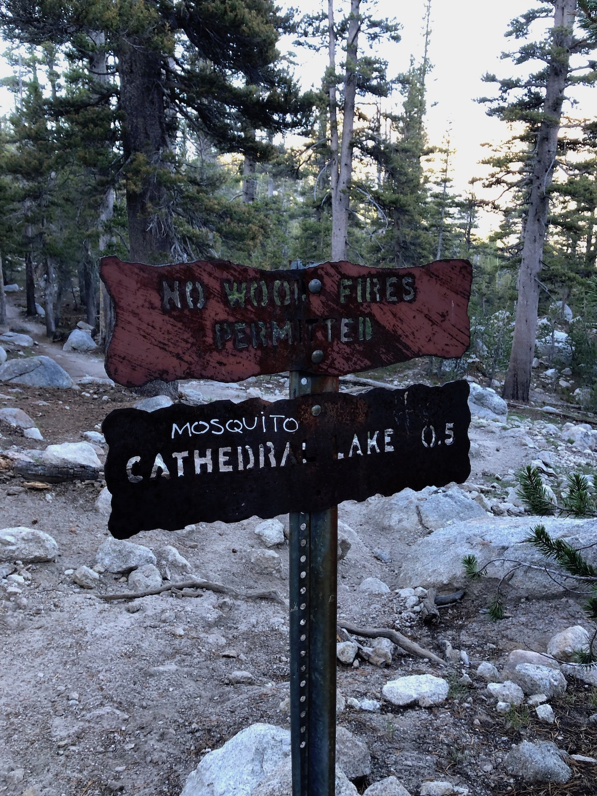
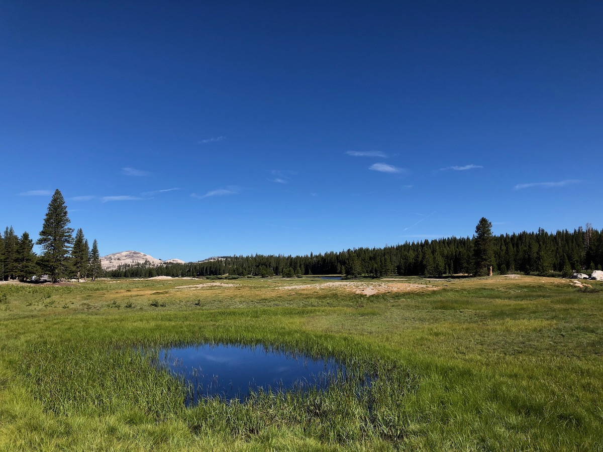
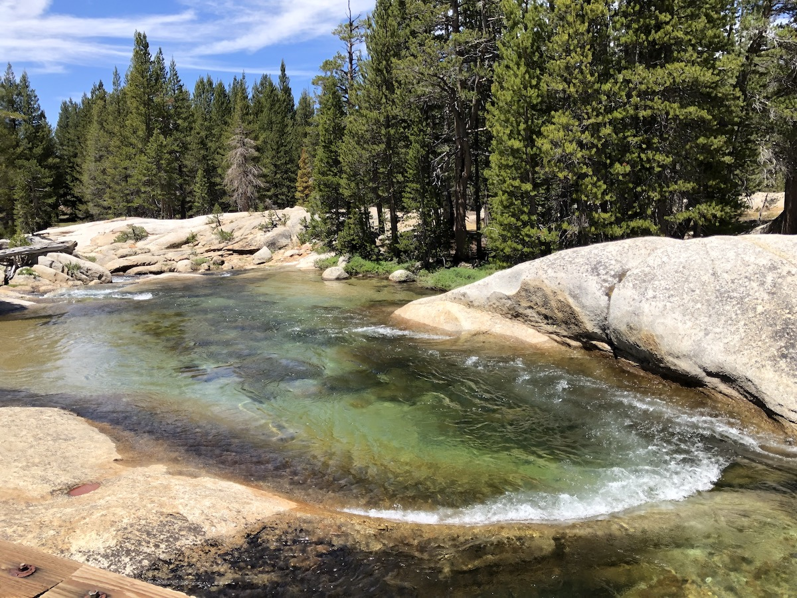
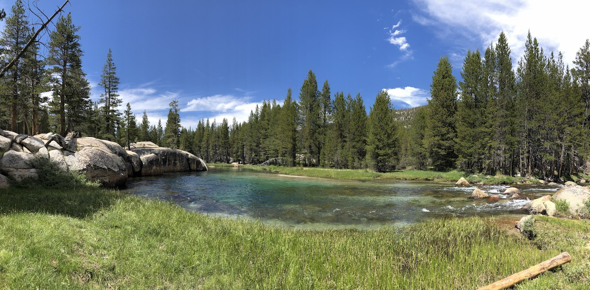
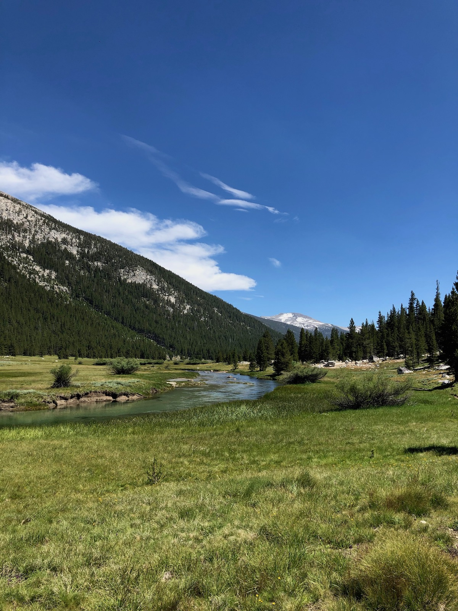
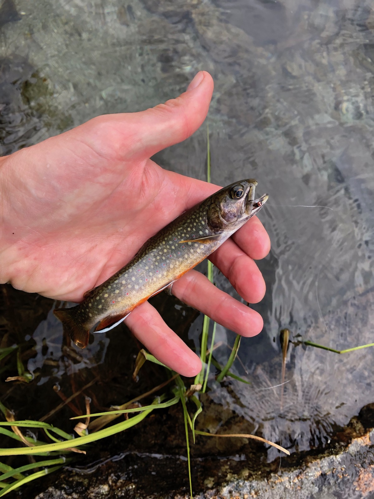

**Day 3 – 16.4 miles, 909 ft ascent.**

I woke up to a tent that was drenched from condensation. I had closed my tent's upwind storm doors, and apparently, it led to a lot of moisture in the tent. I made breakfast and waited for a while for the sun to rise high enough to hit my campsite and dry the tent.

<figure>
 
 <figcaption>Hiker was surprised to find mosquitoes in the Sierra, proceeded to vandalize the park.</figcaption>
</figure>

I had a resupply to pick up at Tuolumne Meadows. I wanted to get lunch there too, so I didn't want to get there too early. Walking down towards Tuolumne, I started meeting more and more day hikers. I also met a couple hiking the JMT that had also stayed at the same lake the previous night. They were also picking up a resupply at the post office, so we'd meet again in a while.

<figure>
 
 <figcaption>Tuolumne Meadows.</figcaption>
</figure>

<figure class="full-width">
 
 <figcaption>Looking back towards Cathedral Peak</figcaption>
</figure>

I took a short detour to Soda Springs, a naturally carbonated spring. The water was clear, although the ground around it was colored red-brown from all the iron in the water. The water tasted very metallic and was slightly carbonated. I decided to stick with normal water for drinking.

<figure>
 
 <figcaption>Carbonated water bubbling from Soda Spring.</figcaption>
</figure>

I got to the building with the store and post office before 10. I picked up my resupply box and put my devices
to charge while I was sorting out my food.

The grill didn't start serving lunch until 11:15, so I had plenty of time to hang out with other hikers and have some appetizer snacks while I waited. Both JMT and PCT hikers were resupplying, so it was an excellent chance to get intel on trail conditions.

<figure>
 
 <figcaption>Non-freezedried calories.</figcaption>
</figure>

The burger did not live up to expectations. Aramark, who has a monopoly on all concessions in the park, clearly has set the bar low on food. The burger was two re-heated pre-made patties on a stale bun. But it wasn't freeze-dried hiker food, so it had that going for it.

After hanging out for a good 2+ hours at the resupply area, I decided it was time to head out. I still wanted to cover several miles and do some fishing along the way.

<figure>
 
 <figcaption>Lyell Fork bridge.</figcaption>
</figure>

The trail followed the road for a while before cutting south and towards Lyell Canyon. A ranger checked my JMT and fishing permits just before the bridge over Lyell Fork.

Lyell Canyon was beautiful. The bright-blue river meandered through a meadow of tall grass and flowers. The winter had been exceptionally wet, so everything was still bright green and blooming even though it was already late July.

<figure class="full-width">
 
 <figcaption>A blue pool in Lyell Fork.</figcaption>
</figure>

I stopped to fish a beautiful pool in the river. I could see fish swimming from the rocks above, but the clear water made it hard to approach them without scaring them. I did manage to catch a handful of small brookies and rainbow trout.

I continued up the canyon, wanting to get within a short distance of Donohue Pass, but still staying under 9,600 ft elevation so I could have a fire.

<figure>
 
 <figcaption>Looking up Lyell Canyon towards Donohue Pass.</figcaption>
</figure>

I ended up finding a great campsite with a fire ring – this time well above the meadow to avoid condensation. After setting up camp, I went down to the river to do some more fishing. Again, I caught several brookies, but they were all small.

<figure>
 
 <figcaption>A massive brook trout.</figcaption>
</figure>

After I was done fishing, I took a quick dip in the river to wash off the trail dust and then headed up to my camp to get a fire and dinner started.

I sat by the fire listening to podcasts until the sun went down, then headed to bed so I would be well rested for my climb up Donohue the next morning.
