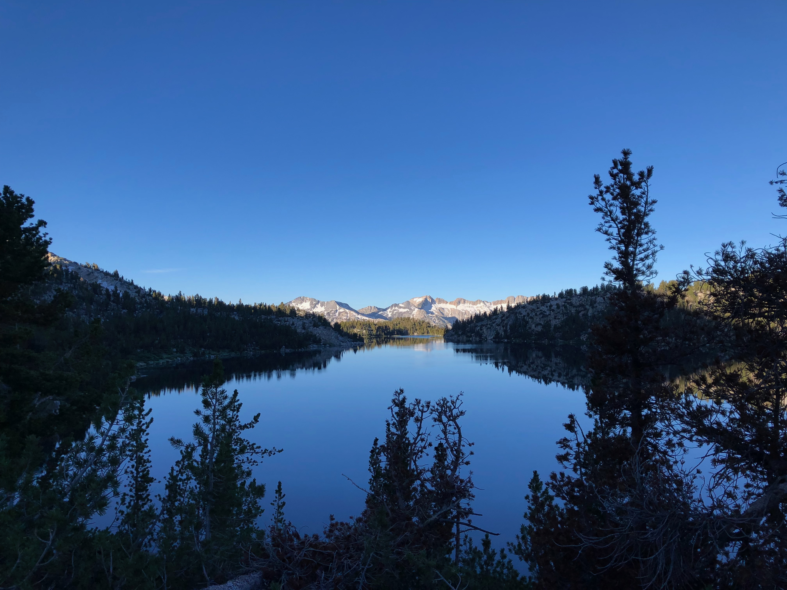
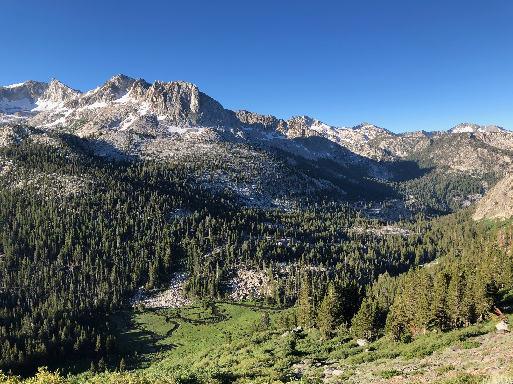
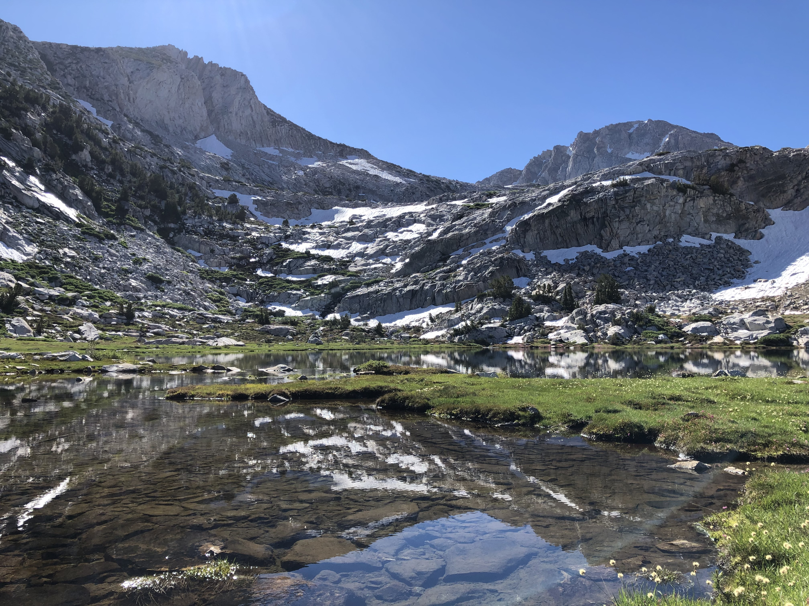
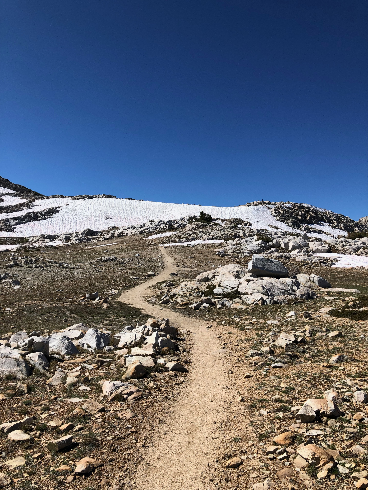
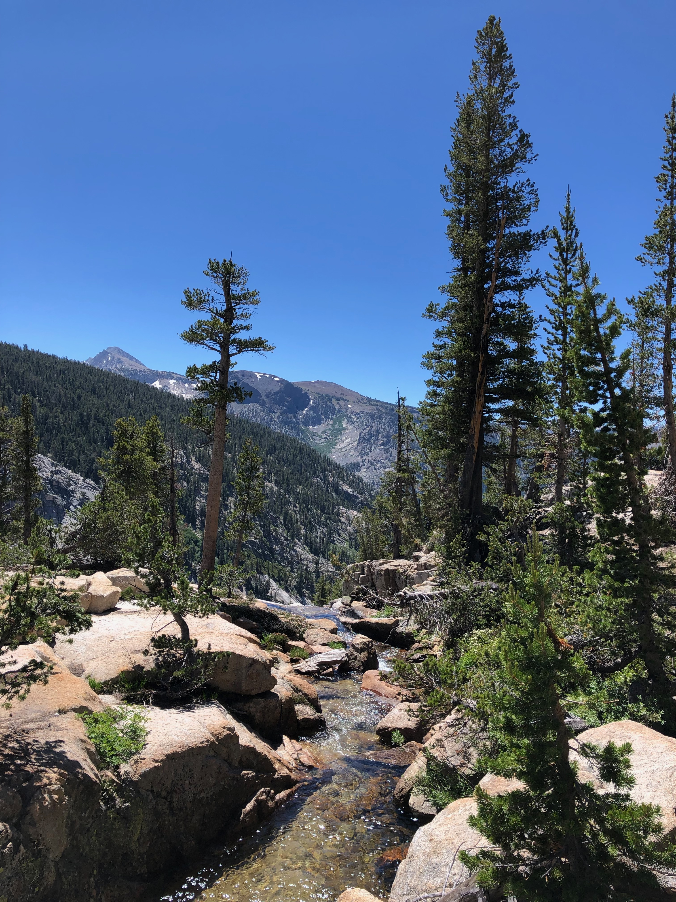
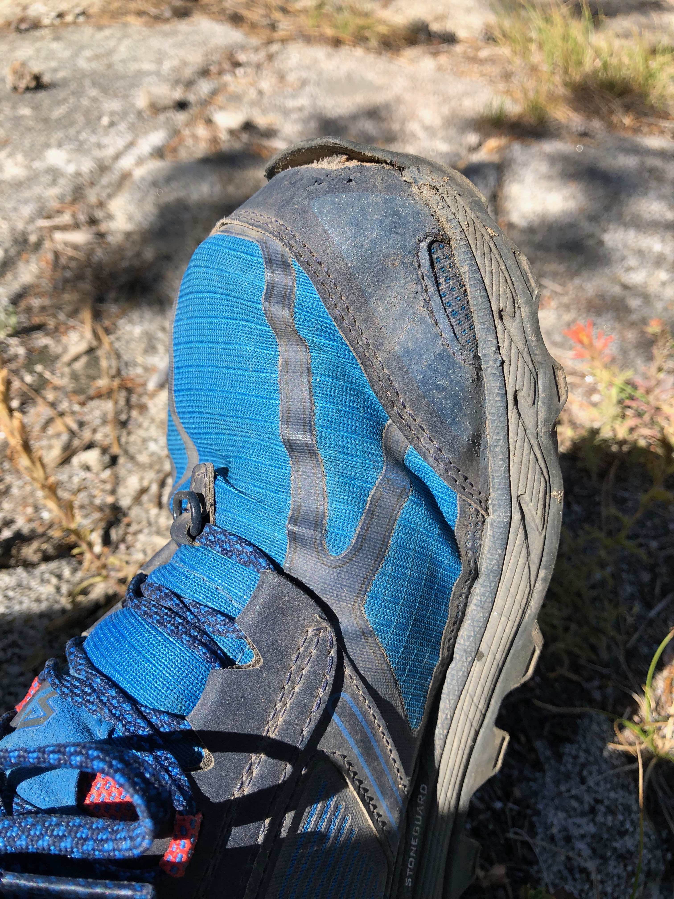
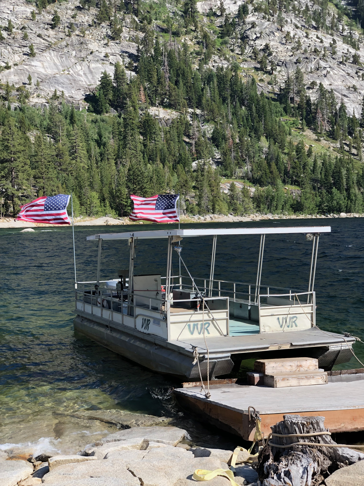
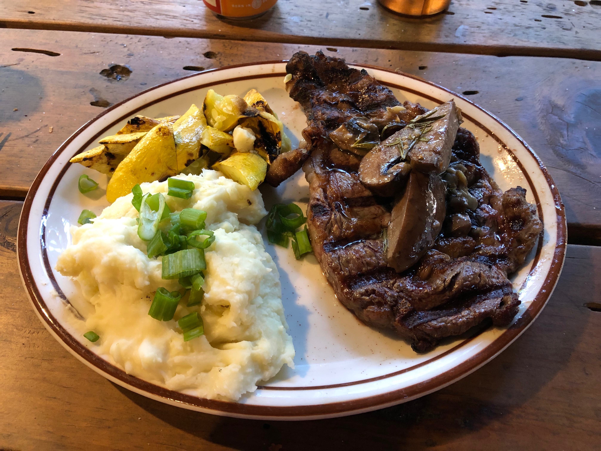

**Day 7 – 15.2 miles, 1900 ft ascent.**

Even though I camped well above the lake, I woke up to a wet tent and quilt. The sun wasn't hitting my campsite yet, so I packed up everything wet and decided I'd stop later to dry out everything.

<figure>
 
 <figcaption>A calm morning at Virginia Lake.</figcaption>
</figure>

After a small climb up from Virginia, the trail dipped down to Fish Creek before climbing back up to Silver Pass. The morning was still chilly, making the hike pleasant.

<figure>
 
 <figcaption>Looking down towards Fish Creek.</figcaption>
</figure>

There were several small lakes on the climb up towards Silver Pass. Their surfaces were dotted with hundreds of fish feasting on the morning hatch. I contemplated fishing but continued up the pass.

The lakes were like mirrors. The sky was deep blue, and it was wind still.

<figure>
 
 <figcaption>Squaw Lake, below Silver Pass.</figcaption>
</figure>

<figure class="full-width">
 
 <figcaption>Heading up Silver Pass.</figcaption>
</figure>

As I approached Silver Pass, I saw that there was still a small snowfield on the north side. It covered the last few switchbacks, but there was a solid boot track, and the snow was firm.

<figure>
 
 <figcaption>A small snow field before the top of Silver Pass.</figcaption>
</figure>

Once I got to the top of the pass, I laid out my tent and quilt to dry in the sun and made myself a coffee. I hung out with two other SOBO JMT hikers that also planned to hike to VVR that day. We chatted for half an hour as my gear dried up.

<figure class="full-width">
 
 <figcaption>Silver Lake, just South of the pass</figcaption>
</figure>

Right after the pass, the trail descended towards Silver Pass Lake. There were a few snowfields, and I managed to lose the path for a while. Thankfully, the ground was mostly dry gravel, making off-trail walking a breeze. I shortly re-joined the trail and continued my way down.

I passed a meadow with a small twisting creek. It was just a couple of feet across at times, but still held some nice looking deep holes where I could see small brook trout.

<figure>
 
 <figcaption>A creek running through a meadow.</figcaption>
</figure>

The creek dropped down the side of a steep cliff, turning into a waterfall. A while later, the trail crossed below the waterfall. I've heard that earlier in the season this is a super wet crossing as you need to ford it and get showered by water from above. Thankfully, the water was already low enough that I could get across dry.

<figure>
 
 <figcaption>On the top of a waterfall.</figcaption>
</figure>

<figure>
 
 <figcaption>The trail went under a waterfall.</figcaption>
</figure>

The final part of the descent down to Edison Lake was very steep and rocky. I got stuck behind a mule train which was kicking up a lot of dust. I slowed down a bit to get some distance between them and me.

<figure>
 
 <figcaption>I got stuck behind a mule train.</figcaption>
</figure>

Somehow, I assumed that the walk down from the Edison Lake trail junction to the VVR ferry would be a quick 5-minute walk. It turned out to be closer to 30 minutes with many boggy sections.

<figure>
 
 <figcaption>VVR and a steak dinner was getting close.</figcaption>
</figure>

I arrived at the VVR ferry landing at 1:30 PM, so I had plenty of time to kill. Lake Edison is at 7600 feet, significantly lower than the lakes I had stayed at for the past few nights. The water was surprisingly warm, and I decided to take a swim to rinse off the trail dust and sweat. After swimming, I laid my clothes out to dry on the cliffs and chatted with a couple of Italian hikers that were hiking a section of the JMT.

My shoes, which had been brand new at the start of the hike, were starting to fall apart. Specifically, the toe guard was beginning to detach from the shoe, and it was funneling sand into my shoe. I attempted to tape it with some duct tape but quickly abandoned the idea as I could tell the adhesive would not be strong enough.

<figure>
 
 <figcaption>My shoe started to fall apart.</figcaption>
</figure>

After my clothes were dry, I went to the inlet of the lake to do a bit of fishing. The creek running into the lake was deep, so I set up a dropper with an extra nymph to get down deep. Almost immediately, I hooked on to a monster of a trout. It snapped my tippet in a fraction of a second.

This time, I went with a single but heavier nymph and moved to another hole. Again, I hooked a huge trout. This time, I had it on for a few seconds before it bolted down the strong current and snapped the line.

I had to accept defeat. My Tenkara rod and 5x tippet were not up for the job. If I come back here, I need to bring heavier gear.

<figure>
 
 <figcaption>The ferry to VVR.</figcaption>
</figure>

Finally, the ferry arrived and shuttled us over to VVR. We stopped halfway to look at an osprey nest and see the mother fly in with food for her chicks.

Once we arrived at VVR, I set up my tent at the campground and headed to the restaurant for a real meal. The special of the day was a ribeye steak with mashed potatoes and vegetables. It tasted heavenly compared to my freeze-dried dinners. I finished off the meal with a slice of apple pie and ice cream.

I spent the rest of the evening talking to other hikers and enjoying some live guitar music by the fire. There were both JMT hikers and PCT section hikers, so I could get some insights into the trail conditions ahead of me. Apparently, the snow had still been pretty bad at least around Muir Pass, and the mosquitoes were terrible everywhere.

I went to bed around 10 as I wanted to get a good night's sleep before heading out on the morning ferry. The music and loud campsite party continued until well past midnight, so I didn't end up getting that much sleep.

<figure>
 
 <figcaption>The campsite at VVR was popular.</figcaption>
</figure>

<figure>
 
 <figcaption>Ribeye for dinner.</figcaption>
</figure>
