**Day 8 – 20.3 miles, 4400 ft ascent.**

I woke up at 6, so I would have enough time to get everything in order before the morning ferry back to the other side of the lake. I packed up my tent and waited for the restaurant to open.

I had a hard time deciding what to get for breakfast. The pancake breakfast looked great, but I was worried it wouldn't be big enough based on the description. I was wrong. The breakfast came out on two dinner plates, and I had a hard time breathing after eating it.

<figure>
 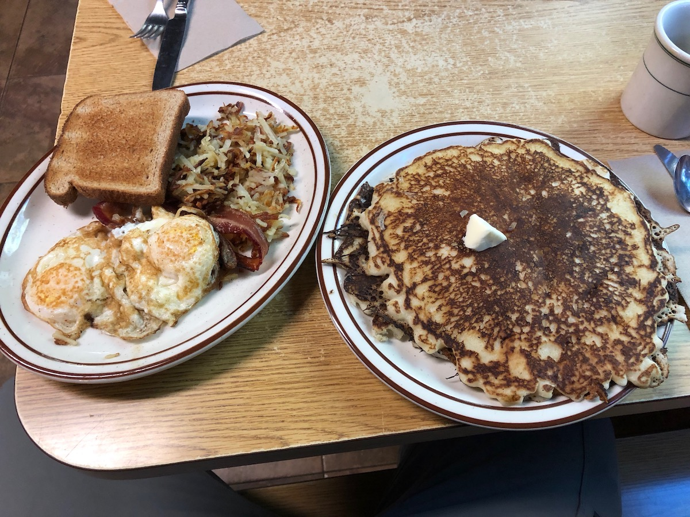
 <figcaption>A huge pancake breakfast at VVR.</figcaption>
</figure>

After breakfast, I took a shower as this would be my last chance before finishing the hike. A warm shower felt great, and I was ready to hit the trail.

I paid my tab and got on the ferry. The lake was still calm early in the morning, offering spectacular reflections of the surrounding mountains.

<figure>
 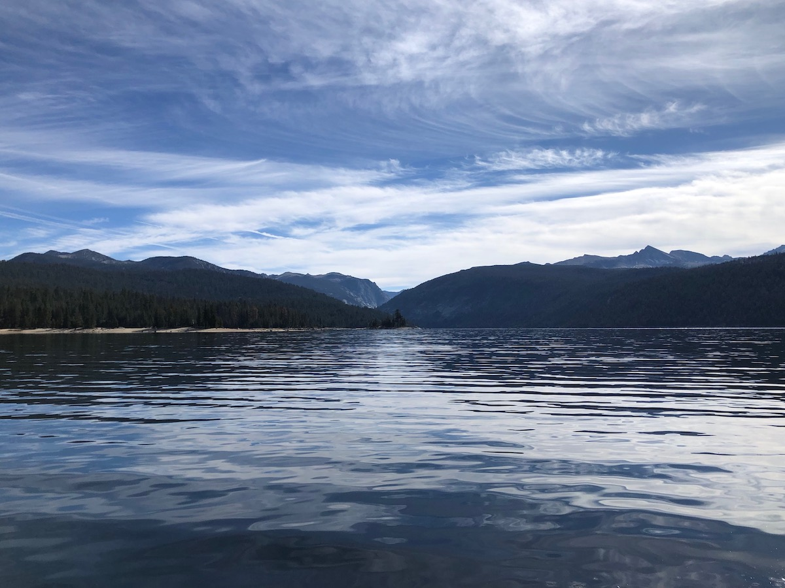
 <figcaption>A calm morning at Lake Edison.</figcaption>
</figure>

After rejoining the JMT, I began to climb up Bear Ridge. The ridge is nicknamed Beer Ridge as it can be especially tough after a few too many beers at VVR. The trail was mostly shaded, which made it cool, but also that there weren't many views.

<figure>
 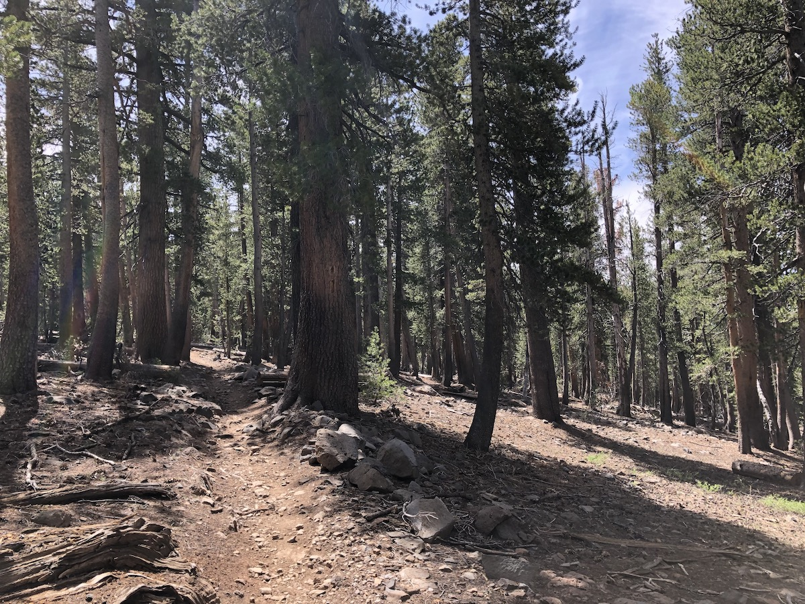
 <figcaption>Bear Ridge was a steep but shaded climb.</figcaption>
</figure>

At the top, the views began to open up finally, and I started descending down toward Bear Creek with some beautiful views.

<figure>
 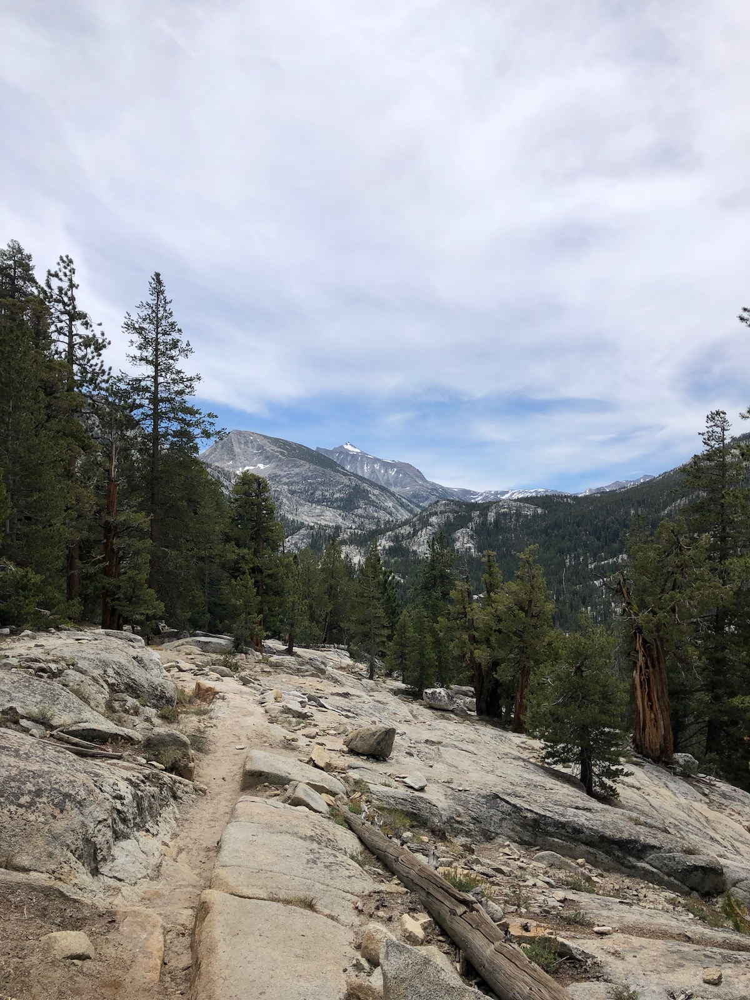
 <figcaption>Starting to descend towards Bear Creek.</figcaption>
</figure>

I stopped to fish for a while along Bear Creek. The brook trout were hungry, but so were the mosquitoes, so I didn't stay too long.

The Bear Creek crossing is normally one of the most difficult on the JMT, but the water was below my knees when I forded it.

<figure>
 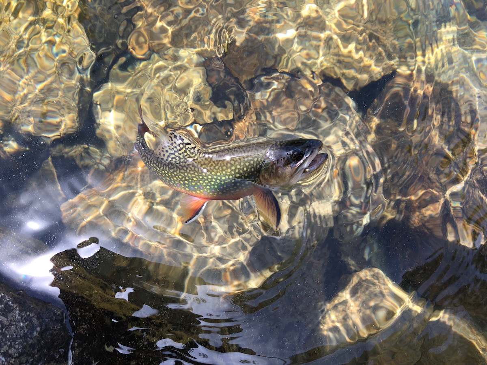
 <figcaption>A brook trout in Bear Creek.</figcaption>
</figure>

<figure class="full-width">
 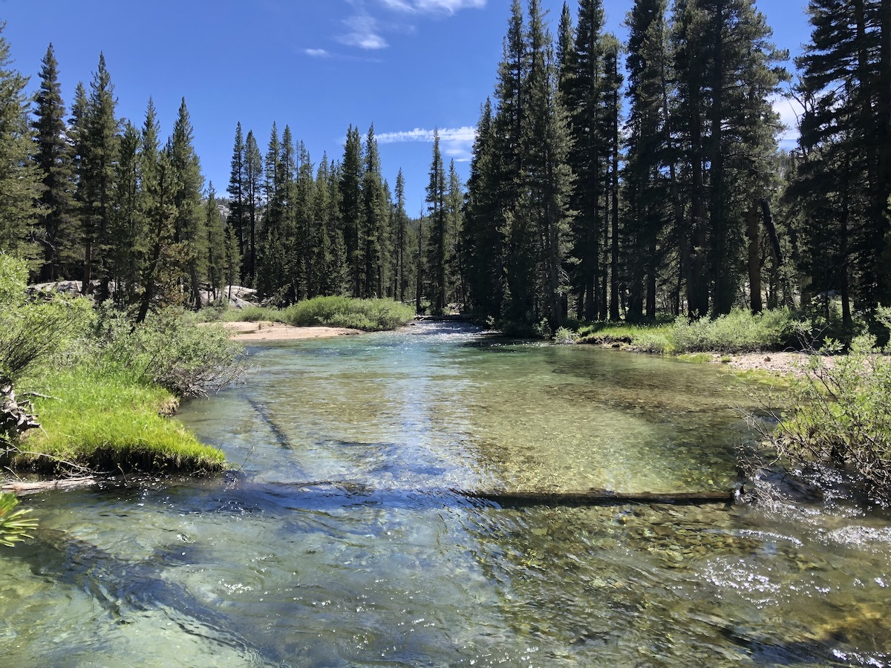
 <figcaption>Bear Creek.</figcaption>
</figure>

I began my second big climb of the day after crossing Bear Creek. The trees started to thin out before Rose Lake, revealing some spectacular views of the mountains up ahead.

I stopped at Marie Lake for a short break before the final push up the pass.

<figure>
 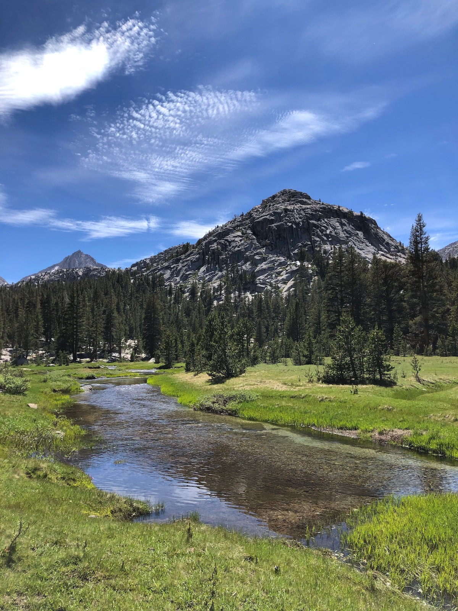
 <figcaption>Views before Rose Lake.</figcaption>
</figure>

<figure>
 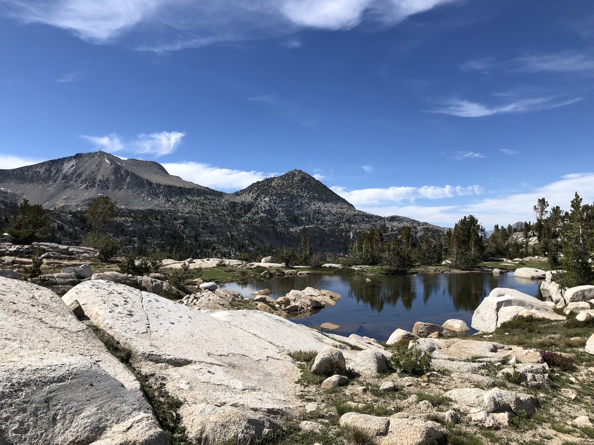
 <figcaption>Marie Lake.</figcaption>
</figure>

The climb up to Selden was pretty gradual, and the snow was mostly gone except for a few lingering patches. On the way down, there was a bigger snowfield covering the trail. I had to walk through a soggy meadow for a while before rejoining the trail.

<figure class="full-width">
 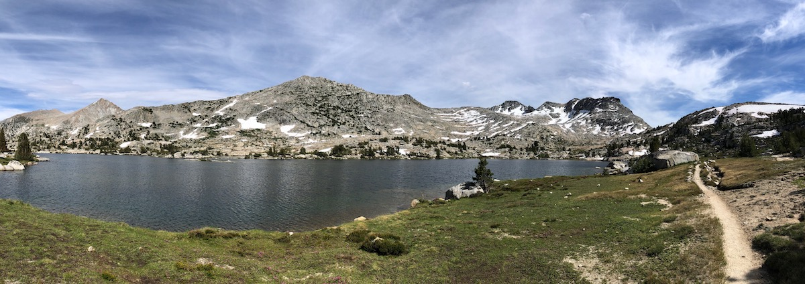
 <figcaption>Heading up Selden Pass.</figcaption>
</figure>

I noticed that the small stream I was following was teeming with trout. More specifically, I noticed that the fish looked like golden trout – a species I had never caught before.

The trail offered a good look down into the creek flowing into Heart Lake. I couldn't resist – I went down to the stream and got out my rod. The trout were hungry, swarming my fly any time it hit the water. The colors on the golden trout were incredible. They looked more like tropical fish than anything that you would expect to live up in the High Sierra.

<figure>
 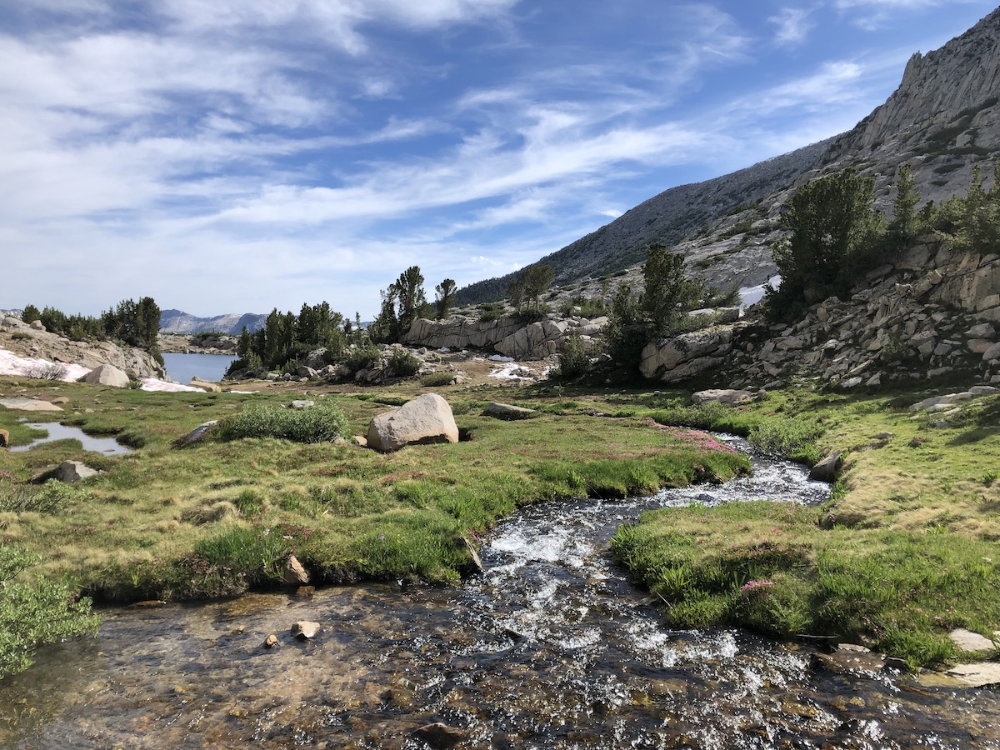
 <figcaption>The small stream flowing into Heart Lake.</figcaption>
</figure>

<figure>
 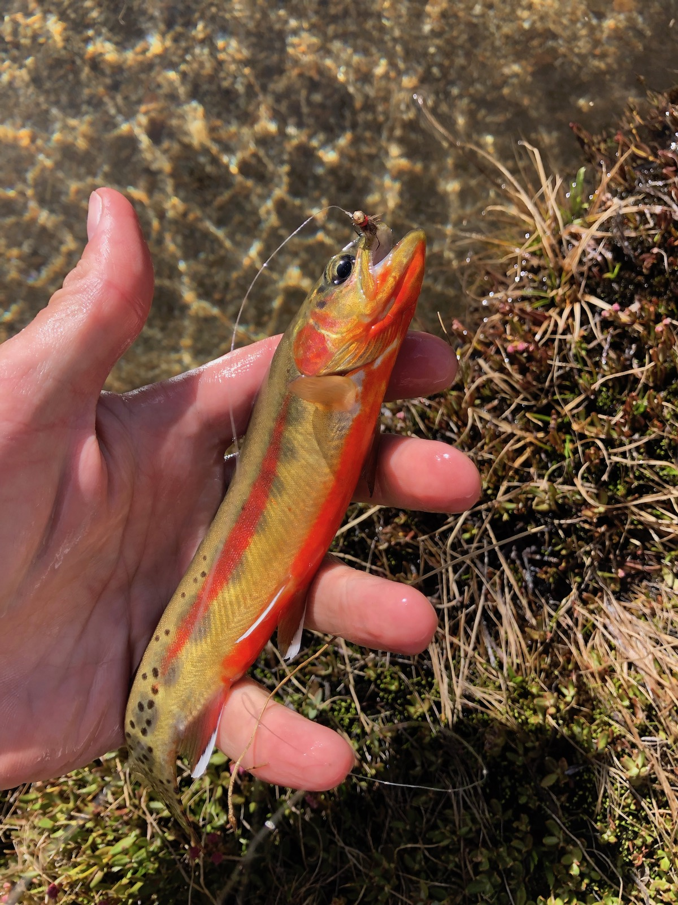
 <figcaption>A brightly colored golden trout.</figcaption>
</figure>

My plan was to camp at the Sallie Keyes Lakes, two miles past Selden Pass. The lakeshore almost looked like it was boiling from all the trout that were feeding on the hatching mosquitoes. But despite their valiant efforts, the majority of the mosquitoes had clearly made it out of the water. It was impossible to stand still for ten seconds without getting swarmed.

<figure>
 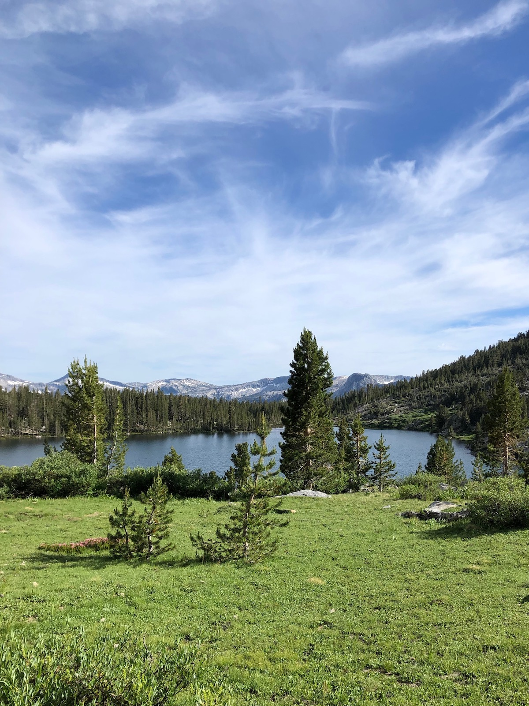
 <figcaption>A meadow above Sallie Keyes Lakes.</figcaption>
</figure>

<figure>
 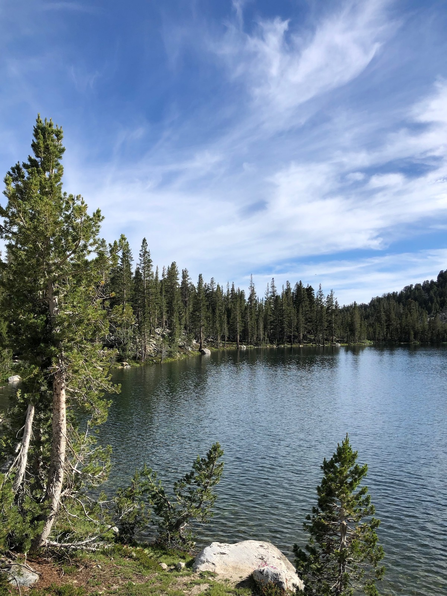
 <figcaption>Sallie Keyes Lakes.</figcaption>
</figure>

In addition to the mosquito situation, I heard from NOBO hikers at VVR that condensation had been a big issue at the lake. I decided I might as well continue a couple miles more to find a drier campsite and get closer to MTR for my resupply.

I only ended up walking another two miles before finding a good campsite near the halfway point of the JMT. It put me within a couple of miles from MTR so I could pick up my resupply early and still make good miles.
