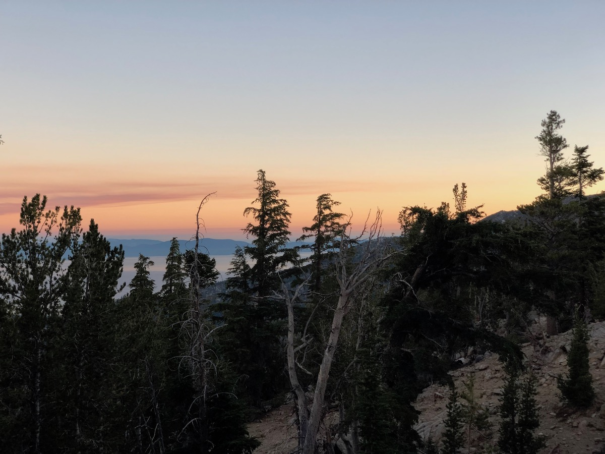
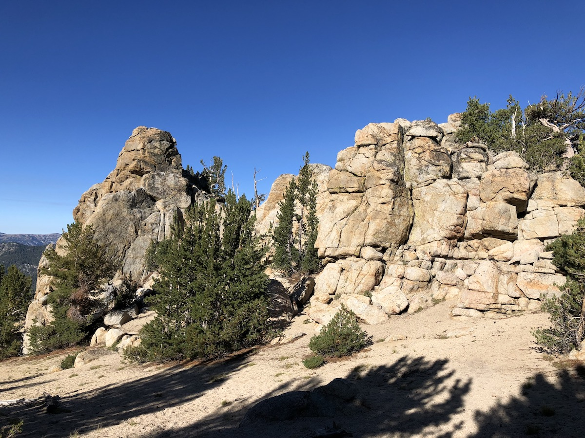
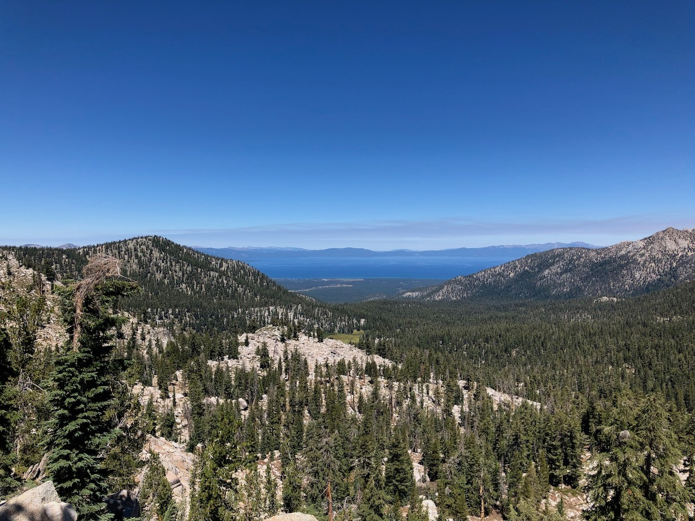
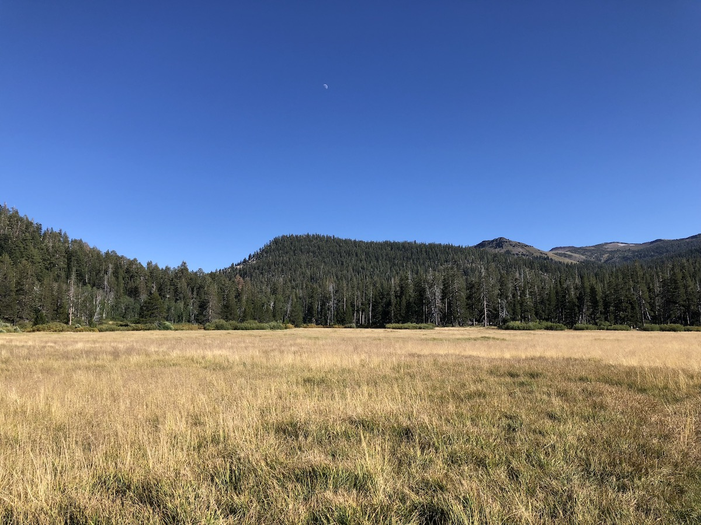

Day 7. Although our campsite had great views, it was a bit exposed. The wind was flapping my tent around early in the night before finally calming down and letting me sleep. We enjoyed our breakfasts as the sunrise started to color Lake Tahoe.

<figure>
  
  <figcaption>Sunrise at Freel Peak.</figcaption>
</figure>

We filled up with water at the creek near our campsite and started climbing up towards Armstrong pass. The views from the top were spectacular.

<figure class="full-width">
  
  <figcaption>Views from Armstrong Pass.</figcaption>
</figure>

We continued downhill through interesting rock formations and open forests. After the pass, the trail heads West for a few miles and climbs up over another pass. We could see glimpses of Lake Tahoe in the distance every time we got up above the trees.

<figure>
  
  <figcaption>An interesting rock wall.</figcaption>
</figure>

<figure>
  
  <figcaption>Lake Tahoe in the distance.</figcaption>
</figure>

Although we thought we had filled up with enough water in the morning, we noticed that my cousin's 2-liter Hydrapak bladder had fallen from his pack at some point. This led to a thirsty 12-mile stretch before we hit a small seasonal creek that was still trickling in mid-August. It wasn't flowing enough to fill a bottle directly. Instead, I had to put my cooking pot under the small trickle and use it to fill up the filter bag.

Now that we finally had some water, we took the chance to sit down for a short break in the shade of some aspen trees. We saw bear claw marks on some of the trees and found what looked to be a bear femur a bit off the trail.

<figure>
  
  <figcaption>Bear femur?</figcaption>
</figure>

The trail continued down toward Highway 89, passing through meadows and an old burn area.

<figure>
  
  <figcaption>Burned out tree.</figcaption>
</figure>

We took advantage of the toilets at the Big Meadow trailhead, then crossed highway 89 and up toward Big Meadow. As the name implies, it was a big meadow. We stopped a while at the creek that ran through the field to look at the small trout swimming in the river. I considered breaking out my Tenkara rod but figured they were too small to bother with.

<figure class="full-width">
  
  <figcaption>Big Meadow.</figcaption>
</figure>

From Big Meadow, we had about two more miles to Round Lake. The trail went through thick woods with tons of fallen trees and branches on the forest floor.

There were already more than ten other tents at Round Lake when we got there. We spent some time scouting out campsites along the North and Northwest shores of the lake.

Eventually, we settled on a campsite that was a bit higher up on a shelf on the Western side of the lake. Although we had a small rock scramble to get down to the lake for water, the views were easily worth it. Being farther from the lake also meant that we didn't need to deal with condensation or mosquitoes.

<figure>
  
  <figcaption>Campsite overlooking Round Lake.</figcaption>
</figure>

We took a quick dip in the lake and made some dinner before the sun went down, then went to bed early.

## Stats

16.1 miles +2,700ft, -3,900ft total elevation change.

You can find the routes for all days on [Caltopo](https://caltopo.com/m/HJ0L).
