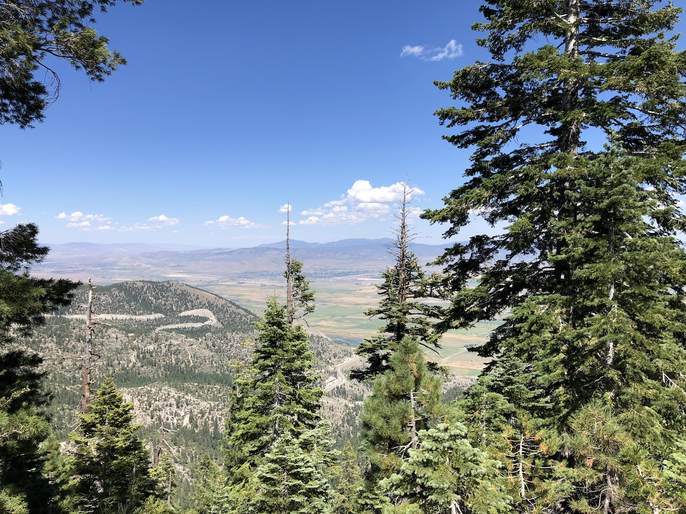
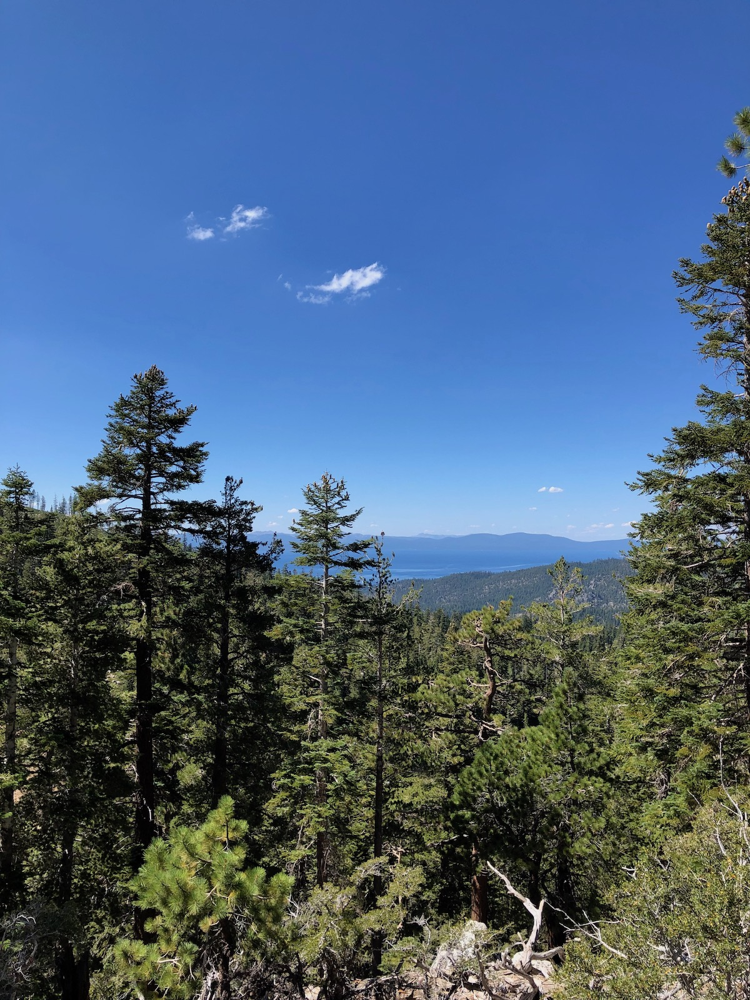
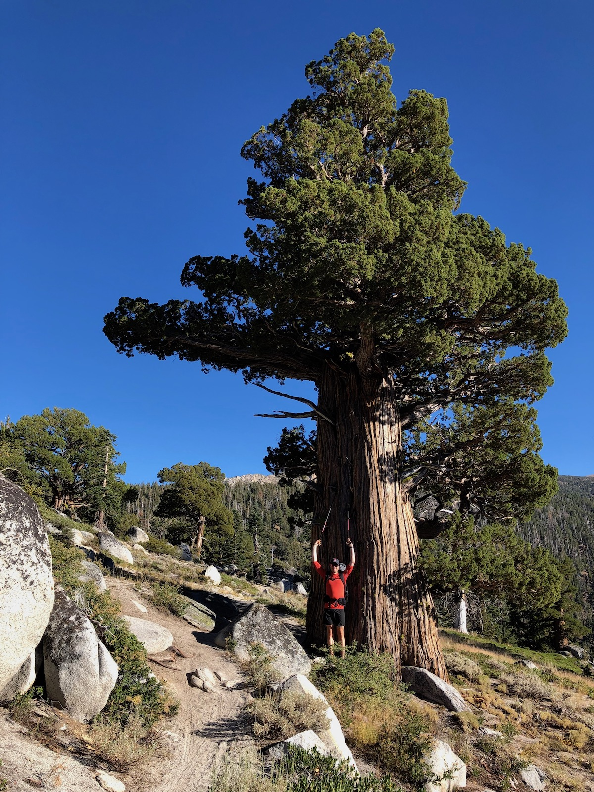
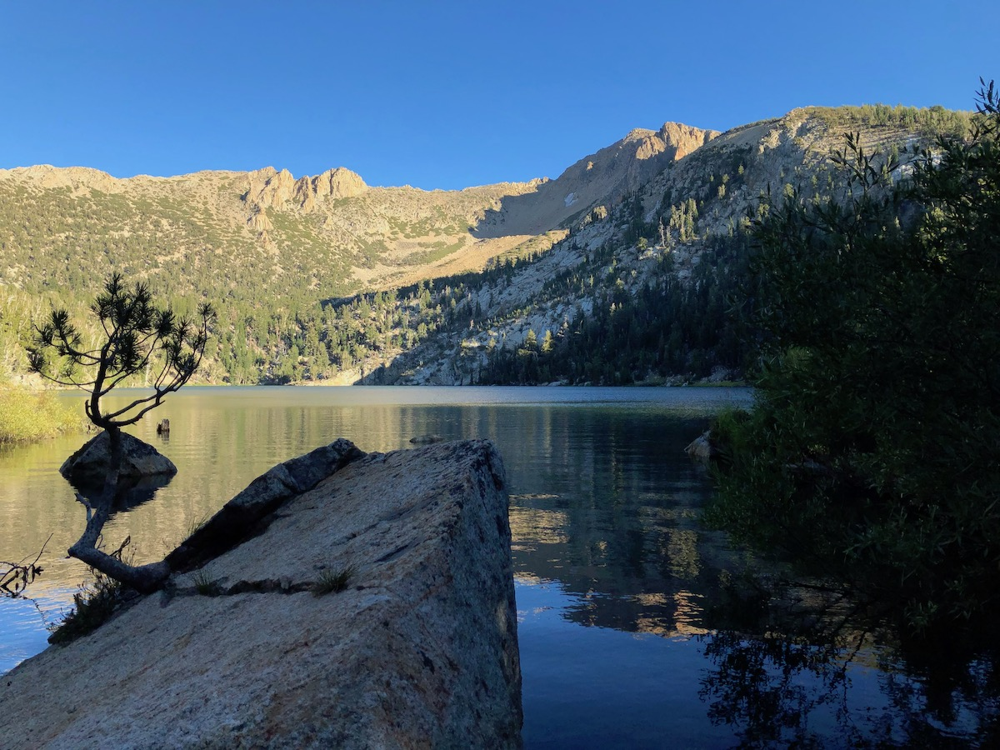

Day 6. After a two week break from the trail due to work, it was time to continue the TRT. My cousin flew in from Finland to join me on the second part of the trail. It was his first time to California, and I was sure he'd love the nature.

We got an early start from San Jose, stopped at a classic diner for a pancake breakfast, and got up to Tahoe City a bit after nine. We planned to leave the car at the parking lot near the Tahoe City Transit Center and take the bus down to Kingsbury South Trailhead. The West shore bus line only ran on weekends in August, so we wanted to take the bus on the first day and then hike back to the car. That way, we didn't need to hurry and finish by a specific day to catch a bus.

## Gear changes

During my time off the trail, I decided to make a few changes to [my gear list](/trips/tahoe-rim-trail-2018/overview-and-gear-list/).

The first change was to my sleep system. The Therm-a-rest XTherm I had started out with was way too hot for summer, it was like sleeping on lava. I swapped it out for a lighter XLite. I also replaced my sleeping bag with an Enlightened Equipment Revelation quilt for more flexibility.

I got Superfeet Carbon insoles for my shoes. Walking on the loose sand on the Eastern stretch tired out the bottoms of my feet, so having a bit more rigidity felt like a good idea.

Finally, I swapped out my Gerber pocket knife for a small Victorinox that weighed about the same but had scissors. Scissors make things like cutting Leukotape so much easier.

<figure>
  
  <figcaption>Ready to get back on the trail again!</figcaption>
</figure>

## Back on the trail

Right out of the gate, the trail started with a steady climb. In fact, the whole day was going to be more or less a non-stop climb.

As we climbed, we crossed a few ski slopes and started getting beautiful views of the valley that was to our East, on the Nevada side. The weather was beautiful. The sky was clear, all the smoke I had dealt with two weeks earlier was now gone.

<figure>
  
  <figcaption>Views East, toward Nevada.</figcaption>
</figure>

My cousin kept saying that the Sierra scenery looked utterly unreal as if it was from a movie set. We started joking that it was like going from one scene to another as the terrain changed completely every few miles, going from dense forest to wide-open sandy stretches with boulders.

With the smoke gone, we were rewarded with views of Lake Tahoe and some of the green, forested valleys to the South of the Lake.

<figure>
  
  <figcaption>Clear blue skies.</figcaption>
</figure>

<figure class="full-width">
  
  <figcaption>Green valley.</figcaption>
</figure>

The big Juniper trees were one of the highlights of our day. Their trunks are so broad they almost look like cartoon trees. My cousin and I are big fans of Gin, so we also had to check the trees for juniper berries. To our disappointment, they were all still very green.

<figure>
  
  <figcaption>Gin tree, a.k.a. juniper.</figcaption>
</figure>

Our plan was to camp at Star Lake. We had read that it was one of the most beautiful camping spots along the trail and that fishing was good. I had brought my Tenkara fly rod with me in hopes of doing a bit of fishing, and maybe even add some tasty calories to our menu.

When we got to the lake, there were already a few groups of people there. They had their tents right on the water, and their dogs were running around and barking. Not really the peace and quiet we were hoping for.

<figure class="full-width">
  
  <figcaption>Star Lake.</figcaption>
</figure>

The water also looked pretty murky and had algae floating in it. We only had an hour or so before sunset, so we decided to keep hiking.

After checking the map, we found a flat looking ledge facing South toward the lake. It was also close to a stream, which we hoped would have better water.

<figure class="full-width">
  
  <figcaption>Lake Tahoe in the distance.</figcaption>
</figure>

I'm thrilled we continued from Star Lake. This ended up being my favorite campsite of the whole trip. We had a fantastic view of the sunset and an unobstructed view of the night sky once it got dark.

The starry sky was amazing that night. Not only could we see the Milky Way, but we were lucky enough to catch a couple of shooting stars leaving bright green trails against the dark night sky.

<figure class="full-width">
  
  <figcaption>Sunset from our campsite below Freel Peak.</figcaption>
</figure>

Overall, the first day back on the trail had been great. It was fun to have company, and getting to introduce my cousin to the California Sierras.

## Stats

9.5 miles +2,800ft, -930ft total elevation change.

You can find the routes for all days on [Caltopo](https://caltopo.com/m/HJ0L).
