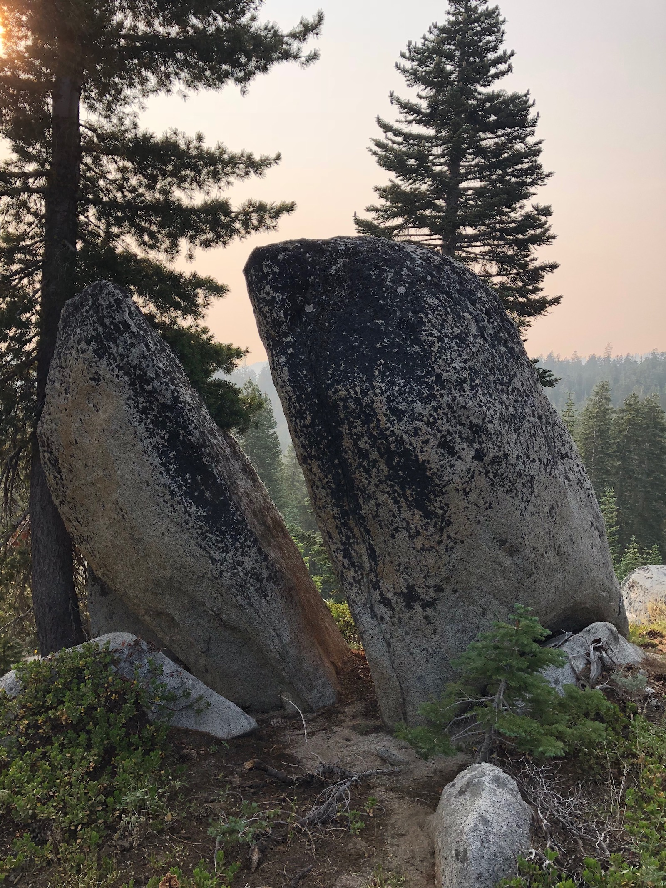
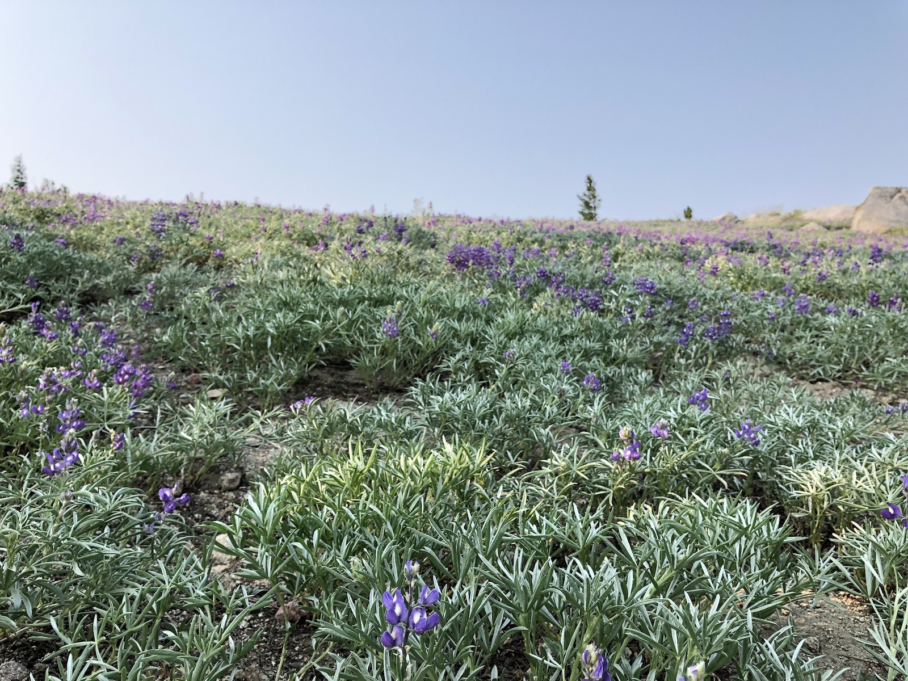
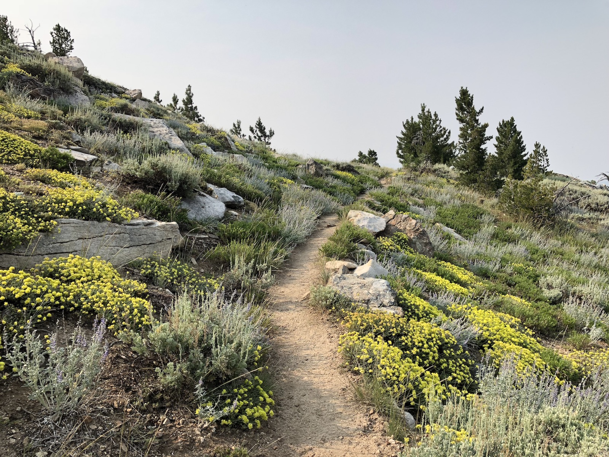
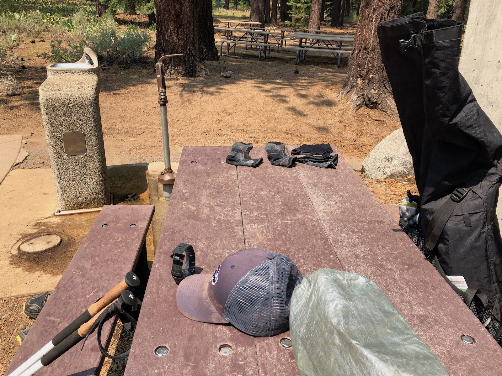
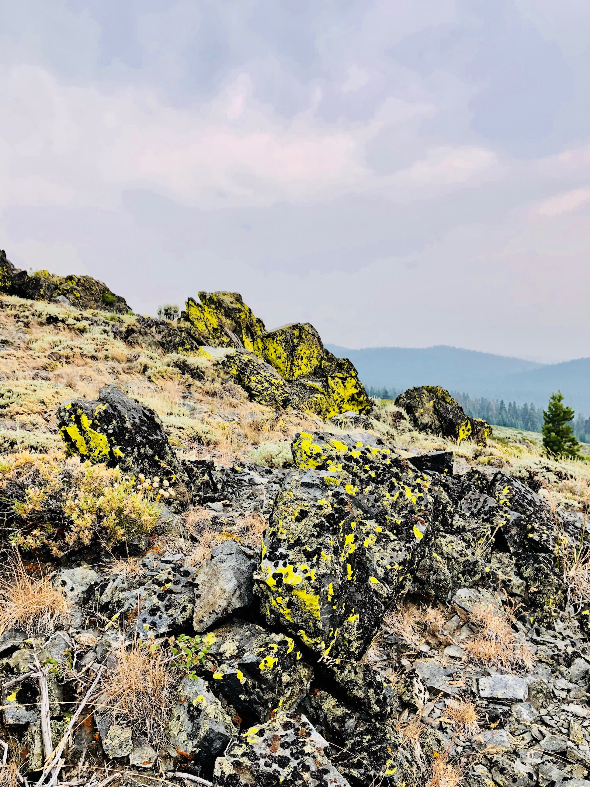
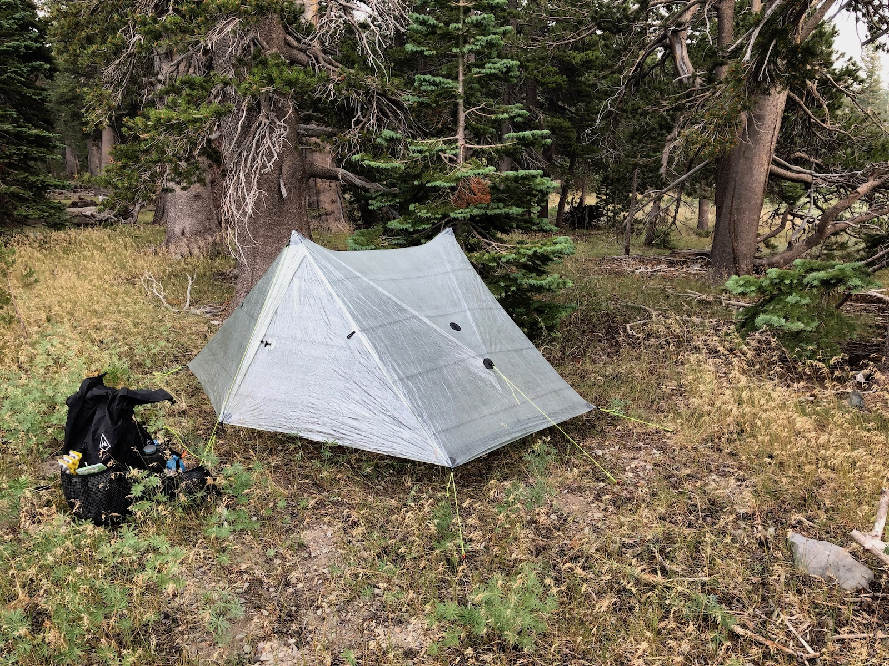
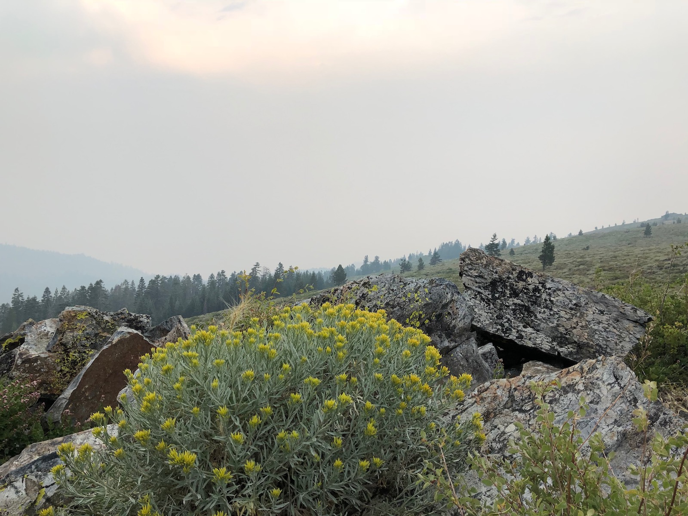
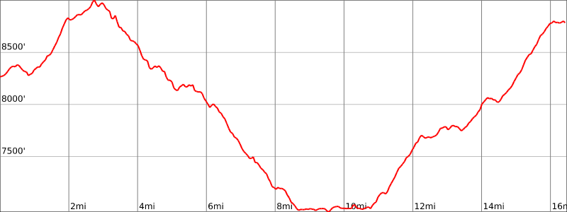

Day 4. Today was going to be a shorter day as I had two days to get to my car at Kingsbury South trailhead. I was in the middle of the longest dry stretch on the Tahoe Rim Trail, so I filled up on water at the Marlette pump before heading out. My first refill would be at Spooner Lake.

I headed out of camp a little after six in the morning. Because I didn't have that many miles to cover, I planned to take an extended break at Spooner Lake.

Hiking in the early morning is great because that's when you get to see wildlife. Just ten minutes out of camp, I walked up on two deer that looked at me with suspicion before hopping off.

<figure>
  
  <figcaption>A cool rock that looks like a whale</figcaption>
</figure>

After climbing out of the forest near the campground, the trail passes through broad fields covered in all sorts of flowers. The smoke was still heavy and dulled the color of the sky, which made the flowers and their colors stand out even more against the gray backdrop.

<figure class="full-width">
  
  <figcaption>Lupine field</figcaption>
</figure>

<figure class="full-width">
  
  <figcaption>Yellow flowers on the trail</figcaption>
</figure>

The morning was mostly cruising downhill. As I turned off the main trail to the Spooner Lake trail, the path dropped down into a lush aspen forest with thick undergrowth. All of a sudden it was as if I had been transported from the Sierra Nevada back to a Finnish summer landscape. The air was moist, and the bugs were there. Just like home.

<figure>
  
  <figcaption>A cool rock that looks like a whale</figcaption>
</figure>

Since I had plenty of time, I didn't go down and filter water at the near end of Spooner. Instead, I decided to walk to the campground on the other side to fill up on water and use the fancy toilets there.

I took the opportunity to rinse off all my clothes once again and let them dry in the sun as I ate my lunch. I met up with another TRT hiker who was heading the same way as I was. We chatted for another hour or so while charging our phones.

> There are outlets in the middle of the concrete "Stonehenge" structure at the campground. They're not very obvious at first. Just look for the poles at the center and near the fire pit.

<figure>
  
  <figcaption>Taking a break and washing stuff at Spooner Lake</figcaption>
</figure>

After a pleasant and relaxing break, I set off. My goal was to camp at South Camp Peak, which according to may had been their favorite campsite along the Tahoe Rim Trail. It was about another six miles from Spooner Lake, with a tough 1,800-foot climb. I wouldn't have a chance to fill up water until several miles in the following day, so I cameled up and packed four liters of water.

After crossing Highway 50, the trail starts climbing up a fairly steep set of long switchbacks. There had been recent forest management in the area, so there was a lot of cut-down trees and debris on the ground.

As the trail climbed up, it left behind the cut-down trees and went through a section of thick, dark forest before finally coming out into a meadow that lines the west side of South Camp Peak.

The rocks along the trail had really cool looking black and yellow lichen that practically glowed against the gloomy gray sky.

<figure>
  
  <figcaption>Yellow and black lichen on rocks</figcaption>
</figure>

I had read some other hikers' trail journals and tried to find the places they had mentioned. In the end, I opted for setting up my tent a bit into the trees so I wouldn't be so exposed out on the ridge. I cleared out a bunch of small pine cones (that I put back as I broke camp the next day) to fit my tent into a nice and cozy spot out of the wind.

<figure>
  
  <figcaption>Tent tucked in under trees at South Camp Peak</figcaption>
</figure>

With the tent set up, I walked out to the rim to make some dinner and catch the sunset. This was supposed to be one of the best views of Lake Tahoe, but I could barely make it out. The only indication that it was there was the faint red reflection of the sun as it went down.

<figure>
  
  <figcaption>The view of the lake was obstructed by heavy smoke</figcaption>
</figure>

As I was finishing my dinner, I could feel a few drops of rain starting to fall down on me. This was my cue to pack up and retreat to my tent. I stayed up a while longer, reading a book on my phone and listening to the rain hitting the tent.

## Stats

16.5 miles +3,300ft, -2,800ft total elevation change.

You can find the routes for all days on [Caltopo](https://caltopo.com/m/HJ0L).
