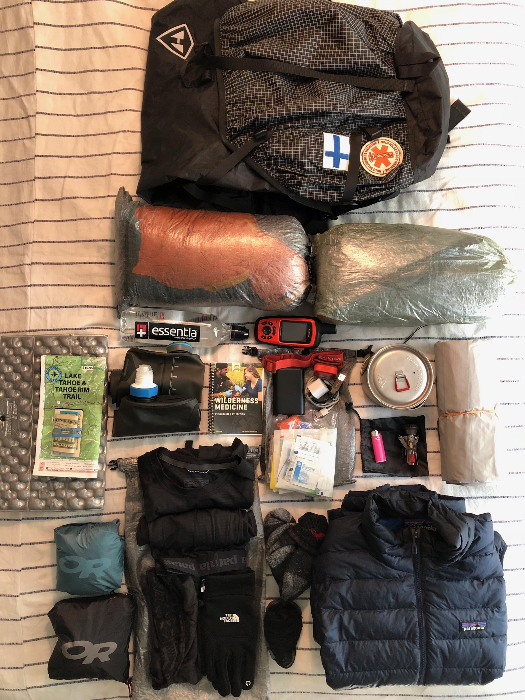
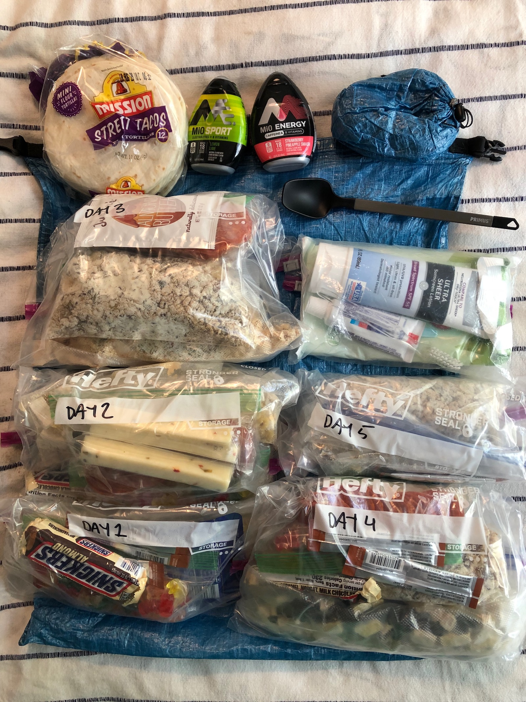
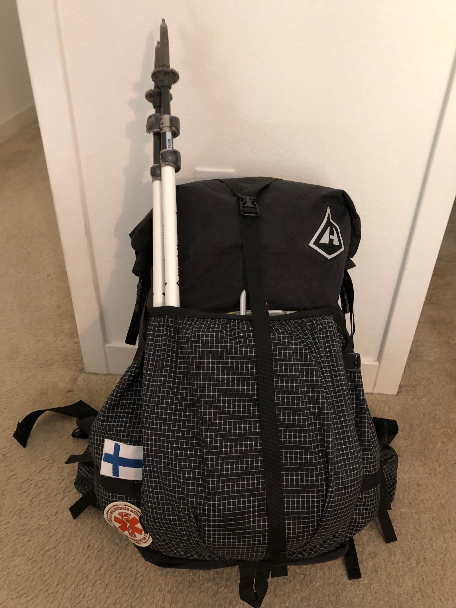

The [Tahoe Rim Trail (TRT)](https://tahoerimtrail.org/) was my first long-distance solo hike. The trail covers 165 miles around Lake Tahoe. What makes the TRT a great option for a first thru-hike is that it's a loop. That makes logistics easier: you end your hike where you begin it. It also offers numerous bailout points along the trail in case something were to go wrong.

I had to split my hike in two parts because of work. The first part was from Tahoe City to Kingsbury South. I would then go back to work for two weeks before completing the trip together with my cousin.

<figure>
  
  <figcaption>My gear setup for the Tahoe Rim trail</figcaption>
</figure>

## Gear list

Most of the gear I had for the hike were already tried and true, with the exception of my brand new [Zpacks Duplex](http://www.zpacks.com/shelter/duplex.shtml). I had ordered the tent almost 7 weeks earlier, and had already mentally given up on getting it before the hike. At last, they shipped the tent and I got it a couple of days before heading out.

I wanted to go light, but still make sure I had everything I needed to stay safe and reasonably comfortable.

### The big four (and friends)

> In the backpacking community, "the big four" refers to the tent, backpack, sleeping bag, and sleeping pad. This is because they often make up the biggest part of the base weight.

- Zpacks Duplex
- 6 Zpacks titanium stakes, 2 MSR Ground Hog stakes, and Zpacks tent stake bag
- Hyperlite Mountain Gear Southwest 3400
- 2 Zpacks shoulder pouches
- Therm-a-rest xtherm
- North Face Furnace 35&deg;
- Zpacks medium dry bag for sleeping bag

### Cook & Water systems

- MSR Titan kettle (0.8l)
- MSR Pocket rocket 2
- Primus long-handled spoon
- Bic mini lighter
- Gerber paraframe pocket knife
- Zpacks bear bag
- Zpacks rock bag + line and carabiner
- Katadyn BeFree filter + 3 liter hyrdopak soft flask
- 0.7 liter water bottle

### Clothes and such

**Worn**

- Patagonia Strider 5" Shorts
- Columbia Titanium hiking shirt
- Darn tough socks
- Altra Lone Peak 3.0 shoes
- Altra gaiters
- Black Diamond Alpine Carbon Trekking Poles

**Carried**

- Patagonia Down Sweater
- Long Darn Tough socks
- Buff
- North Face gloves
- Patagonia Capiliene lightweight top
- Patagonia Capiliene lightweight bottoms
- OR Helium II jacket
- OR Helium pants

### First aid, hygiene, electronics, etc

- Garmin InReach Explorer+ Satellite Navigator
- Anker PowerCore 10,000mAh batter pack
- USB wall charger
- Lightning and micro-USB cables
- Black Diamond Spot rechargeable headlamp
- First aid kit
- Wilderness Medicine field guide
- SPF 50 sunscreen
- Toothbrush and toothpaste
- Squirrel's Nut Butter anti chafing cream
- Dr. Bronner's soap
- Purell

## Food

It would take me 5 days from Tahoe City to Kingsbury South, which was the end of the first leg of the trail for me. The first and last days were only half days, so I only needed half the amount of food those days.

I accounted for 2 boils per day: one for morning coffee and one for a warm dinner.

<figure>
  
  <figcaption>Packed up food for the first 5 days of the TRT</figcaption>
</figure>

Without going into a ton of details, my basic "meal plan" was:

**Breakfast**\
Granola with whole milk powder, freeze drided fruits or berries, and Starbucks Via coffee.

**Lunch**\
Street tacos filled with string cheese, pepperoni, and almond butter (for dessert, not mixed together).

**Snacks**\
Haribo gummy bears, Snickers, trail mix. Mio sport and energy for both electrolytes and boil-free caffeine.

I split my food up into separate bags per day to make it easier on the trail.

That's it, time to hit the trail!

<figure>
  
  <figcaption>All packed up!</figcaption>
</figure>
