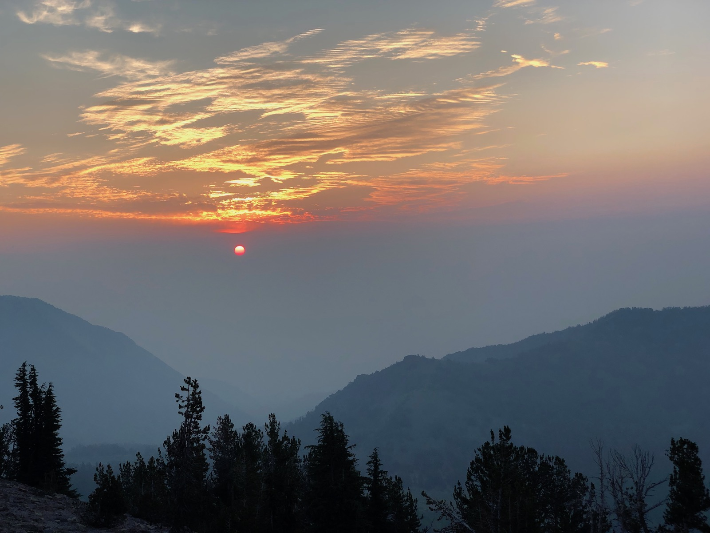
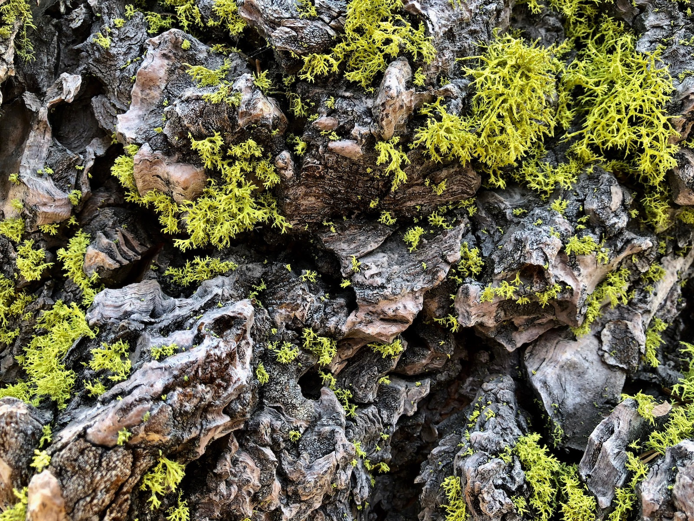
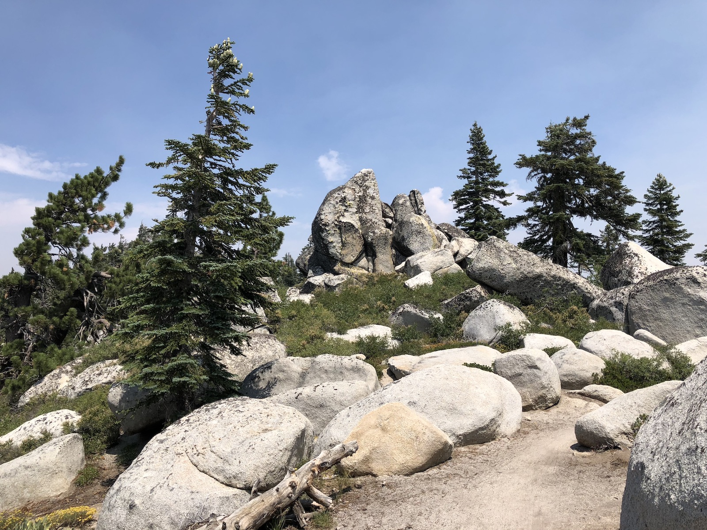
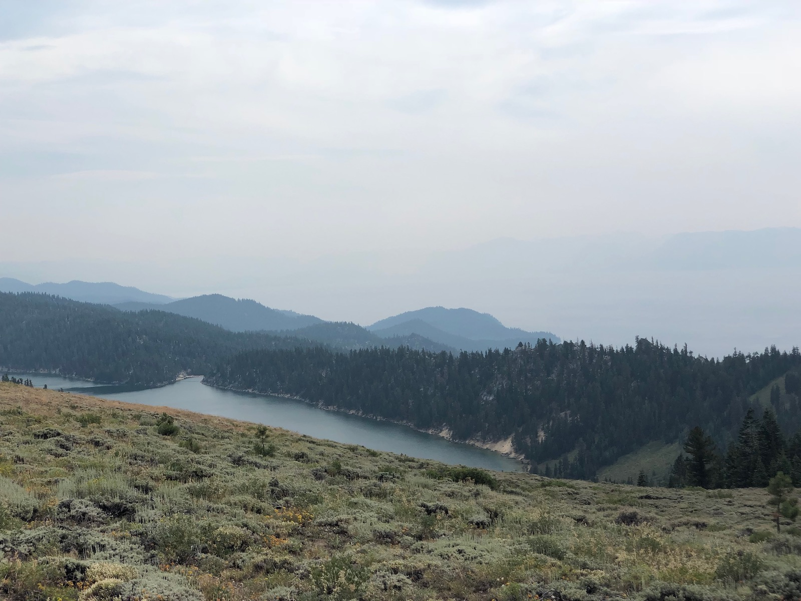
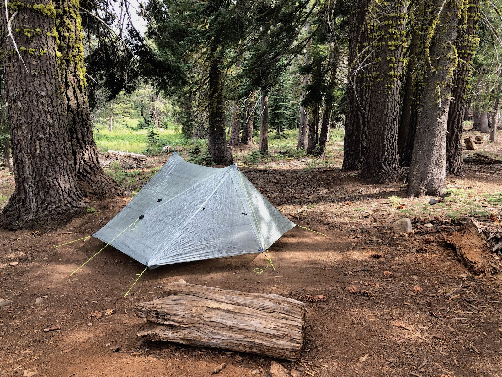
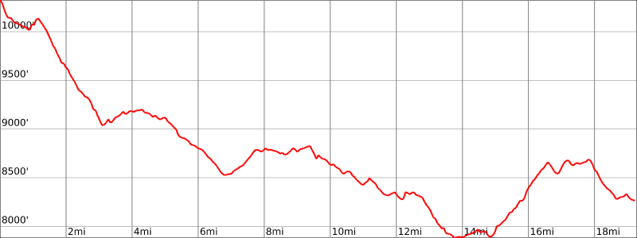

Day 3. I woke up to a draft in my tent. I had left the downwind storm doors of my Duplex open for ventilation. The wind had turned around over the night, and they were now instead funneling in the air into my tent.

The air was significantly smokier than it had been the previous day. The change in wind direction had brought in thick smoke that smelled like a campfire in the distance.

The upside of all the smoke was a spectacular sunrise.

<figure>
  
  <figcaption>A smoky sunrise on Relay Peak</figcaption>
</figure>

I had a quick breakfast and was on the trail after 6. After the grueling climb the previous day, today would be mostly downhill. My knee that was bothering me had also decided to start playing nice again and didn't bother me at all during the rest of the trip.

The smoke obscured views of the lake and gave everything an eerie yellow-ish tint.

<figure>
  
  <figcaption>You couldn't see the lake due to all the smoke</figcaption>
</figure>

My first quick stop of the day was to fill up water at Galena Falls. There was still a trickle of water coming down despite the dry summer.

<figure>
  
  <figcaption>Galena Falls</figcaption>
</figure>

I continued my way down towards the Mt. Rose trailhead, or more specifically the campground at Mt. Rose. The campground was right off the trail and offered two amenities any hiker can appreciate: a pit toilet and a dumpster for lightening the pack.

<figure>
  
  <figcaption>There was a toilet and a trashcan at Mt. Rose Campground</figcaption>
</figure>

After Mt. Rose, the trail went through Tahoe Meadows and stayed relatively flat. I finally got some relief from the sun as the path began to climb after Opihr Creek and went into the woods.

Thankfully, I had the [Guthook](https://atlasguides.com/guthook-guides/) app installed on my phone and could see some recent updates saying that the spring near mile 44 was still going, so I didn't need to fill up on water before the climb.

One of my favorite things in the forest was the bright green lichen that grew on trees in the darker parts of the woods.

<figure class="full-width">
  
  <figcaption>Bright-green lichen on a tree</figcaption>
</figure>

The landscape was dotted with round boulders, some looking like giant eggs left there by dinosaurs long ago. I amused myself by trying to see different animal shapes in the rocks.

I stopped for lunch at a small creek and sat in the shade for a while. Once again, I took the opportunity to rinse off my clothes. This daily routine was both refreshing and helped keep the stink down.

<figure>
  
  <figcaption>Big boulders dotted the landscape</figcaption>
</figure>

The trail continued to be a gentle downward slope until Twin Lakes. The lakes still held water, but I still had plenty from lunch as it had been all downhill since then.

After Twin Lakes, the trail starts to switchback up somewhat steeply. Looking back, you have beautiful views of Twin Lakes, and a bit later Marlette Lake with Lake Tahoe in the background. Unfortunately, the smoke was blocking much of the view for me.

<figure>
  
  <figcaption>Views of Marlette Lake and Lake Tahoe in the distance</figcaption>
</figure>

After the climb, there were just a few more miles left until Marlette Campground. The campground is the only place you're allowed to camp at in the Lake Tahoe Nevada State Park. It also has a water pump, which is excellent as the Eastern section of the trail can otherwise require a very long water carry here.

As I started descending towards the campground, the dry forest gave way to meadows of flowers and butterflies.

<figure>
  
  <figcaption>Flower field just before the campground</figcaption>
</figure>

I got to camp before anyone else, so I was able to score a sweet spot with a picnic table.

<figure>
  
  <figcaption>Tent set up at Marlette Campground</figcaption>
</figure>

The water pump at Marlette is somewhat of a pain to operate on your own. It can be done, but it's much easier if you can get someone to help you.

A few more hikers showed up, but the campground was surprisingly empty being the only place you're allowed to camp at for miles.

I spent a few hours talking to another hiker before turning in for the night.

## Stats

19 miles +2,250ft, -4,329ft total elevation change.

You can find the routes for all days on [Caltopo](https://caltopo.com/m/HJ0L).
