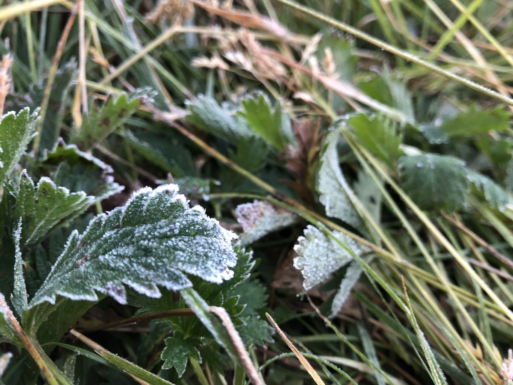
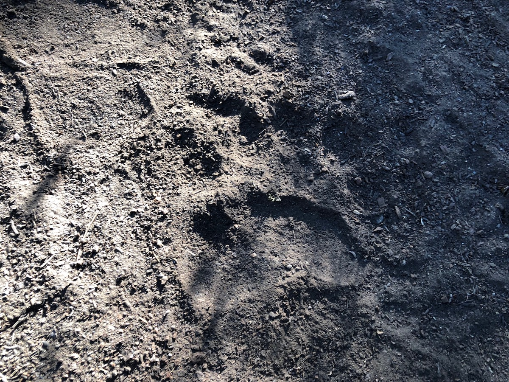
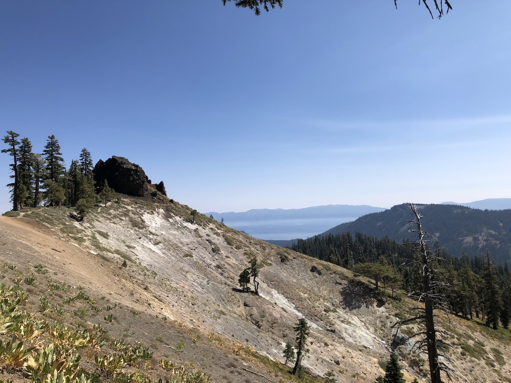
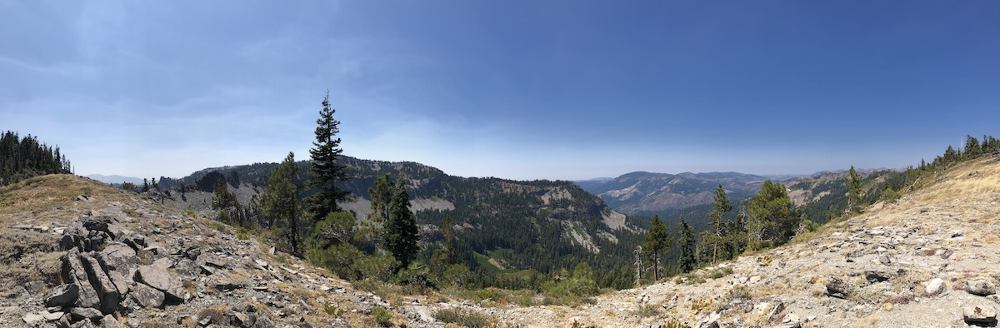
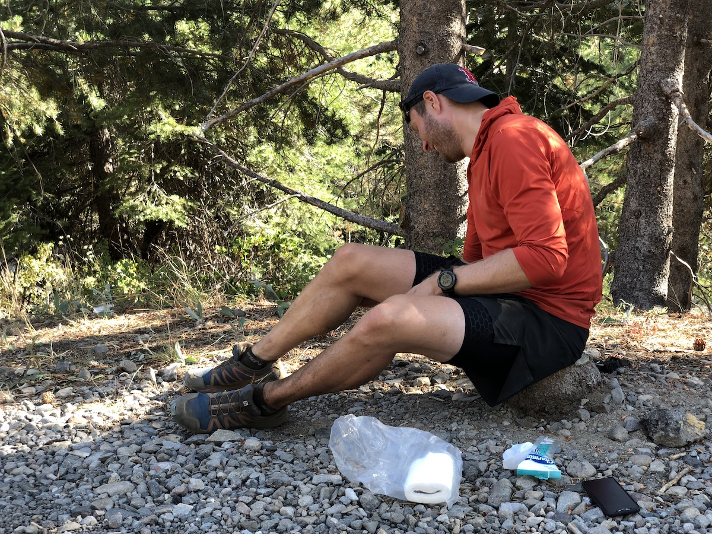
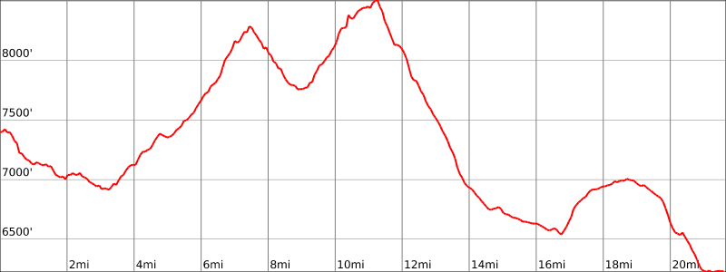

Day 11. I woke up a few times during the night because I was cold and had to put on some more clothes. As my alarm rang at 5AM, I got out of the tent and noticed that the ground around us was covered in frost. We had selected our campsite for its views and were paying for that choice with a damp, cold night. Had we slept just 10-20 vertical feet higher, we would have been sleeping dry.

Because it was cold and we were freezing, we decided just to pack up quickly and have breakfast when we found a place in the sun to sit down and eat.

<figure>
  
  <figcaption>Morning Frost.</figcaption>
</figure>

We thought we were the first ones on trail that morning. But it turned out that a bear had walked in front of us, leaving a set of fresh tracks for us to follow.

<figure>
  
  <figcaption>Fresh bear print on the trail.</figcaption>
</figure>

The first 3.5 miles to the Barker Pass trailhead went fast, and we were able to layer down as the sun started warming the air.

There was a pit toilet at Barker Pass trailhead that we gladly took advantage of. We also had a chat with two women who were there to meet their friends for a resupply.

<figure>
  
  <figcaption>Views from above Barker Pass.</figcaption>
</figure>

Continuing from Barker Pass, the trail continued climbing up into the Granite Chief Wilderness. As we climbed, we had beautiful views of interesting rock formations and Lake Tahoe in the distance.

<figure>
  
  <figcaption>Cool rock formation.</figcaption>
</figure>

<figure class="full-width">
  
  <figcaption>Panoramic views.</figcaption>
</figure>

Unfortunately, my cousin's hip had started to act up, making the climb painful. We took it slow and found a place to stop for lunch on the way down. He was able to stretch the pain away during the break, so we were good to go again.

<figure>
  
  <figcaption>Stretching.</figcaption>
</figure>

We had now settled on our plan. We were going to finish today. Since my cousin was doing a section hike and had his hip acting up, it didn't make sense for him to push hard until the end. So we decided that he would hitch a ride to town from Ward Creek Boulevard, and I would continue the last 5 miles on my own to complete my thru-hike.

<figure>
  
  <figcaption>Wiping off trail dust before getting a ride to town.</figcaption>
</figure>

The last section of trail from Ward Creek Boulevard to Tahoe City was a comparatively small climb, and my legs were still feeling fine. I climbed a 4WD road up to Page Meadows and started the final descent into town. On the way down, the trail was super rocky at places, so I had to be careful not to get injured on the last couple of miles.

<figure>
  
  <figcaption>Rock scramble on the home stretch.</figcaption>
</figure>

Soon enough, I started seeing buildings and finally the blue shimmer of Truckee River. They were doing road construction on the trail going along the river, so I had to make a last little detour before reaching the Transit Center parking lot where I had started my journey. What a great feeling.

My car was still where I left it, and after a short drive to the hotel, I was greeted by my cousin and a can of cold beer. After a not-so-quick shower, we headed out for burgers before crashing for a night of well-earned rest.

<figure>
  
  <figcaption>A happy thru-hiker.</figcaption>
</figure>

## Stats

21.78 miles +3,000ft, -4,200ft total elevation change.

You can find the routes for all days on [Caltopo](https://caltopo.com/m/HJ0L).
