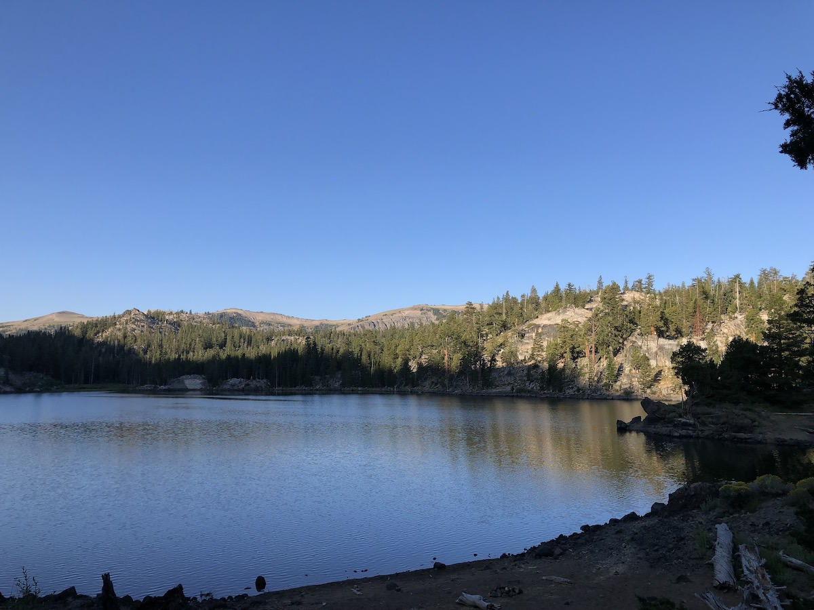
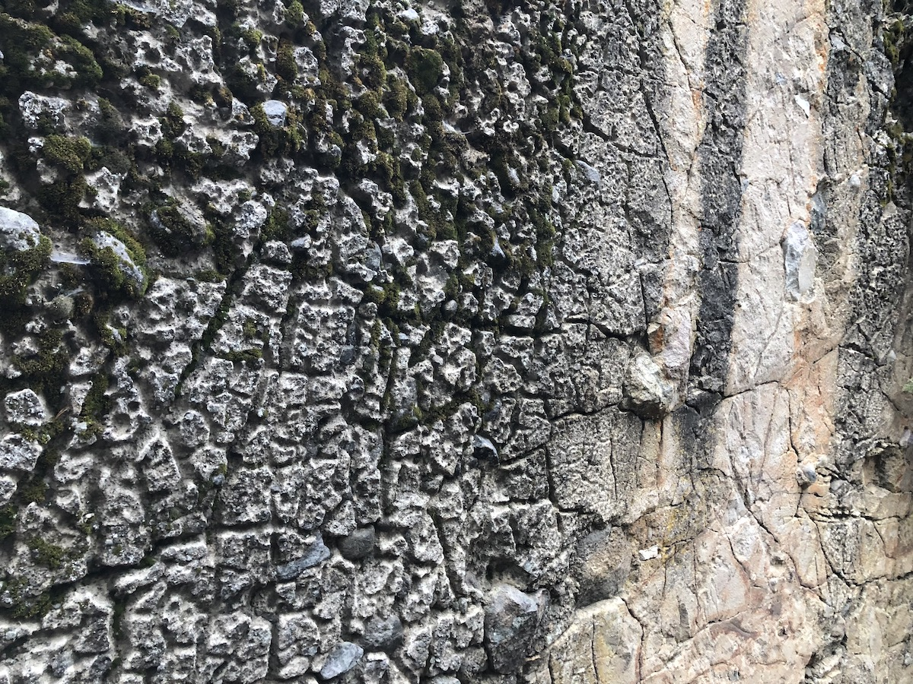
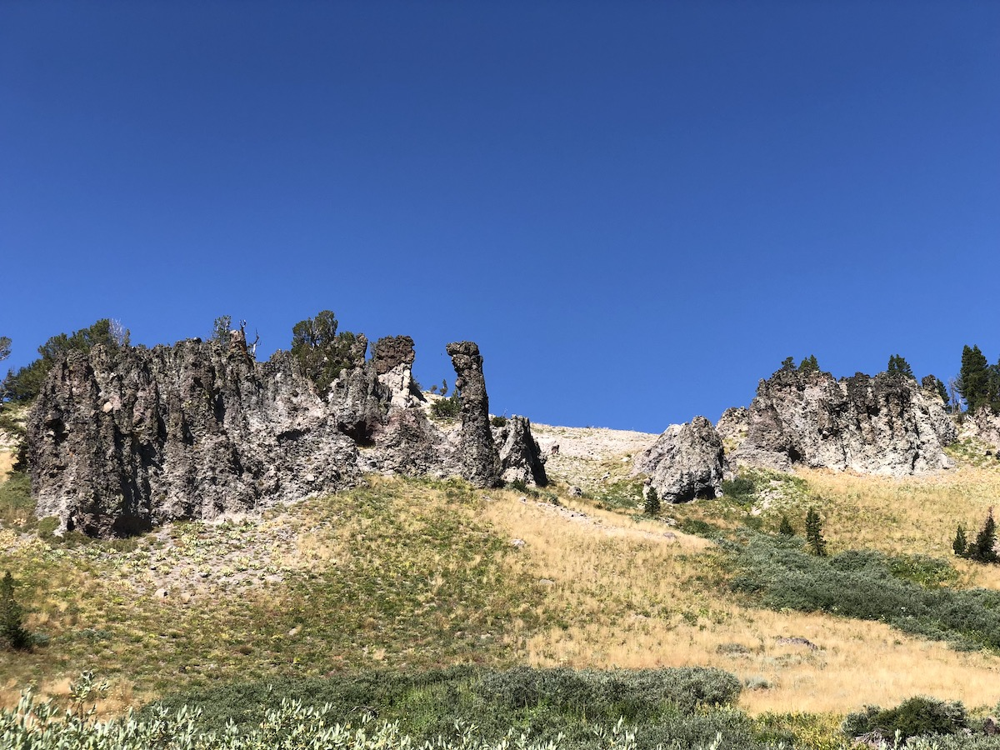
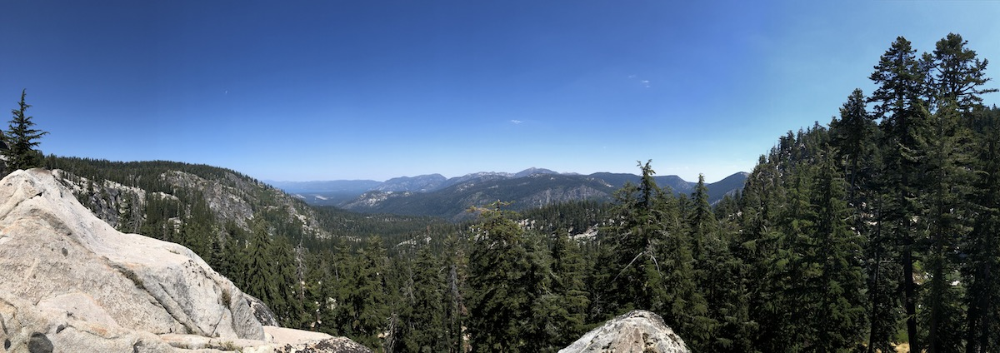

Day 8. We had a good night's sleep. Because we were camped up on the ledge on the Western side of the lake, the morning sun quickly started warming us.

<figure>
  
  <figcaption>Sunrise at Round Lake.</figcaption>
</figure>

The plan for the day was to hike to Echo Summit and get a ride down to South Lake Tahoe for resupply and a hotel night. That meant we only had 12 miles and we were in no hurry in the morning.

We enjoyed our coffees and granola, then packed up and headed out. There was a lot of looking volcanic rocks around Round Lake. Some looked like rough concrete, others like dragon skin.

<figure class="full-width">
  
  <figcaption>Dragon skin rock.</figcaption>
</figure>

We filled up on water at a stream at the end of the lake and continued South through small meadows. Three miles from Round Lake, we came to the Southernmost point of the Tahoe Rim Trail. This is where the trail joins the Pacific Crest Trail (PCT) and heads North.

<figure>
  
  <figcaption>Meadow where the TRT joins the PCT.</figcaption>
</figure>

The first mile after the junction, the trail crosses a big meadow. We stopped at one of the forks of Little Truckee River that runs through the meadow for some snacks and to see if the small trout in the river were interested in the flies I had to offer. They were not.

We continued climbing up towards Showers Lake. The trail passes right by the lake which offered some magnificent scenery. Even though the lake itself was beautiful, there were a lot of people, so we just continued on.

<figure class="full-width">
  
  <figcaption>Showers Lake.</figcaption>
</figure>

After Showers Lake, the trail climbs up and follows the contour beneath Little Round Top. The views were spectacular.

<figure>
  
  <figcaption>Beneath Little Round Top.</figcaption>
</figure>

On the ridge above us, rocks formed tall spires, and below us, we had an expansive view of the valley with views all the way to Lake Tahoe. Late-season yellow wildflowers lined the trail.

<figure>
  
  <figcaption>Rock Spires.</figcaption>
</figure>

We soon hit the top of the climb and stopped for a coffee break at a small stream. We only had a few more miles to go, all downhill.

But the going would prove to be harder than we anticipated. The descent down to Echo pass was long, steep, and rocky. I'm glad we weren't climbing it.

<figure>
  
  <figcaption>Boulders.</figcaption>
</figure>

The views on the way down were magnificent. Granite walls towered over us on both sides of the trail and could see glimpses of the lake out in the distance.

<figure class="full-width">
  
  <figcaption>Lake Tahoe in the distance.</figcaption>
</figure>

<figure>
  
  <figcaption>Granite wall.</figcaption>
</figure>

It was a good thing that we were planning on heading into town for a resupply. My Katadyn BeFree filter's flow rate had slowed down to a trickle and the added pressure I had to put on it to get water had led to a leak in the bottle. I would have to get it replaced before we got back on the trail again.

When we got to Echo Summit, our challenge was to get a ride down to South Lake Tahoe. Neither of us was comfortable with hitchhiking, but fortunately, there was cell service, and we were able to order a Lyft. We rewarded our driver with an extra cash tip for tolerating our stinkiness.

Once we were in town, we checked into our hotel, showered and washed our clothes. With our clothes still damp, we then headed for the most critical thing: dinner. After I ordered my pizza, the waiter thanked us and started walking away. We had to call him back and explain that we weren't done ordering – my cousin still needed to order his. Needless to say, we had an absurd amount of pizza. We had to get a box for the last half pizza, but we took care of that the next morning.

<figure>
  
  <figcaption>Post-hike pizza.</figcaption>
</figure>

We visited the sporting goods store to get some more gas and a replacement filter for me. I ended up switching to a Sawyer Squeeze. They weigh a bit more, but they are bomb proof and can use any old bottle which makes them much more convenient on a long hike.

## Stats

12.5 miles +2,100ft, -2,800ft total elevation change.

You can find the routes for all days on [Caltopo](https://caltopo.com/m/HJ0L).
