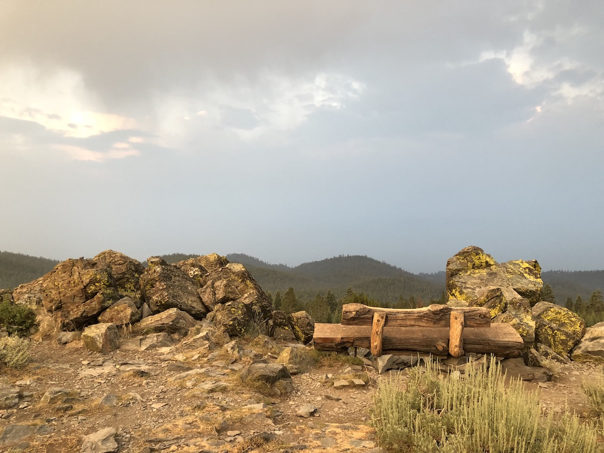
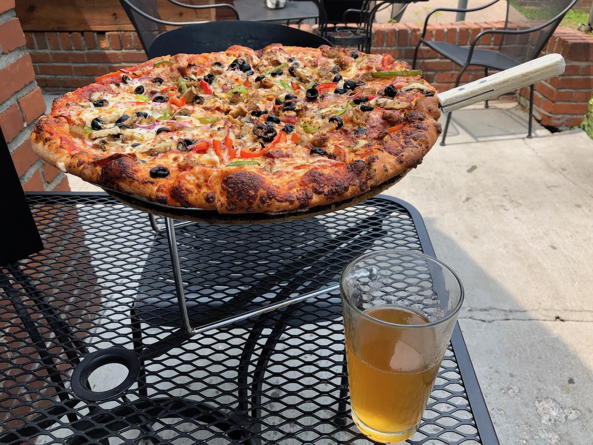

Day 5. I woke up a few times during the night to rain showers pattering on the tent. This was my last day on trail before I needed to get back to work for two weeks. I ate breakfast in the tent, out of the rain. I then packed up and hit the trail before six.

Pretty soon, I came upon the famous bench that's overlooking the Lake Tahoe. Unfortunately, the rain clouds and the smoke obscured the view.

<figure class="full-width">
  
  <figcaption>Sunrise at the bench on TRT</figcaption>
</figure>

The trail was mostly downhill for the first ten miles, and the mild weather made it refreshing. The rain during the night and morning dissipated, leaving the air a bit easier to breathe than it had been the past few days.

After leaving the ridge at South Camp Peak, the forest started out thick and dark but quickly thinned out into beautiful open forest dotted with boulders.

<figure>
  
  <figcaption>Open forest.</figcaption>
</figure>

<figure>
  
  <figcaption>Some cool rocks.</figcaption>
</figure>

Getting started in the cool morning hours was necessary. I was still carrying water from Spooner Lake, and the next reliable water source was over ten miles from camp at Edgewood Creek. Thankfully, the downhill made the trek easy going.

The clouds and smoke started clearing out as the sun rose. I could begin to see the hideous Stateline casinos in the distance, signaling that I was getting closer to my goal.

<figure>
  
  <figcaption>A smoky view of Stateline and South Lake Tahoe.</figcaption>
</figure>

The winds had turned enough that the skies started clearing out from the east, giving everything a bit more color and contrast. The greens were greener, and the blues bluer. The blue Sierra sky really makes the landscape come alive.

<figure>
  
  <figcaption>Blue skies and granite.</figcaption>
</figure>

At mile 10 for the day, I finally got to my first and only water source. I only had another 2.5 miles to go to my car, so I drank a liter and carried a half liter for the final ascent.

<figure>
  
  <figcaption>Edgewood creek flowing at the end of July 2018.</figcaption>
</figure>

Nearing the Kingsbury South trailhead, the trail crosses several ski slopes and goes under chair lifts waiting for the next season to start. The thing that surprised me the most was how much vegetation was able to survive on the slopes. Apparently, the amount of snow they get is sufficient to shield all the plants when they groom the trails.

<figure>
  
  <figcaption>Ski lift at the Heavenly ski resort.</figcaption>
</figure>

The trailhead is at the end of a side trail that ascends a few hundred feet to the Heavenly Stagecoach Lodge where I had left my car. At the car, I changed into clean clothes and washed up a bit. I then drove down to South Lake Tahoe for a well-deserved pizza before continuing back home.

I would be back in weeks with my cousin to finish the trail.

<figure>
  
  <figcaption>Post hike refuel: pizza and beer.</figcaption>
</figure>

## Stats

12.4 miles +1,900ft, -3,200ft total elevation change.

You can find the routes for all days on [Caltopo](https://caltopo.com/m/HJ0L).
