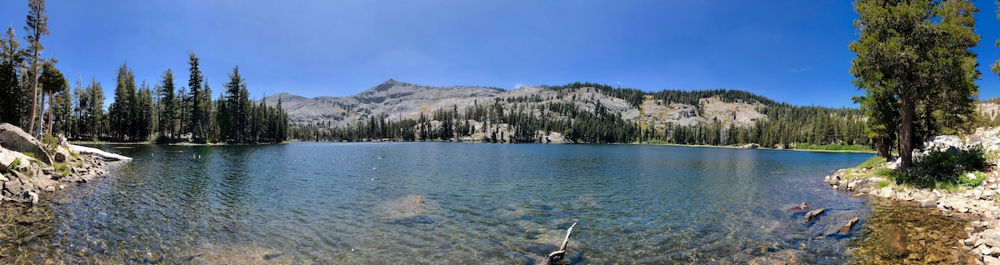
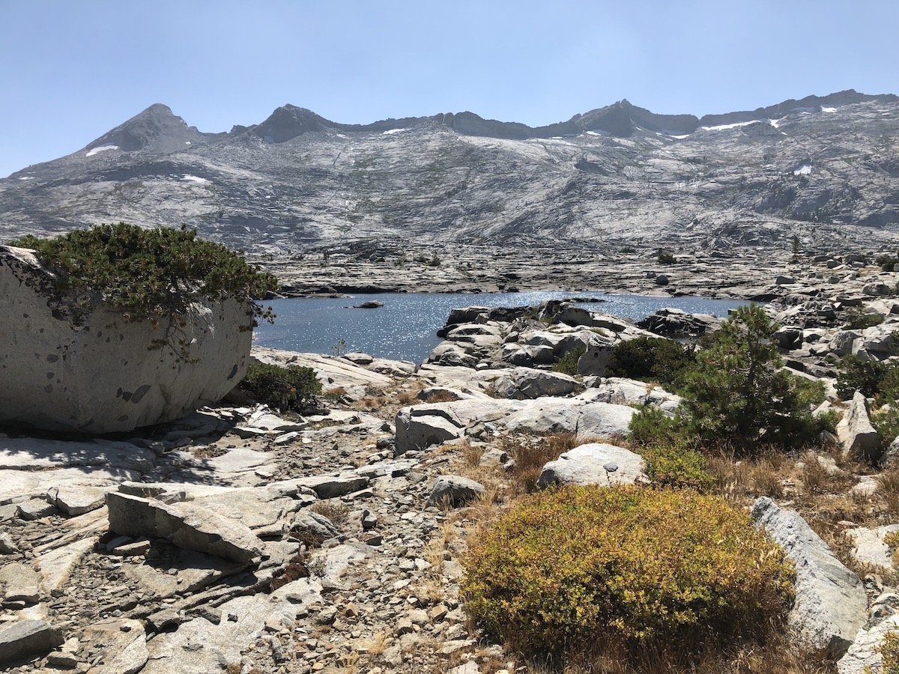
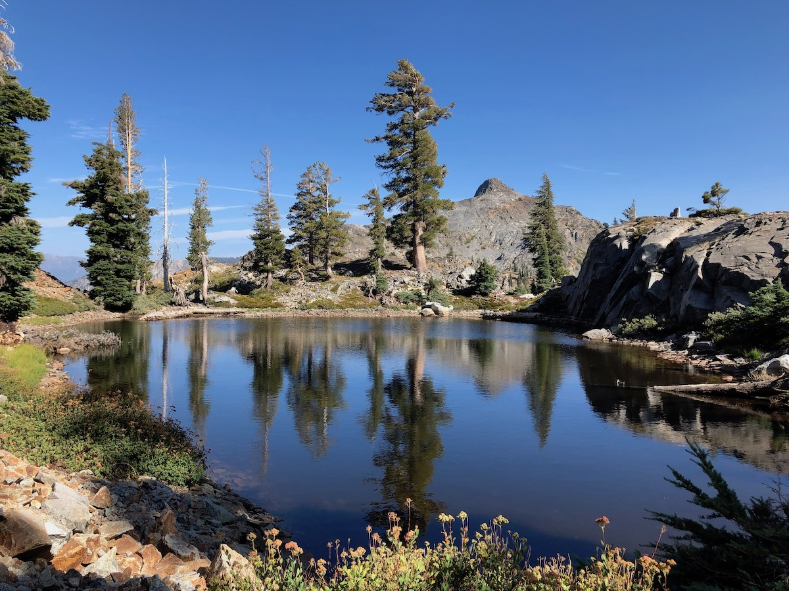
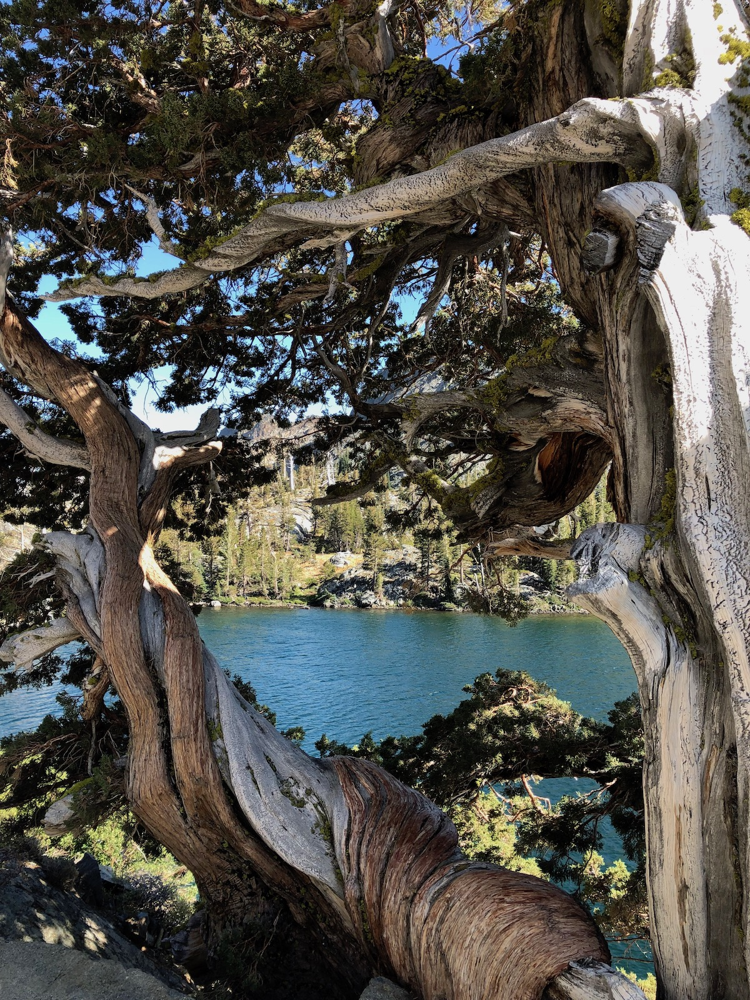
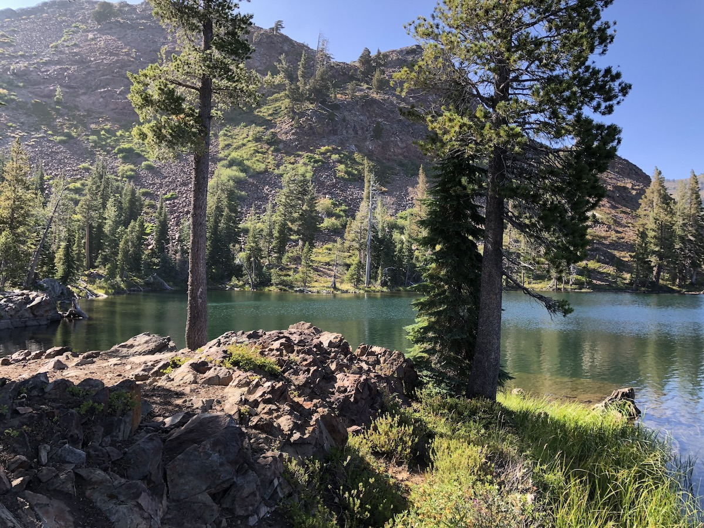
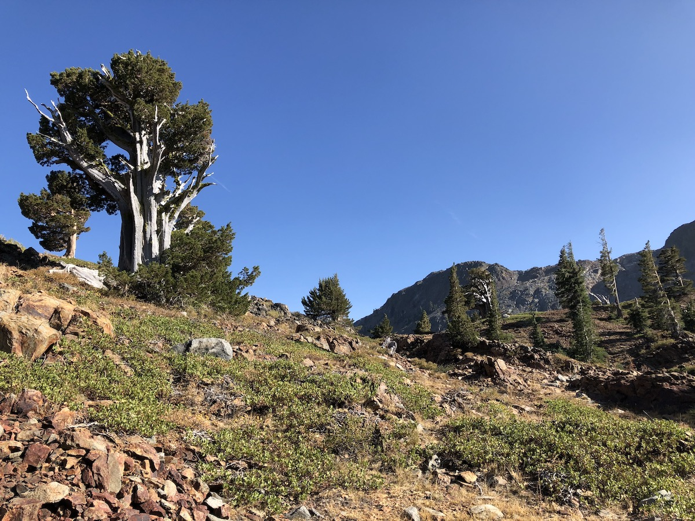

Day 9. After a great night's sleep in a hotel bed, we made ourselves a big breakfast with eggs, bacon, and toast with a side of leftover pizza from the night before.

I was excited to get into Desolation Wilderness. I had hiked to Lake Aloha the previous summer, which was what prompted me to look into hiking the TRT.

We got a couple of last things from a nearby sporting goods store and grabbed a Lyft to the Lake Tahoe Basin Management Unit building to pick up a permit for Desolation Wilderness.

The permit process was easy. We walked in, said we're hiking the Tahoe Rim Trail and that we needed a permit. The ranger gave us some tips and warned us about a momma bear with a cub near Lake Aloha that had been sniffing around hikers' food lately.

With the permit taken care of, we took a Lyft back up to the trailhead where we had left off. To my cousin's amusement, I was very adamant about continuing exactly where we had stopped the day before so I could say I had hiked the whole trail.

We followed Highway 50 for a few minutes, then made a mad dash to cross it between cars zooming by. After crossing the road, we hiked for about 30 minutes through a sparsely populated forest before coming to the Echo Chalet at Lower Echo Lake.

We were unable to fill up water at the Chalet, so we bought some Gatorade instead.

<figure>
  
  <figcaption>Boat on Lower Echo Lake.</figcaption>
</figure>

The trail follows the steep shore of Lower Echo Lake for the first 3 miles after the Chalet. It was interesting to see all the cabins on the lake, but at the same time, it didn't feel like being out in the wilderness. Despite its name, Desolation Wilderness was probably the most trafficked part of the whole trail.

<figure>
  
  <figcaption>Desolation Wilderness sign.</figcaption>
</figure>

A while after entering Desolation Wilderness, we stopped at Tamarack Lake, just off the trail, for a short coffee break. There were some tents pitched right by the lake, and we watched a ranger tell them to pack up while we had snacks.

<figure class="full-width">
  
  <figcaption>Tamarack Lake.</figcaption>
</figure>

The beauty of Desolation Wilderness comes at a cost as the trail is very rocky throughout the entire stretch. The path consists mostly of fist-sized loose rocks, some of which are pretty sharp. I'm glad I had my insoles for comfort and hiking poles for support. I would have rolled my ankle a few times if I hadn't been able to catch myself with the poles.

<figure>
  
  <figcaption>The trail was very rocky.</figcaption>
</figure>

Lake Aloha is just on the treeline, surrounded by bare rock on the far side from the trail. The water was several feet lower than it had been the year before. This exposed many of the rocky islands that dot the lake.

<figure>
  
  <figcaption>View of Lake Aloha.</figcaption>
</figure>

<figure class="full-width">
  
  <figcaption>Panoramic views of the granite wall behind Lake Aloha.</figcaption>
</figure>

Although the views at Lake Aloha were spectacular, it was also very exposed and windy. After exploring the shore for a while, we continued down towards Heather Lake and the treeline.

<figure>
  
  <figcaption>Small pond below Lake Aloha.</figcaption>
</figure>

<figure>
  
  <figcaption>Twisted tree by Heather Lake.</figcaption>
</figure>

We continued down past Heather Lake towards Susie Lake. The terrain started to shift color from gray to a red hue which provided a dramatic contrast to the turquoise water in Susie Lake.

Susie lake looked like a great place to camp, but we still wanted to cover a few more miles before stopping for the day. There were several groups of people already camping at the lake, so we didn't feel too bad about continuing on.

<figure>
  
  <figcaption>Susie Lake.</figcaption>
</figure>

<figure>
  
  <figcaption>Red rocks and juniper trees.</figcaption>
</figure>

The last mile and a half before Gilmore Lake felt brutal. The climb wasn't objectively that bad, but for some reason, both of us were feeling pretty drained.

We found a campsite tucked into the trees, set up our tents, and took a quick dip before dinner. The lake is surrounded by mountains to the West, which meant that it got dark early. Since we were tired, this was a great excuse to go to bed early.

<figure>
  
  <figcaption>Gilmore Lake at sunset.</figcaption>
</figure>

## Stats

13 miles +2,700ft, -1,800ft total elevation change.

You can find the routes for all days on [Caltopo](https://caltopo.com/m/HJ0L).
