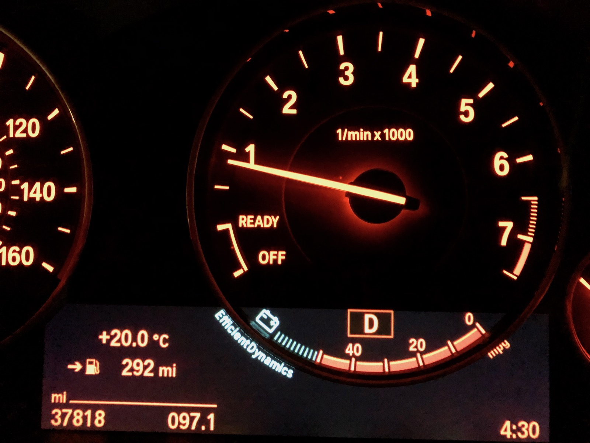
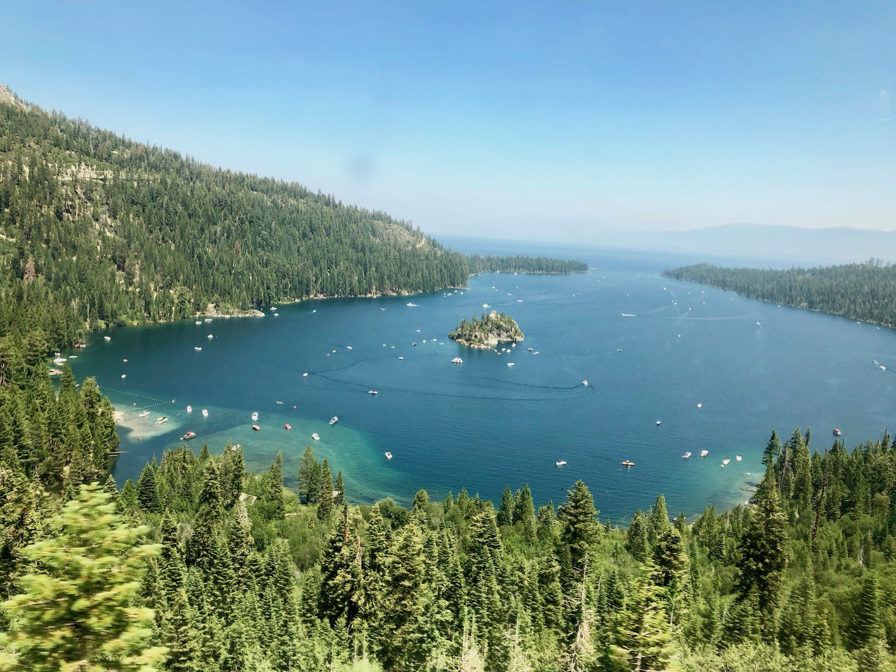
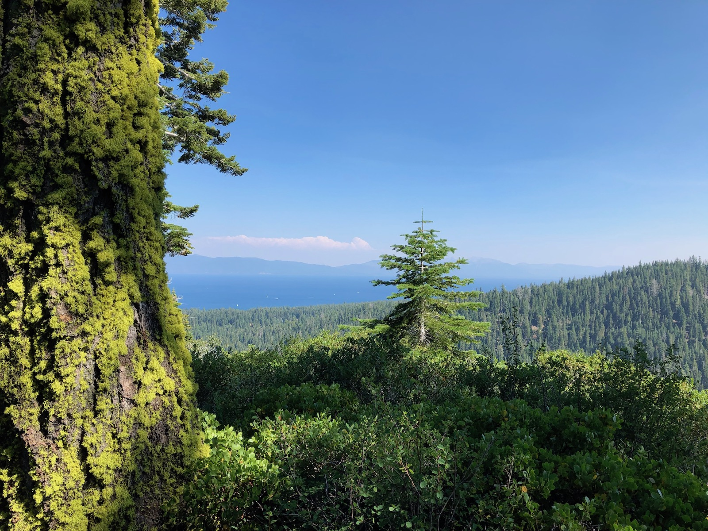
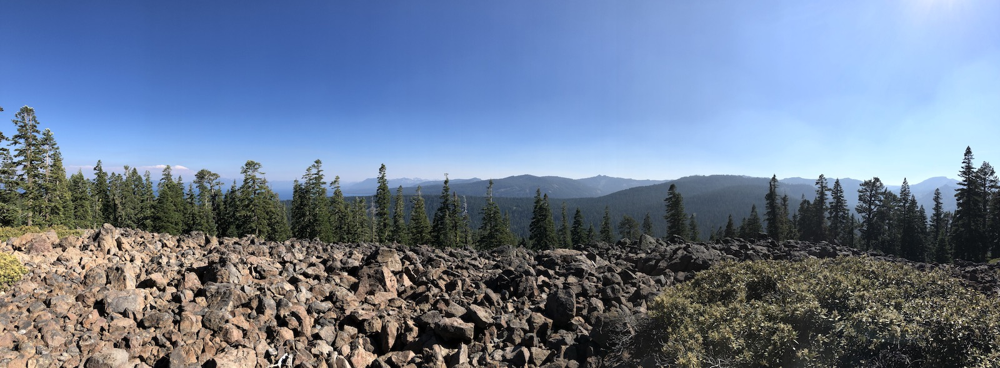
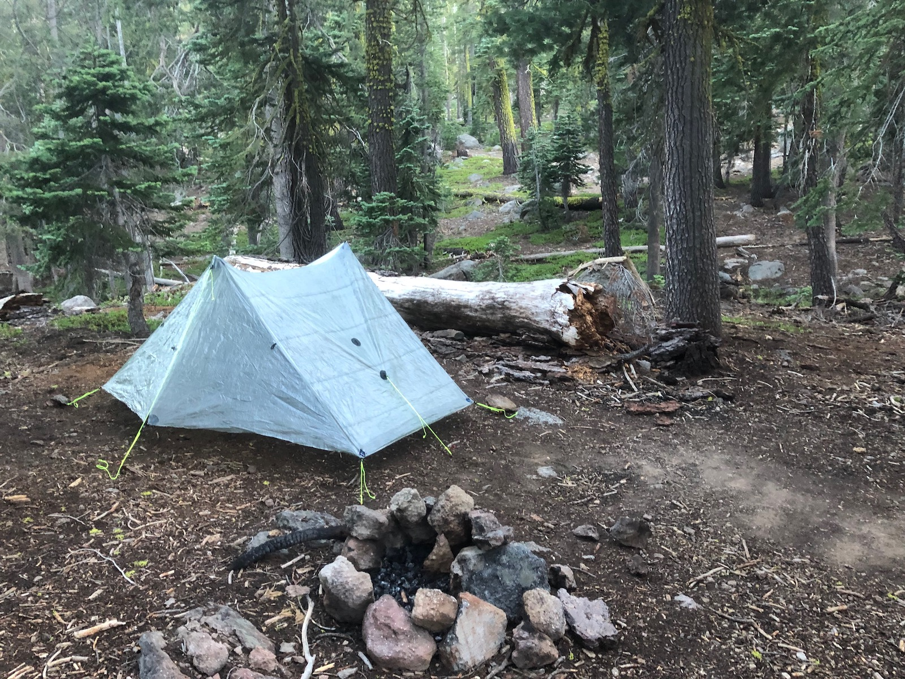
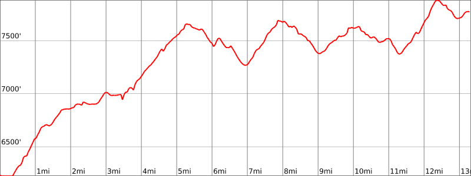

Day 1. 4am wakeup. I had a long trip ahead of me, and I wanted to get on the trail early enough to get to Watson lake before dark.

<figure>
  
  <figcaption>4:30am start</figcaption>
</figure>

The drive up to South Lake Tahoe was smooth. I stopped for a quick breakfast around 6 and got to SLT around 9am. The city was packed. There were forest fires both South and North that had closed a lot of other options for people to experience a vacation in the mountains.

Because I needed to split my trip into two parts due to work, I planned to park at Kingsbury, take the bus up to Tahoe City, and then hike back down to my car.

I parked at the [Kingsbury South Trailhead](https://goo.gl/maps/AJmScgY7CR92) and waited for the first bus back down to South Lake Tahoe. The summer crowds were causing a lot of traffic. I made the first bus change, but we got stuck in traffic, so I missed the bus up to Tahoe City and had to wait for an hour for the next bus.

<figure>
  
  <figcaption>View of emerald bay from the bus</figcaption>
</figure>

The views from the bus were excellent. Emerald Bay was beautiful as ever, but the parking lot and roadsides were packed with people. The bus ride up to Tahoe City ended up taking close to two hours, and I finally made it there around 1pm.

I grabbed a very mediocre but calory-filled burger at the [Bridgetender Tavern](https://goo.gl/maps/cLLfeVUmGQo) that was on the way from the bus terminal to the trailhead.

<figure>
  
  <figcaption>The first TRT blaze on the way to the Tahoe City Trailhead</figcaption>
</figure>

After crossing the river and the busy road, I saw the first of many Tahoe Rim Trail blazes. This was really going to happen!

<figure>
  
  <figcaption>Me at the Tahoe City Trailhead excited to start the journey</figcaption>
</figure>

Finally, almost 3 in the afternoon, I finally got on the trail. The whole first day was going to be mostly uphill. The first 5 miles alone climbed about 1400 feet. But the weather was beautiful, the views were great, and I was finally on the trail!

<figure>
  
  <figcaption>The first views of Lake Tahoe on the Tahoe Rim Trail</figcaption>
</figure>

Views of Lake Tahoe began to open up early into the climb. The trail climbed up through the forest and then followed a ridge high above the Truckee River.

<figure>
  
  <figcaption>The trail followed a ledge above the Truckee river</figcaption>
</figure>

The trail passed through fields of rocks that looked to be volcanic. Despite the boulder fields, the path itself was in good shape, and the going was smooth.

<figure class="full-width">
  
  <figcaption>There were big fields of what appeared to be volcanic rocks</figcaption>
</figure>

I got to Watson Lake a little before 8, just as the sun was setting. I didn't have too much time to scout for a great campsite, so I ended up picking a site a few hundred feet up from the lake.

<figure>
  
  <figcaption>Camp set up at Watson Lake</figcaption>
</figure>

With the tent set up, I used the last remaining daylight to find a suitable branch for a bear bag hang and went down to the lakeside to prepare dinner. In hindsight, I should have stayed a bit farther from the lake as the mosquitoes were swarming thick. But the positive side was that this was the only place on the trail where I encountered mosquitoes.

The water at Watson Lake was really murky. While it was ok for cooking after filtering, it didn't taste all that great.

Belly full, I headed back to my tent to sleep. This was clearly not a plan shared by the car campers at the lake who were drinking and burning campfires late into the night, despite the total fire ban that had been in effect for more than a month.

## Stats

13 miles +3,100ft, -1,600ft total elevation change.

You can find the routes for all days on [Caltopo](https://caltopo.com/m/HJ0L).
