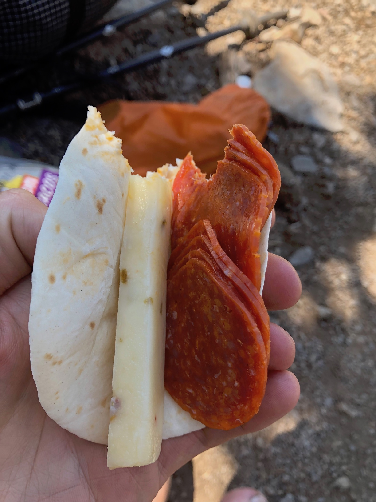
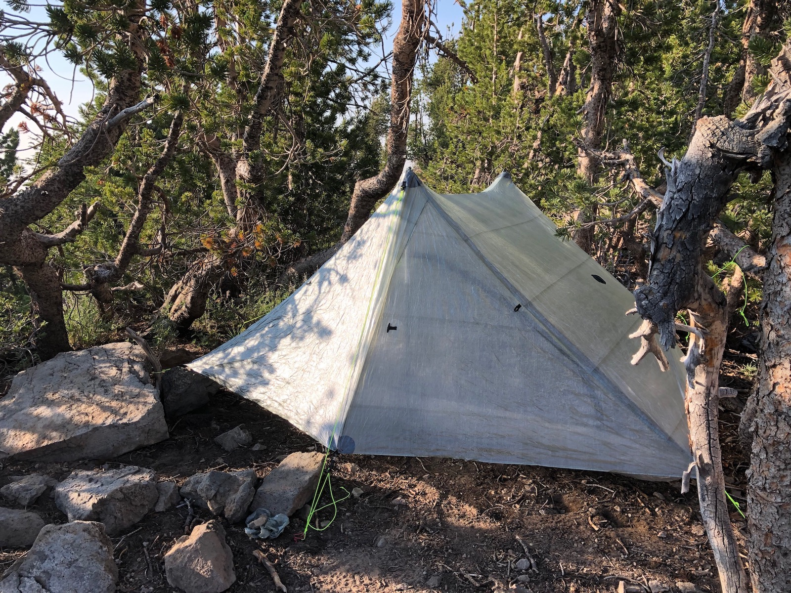
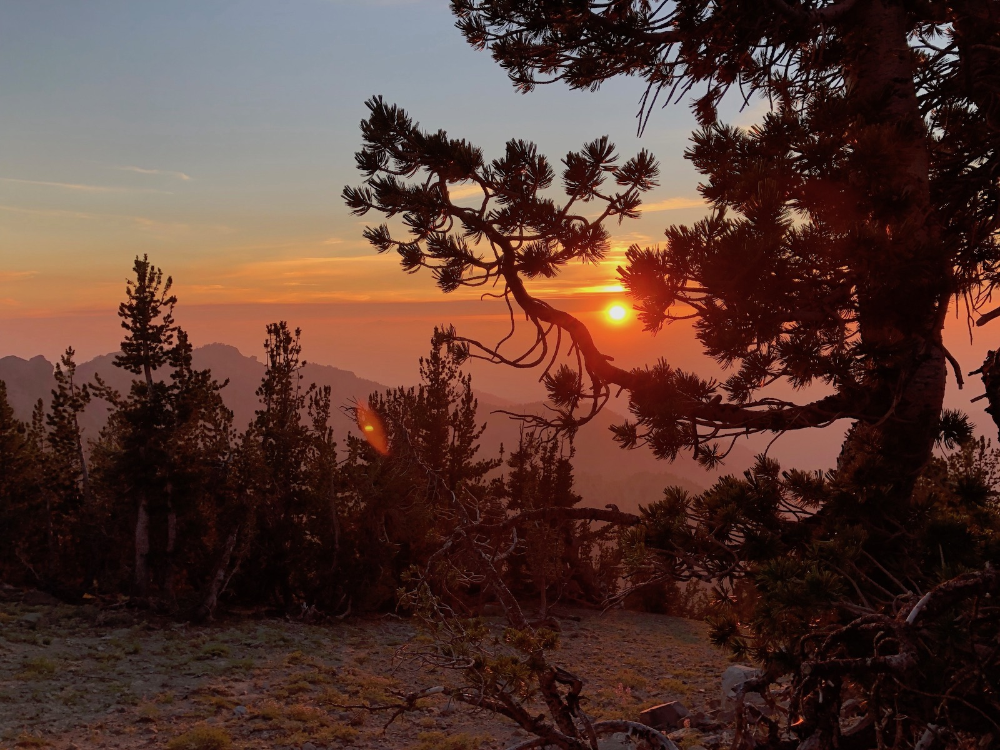
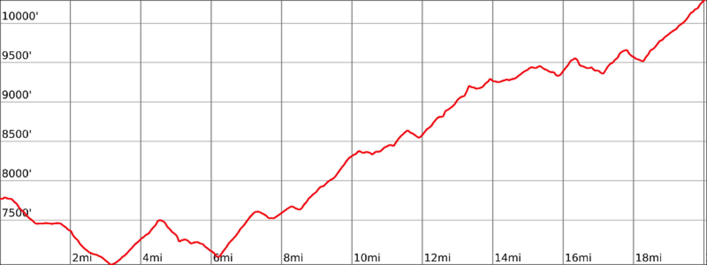

Day 2. I slept poorly like I usually do when up at altitude for the first night. I woke up at 5:45 and had a quick breakfast while watching the first golden rays of the sun illuminate the forest.

<figure>
  
  <figcaption>Sunrise at Watson Lake</figcaption>
</figure>

The water in Watson Lake was murky, so I decided to fill up my water a half mile down the trail at a spring that was still going according to the Guthook app. I drank a liter at the spring and filled up my heaviest water carry of the trail, 5 liters. There wouldn’t be a reliable water source for the next 17 miles.

The first 3 miles of the day were a nice gradual descent through the forest. Unfortunately, that would be the last downhill for the day. The following 17 miles were a gradual 3,400ft climb to the top of Relay Peak, the highest point on the TRT.

<figure>
  
  <figcaption>Meadow with mules ears</figcaption>
</figure>

As I climbed, I walked through meadows of Mule’s Ears and started catching glimpses of Lake Tahoe. There turned out to be a water cache at Brockway summit, but since I was already carrying enough water for myself, I didn’t fill up there.

<figure class="full-width">
  
  <figcaption>Lunch overlooking Lake Tahoe.</figcaption>
</figure>

I stopped for lunch underneath a tree, overlooking the lake. I took the chance to air out my feet and enjoy some healthy snacks.

<figure>
  
  <figcaption>A healthy hiker snack.</figcaption>
</figure>

The trail continued in and out of the forest with some shade until Mt. Baldy, just before entering the Mt. Rose Wilderness. For the rest of the day, I was baking in the afternoon sun, walking on loose rocks for added fun.

<figure>
  
  <figcaption>Me overlooking Lake Tahoe.</figcaption>
</figure>

By the time I finally got to the next water source, a spring just after Mud Lake, I was really starting to get thirsty and cranky. After drinking and filling up my bottles, I decided to rinse off my clothes further downstream quickly. Putting on the wet clothes cooled me down nicely, and I continued with the last few miles of my climb.

<figure>
  
  <figcaption>Butterfly at the spring after Mud Lake.</figcaption>
</figure>

My left knee started acting up for whatever reason after the break. I slowed down a bit and kept going. I had read from an earlier trip report that Relay Peak had a couple of excellent campsites and wanted to get up there.

When I finally reached Relay Peak, I was really done with climbing and wanted to set up camp so I could get some food. There were a few spots right on the trail, but I wanted to be a bit off the trail, and a bit shielded from the wind, so I ended up pitching my tent in an exactly Duplex-sized opening between the trees.

<figure>
  
  <figcaption>Tent setup near Relay Peak.</figcaption>
</figure>

<figure class="full-width">
  
  <figcaption>Nice views from inside the tent near Relay Peak.</figcaption>
</figure>

Smoke from the 2018 Ferguson fire was starting to roll in and made for an awesome sunset.

<figure>
  
  <figcaption>The sunset on Relay Peak was colored by smoke from wildfires.</figcaption>
</figure>

## Stats

22 miles +4,800ft, -2300ft total elevation change.

You can find the routes for all days on [Caltopo](https://caltopo.com/m/HJ0L).
