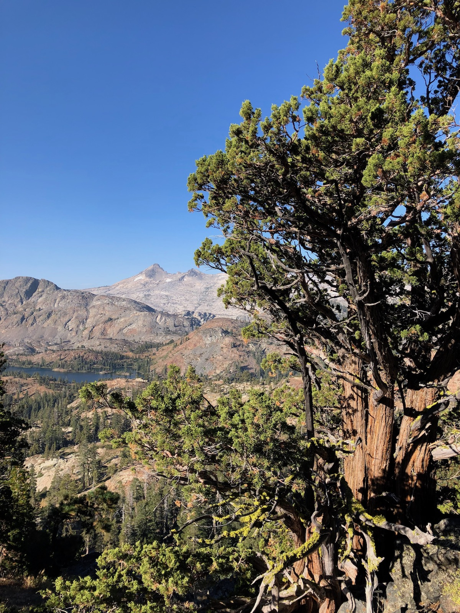
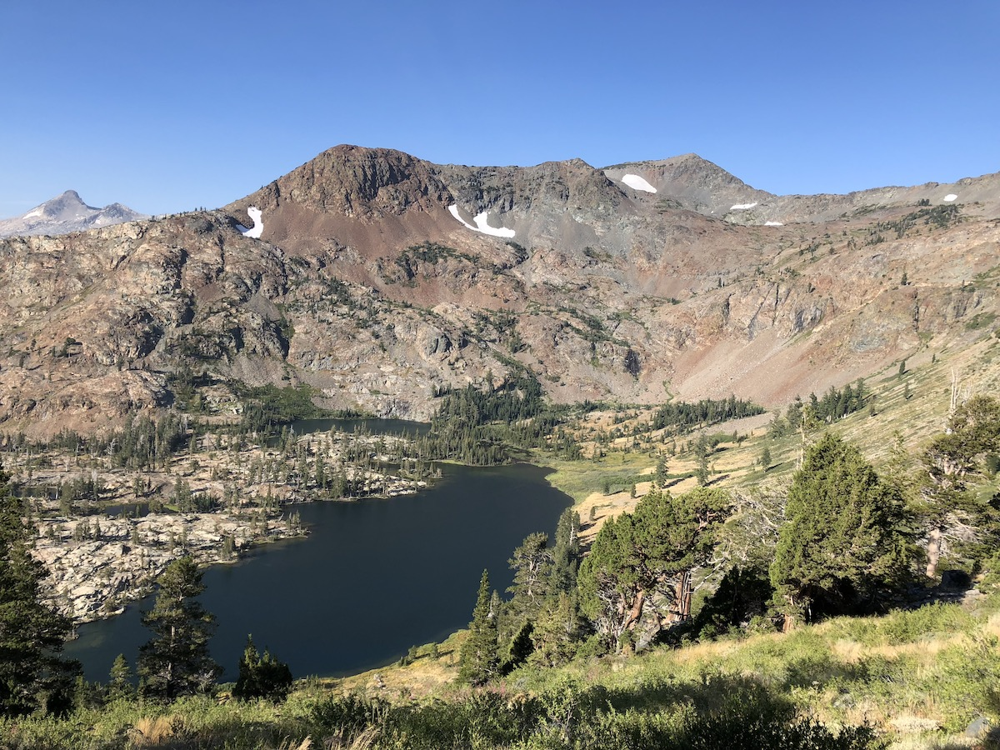
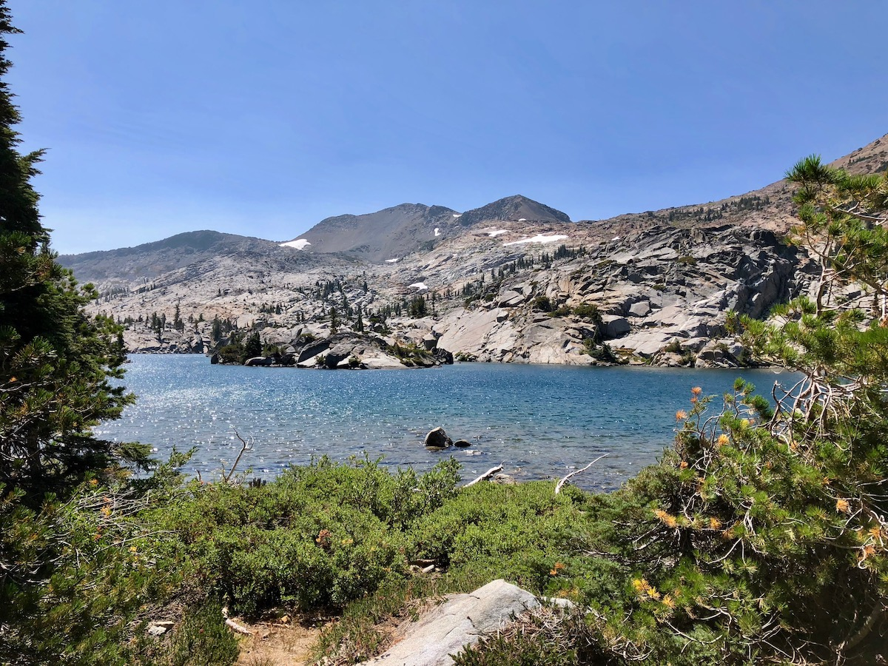
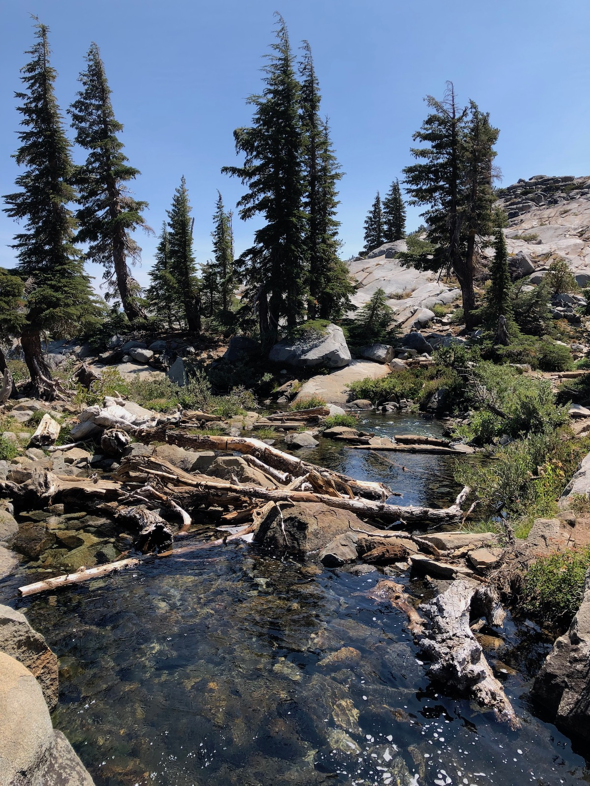
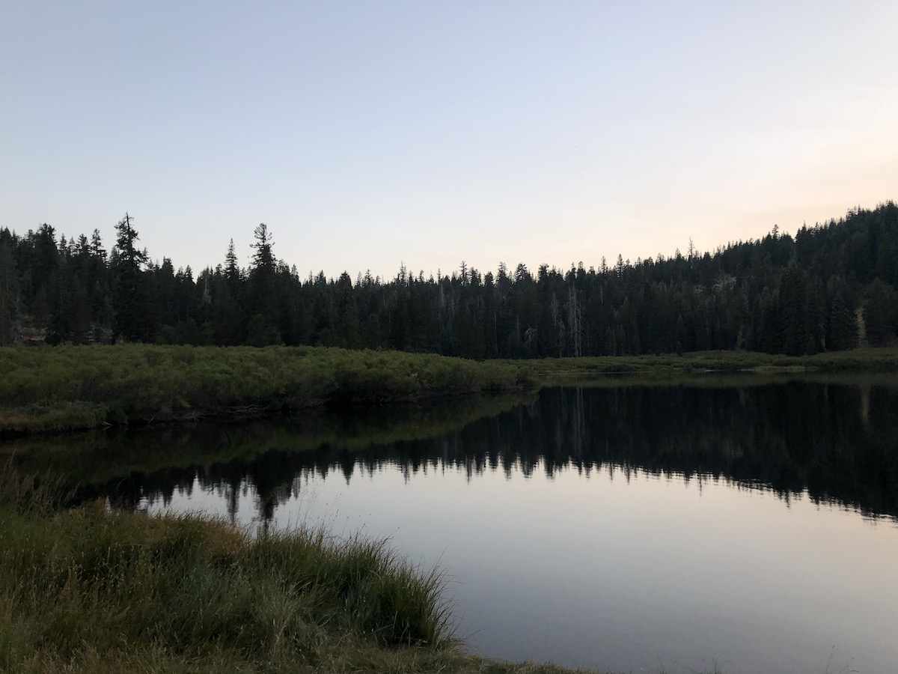
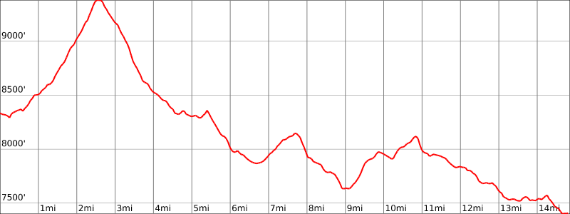

Day 10. Our day started with a 3-mile climb up Dicks Pass. The climbing felt much lighter than it had the night before. We were well rested, and the fresh morning air made the ascent a breeze.

<figure>
  
  <figcaption>Heading up Dicks Pass.</figcaption>
</figure>

As we climbed, we had spectacular views towards Lake Aloha, over the lakes we had passed the day before. Underneath us, Half Moon Lake glistened in the morning sun.

<figure>
  
  <figcaption>Half Moon Lake.</figcaption>
</figure>

Once we got up to the top of the pass, we met another group of hikers and stopped to chat and take pictures for a while. We could see Dicks Lake and Fontanillis Lake in the distance. There were still small patches of snow lingering in some places over Dicks Lake.

<figure>
  
  <figcaption>On top of Dicks Pass.</figcaption>
</figure>

<figure class="full-width">
  
  <figcaption>Views North from Dicks Pass.</figcaption>
</figure>

With the climb out of the way, the rest of the day would be mostly downhill. We made our way down Dicks Pass towards the lake in hopes to find a beautiful place for a morning coffee.

We stopped on the North shore of the lake. It was pretty windy, but the big boulders provided a break from the breeze.

<figure class="full-width">
  
  <figcaption>Dicks Lake.</figcaption>
</figure>

<figure>
  
  <figcaption>Fontanillis Lake.</figcaption>
</figure>

After our break, we continued past the beautiful Fontanillis Lake. We stopped to fill up water at the outlet because there wouldn't be a reliable water source on the trail for the next 10 miles according to Guthooks. This wasn't a big issue as we were going downhill and walking through the forest with some cover from the sun.

<figure>
  
  <figcaption>Fontanillis Lake outlet.</figcaption>
</figure>

The series of beautiful lakes continued with the Velma Lakes. Dicks Lake or any of the Velma lakes would arguably have been a more delightful place to camp than Gilmore lake, but it didn't work out with the mileage we wanted to do. If you're not in a hurry through Desolation, it may be worth camping at either Lake Aloha or Susie lake for one night and then at Velma for a second night.

The eight miles between Middle Velma Lake and Richardson Lake were somewhat unremarkable. The forest was beautiful, and the trail ok. But we had been spoiled with all the spectacular scenery we'd seen during the past few days.

When we got to Richardson Lake, we found a campsite on the far end of the lake. The East shore was well shielded from wind, and the afternoon sun was pleasantly warm. We took advantage of getting early to camp by swimming and relaxing for a while before starting dinner.

<figure>
  
  <figcaption>Swimming in Richardson Lake.</figcaption>
</figure>

<figure>
  
  <figcaption>Sunset at Richardson Lake.</figcaption>
</figure>

After dinner, we were looking at the map and planned the remainder of our hike. We had expected to stay one more night, but we started thinking that maybe we should just push it in one day and get to Tahoe City for a burger and a hotel bed. It would mean almost 22 miles, which was significantly longer than any day so far.

We decided to set our alarms for sunrise and get going early. We would then make the final call based on how we were feeling around Ward Creek, where we had initially planned to camp.

## Stats

14.9 miles +2,200ft, -3,200ft total elevation change.

You can find the routes for all days on [Caltopo](https://caltopo.com/m/HJ0L).
